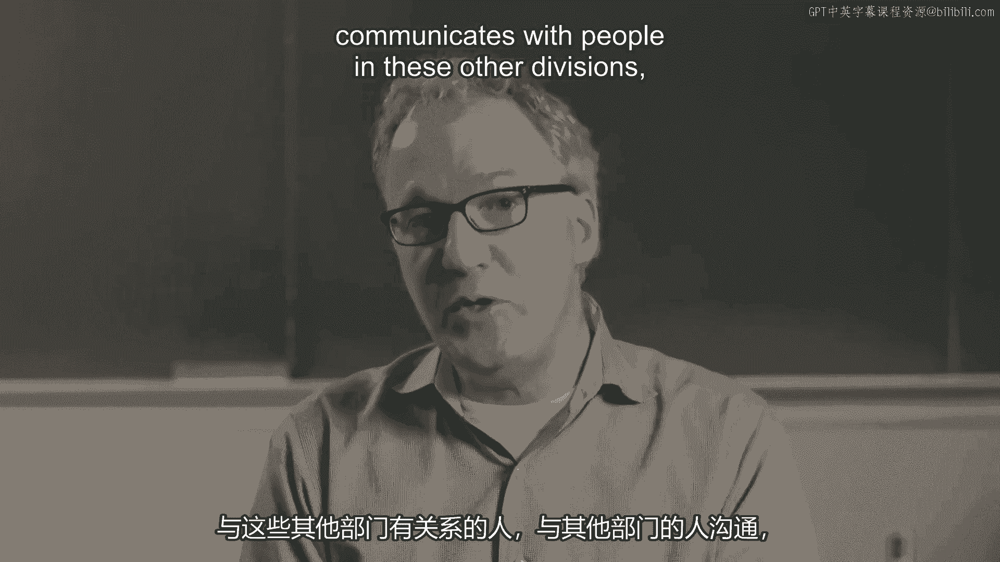

# 沃顿商学院《实现个人和职业成功（成功、沟通能力、影响力）｜Achieving Personal and Professional Success》中英字幕 - P82：18_应用.zh_en - GPT中英字幕课程资源 - BV1VH4y1J7Zk

 So far， we've mostly talked theory。

 Let's talk about what this thing looks like when the rubber meets the road。 How do you act on it？

 What might you do with it？ To do that， consider a few example assignments。

 opportunities that might come your way inside， an organization。

 For example， would you want the following？ Would you want a desk by the bathroom？

 This is something that most people have knee-jerk reactions against for the obvious reasons。

 but give it a little bit more thought。 Give it especially thought。

 given what we just talked through。 Why might you want a desk by the bathroom？

 What might be the benefits of a desk by the bathroom？ Well， clearly everybody's going to come by。

 basically。

 So you're going to have an opportunity to interact with people you might not have an。

 opportunity to interact with。 That's the basic idea。

 And so we can generalize from a desk by the bathroom to a desk in a busy area， to a desk。

 where people are often coming。 I've had people who spent interns， for example。

 in organizations where they happen to sit next， to the boss， the big boss。

 And they had access to executives that they never would have had access to。 And as a result。

 got full-time jobs just because of where they sat in their internship。

 I've observed my colleagues in various faculties over the years。

 And some choose to sit at the ends of Hall， where it's a little quieter， maybe a little。

 bit more space， maybe the view is leafier， and those who sit on the main corridor。

 They have to put up with a little more noise， but they're much more in the flow of things。

 And the research would suggest that's going to put them a little bit better footing and。

 in thicker position with more of their colleagues and more of their relationships。

 So that's a way of thinking about an opportunity you might not have taken otherwise。

 And there are some other ones。 So what about an overseas assignment？

 Well for some that would be an exotic thing， so that sounds fun。

 What's the downside of an overseas assignment？

 You might be forgotten。 You move from headquarters to the field。 People get busy at headquarters。

 They might forget about you。 There's always that risk。

 What are the benefits of an overseas assignment？ Well you start bridging these structural holes in a way that you can't if you're back in。

 staff and you're back in headquarters。 You meet entirely new set of people and you have a chance to create those relationships。

 in a way that you wouldn't have had you only visited for a day or you only talked by email。

 The other thing an overseas assignment does， it guarantees that you'll be in the spinner。

 again when you come off of that thing。 They've got to put you somewhere。

 So you'll be considered again for another spot as you roll off of it。

 Trade-offs but if you bring this structural holes idea and the need for diverse networks。

 to it you might lean a different direction。 Finally， what about a seat on a task force？

 Boss comes or maybe someone who's driving your boss and says you want to be on a committee。

 got room to be on a committee。 This is not something most of us look forward to。

 Most of us have all the work we need。 Don't need more committees。

 In my experience there is no better way to get to know people in a diverse part of your。

 organization， a new part of your organization than to work on a committee。

 It doesn't mean you need to go load up and be on three or four of them but my best relationships。

 with people from outside my department for example have come from one of two places。

 Either I office across the hall from them randomly as we talked about with the desk by。

 the bathroom or I was on some kind of interdisciplinary task force with them and I worked together。

 with them， could have been for a month， it could have been for a year in a way that I wouldn't。

 have had an opportunity to do so otherwise。 I host a radio show here on Sirius XM。

 one of our business radio shows and there are four， of us， one from the marketing department。

 two from the staff department and me from our， operations， information and decisions department。

 I knew one of these guys before we started。 Now three years in。

 there are three of my closest colleagues on faculty。 I never would have had that closest。

 I never would have had that time with them had we not done this committee， this task force。

 together。 So something to think about again， hopefully you'll think about these decisions differently。

 because of this framework。 The framework the Burt and Granovetter and the whole field of sociology have given us。

 it's a very parsimonious one， two parsimonious in some ways but it might push you to make。

 decisions differently if you take it seriously。 So there are trade-offs here。

 we're acknowledging the trade-offs， we're just pushing you a little。

 bit to think about considering the uncomfortable thing。

 We had these inclinations to do the comfortable thing。

 Go back to the seating assignment discussion at the top of the module。

 The comfortable thing when you walk into a room deciding where to sit for dinner or to。

 sign up on a registration for a conference dinner is to find your friends and sit down。

 and that's human and that's understandable。 If you understand though the returns to social network that includes diverse ties that is。

 a little bit less connected， a little bit less dense then you'll start leaning against that。

 comfortable thing and that's what we want to do today really。

 We just want to push you to be a little bit less comfortable， a little less automatic。

 and intuitive in your decisions about where you sit， what assignments you take。 Okay。

 give you a couple of empirical observations。 One neat one comes from Adam Kleinbaum。

 he did this as part of his dissertation in grad， school。

 He was one of the very first sociologists to look at email as a source of data。

 Now tons of people do this， it's become very common， it's very interesting research。

 He was one of the first。 He went into a large information technology company。

 they had 30 product divisions， global， presence and he sampled all email activity for 30。

000 employees for a three month period， of time。 What do you think you found？

 Here's a picture and it shows traffic， email traffic between divisions and what this is。

 showing is essentially all the traffic， whatever the percentage is， 95 plus 98 percent of the。

 traffic is on the diagonal meaning from one division to the same division。

 It's all within division traffic。 Barely anybody is talking to people in other divisions。

 This is a huge opportunity for you。 This is a way of differentiating。

 If you're the person in the organization who actually has relationships in these other， divisions。

 communicates with people in these other divisions， you're going to have an information。

 advantage that other people don't have。 Another way of looking at this and this is increasingly what people are doing。

 bringing， this idea beyond traditional networks and looking for the benefits of diversity and other。

 kinds of networks。 A few researchers recently published a piece in the MIT Sloan Management Review on a study。

 they did of Twitter users and how innovative those Twitter users are compared to people。

 who don't use Twitter and then most interestingly how innovative they are as a function of the。

 type of Twitter network they have。 In particular they used organizational network analysis。

 the kind of structures that we've， been looking at in the last few lectures at 10 work groups and five different organizations。

 Very different organizations， consulting group， a manufacturing firm， consumer food group。

 and higher ed and ask can we see any differences in how innovative an employee is as a function。

 of the kind of network they have。

 In this case we're talking about Twitter network。 So here is a picture of two employees that they looked at and different Twitter networks。

 So the employee A， the one on the left had a Twitter network that they characterize as。

 relatively disconnected。 Most of the people they're following on Twitter don't follow each other。

 Some do of course but mostly they don't。 Contrast that with employee B whose Twitter network is highly dense。

 highly connected。 These people that Twitter， that employee B is following actually follow each other。

 So what is the consequence of that？ How would you interpret that in light of what we talked about with structural holes。

 and。

 Burt and Granite bedroom。 Clearly employee A is tapping into more information and more different kinds of information。

 Interestingly what they found is when they looked at how innovative the employee was at。

 work they found those with more diverse Twitter networks submitted more interesting ideas。

 that were rated higher quality essentially more innovative ideas than employees whose Twitter。

 networks were denser， more connected to each other。

 So there are more and more examples like this where this principle of diversity and networks。

 being a benefit is tested and found in more and more interesting places。

 It's going beyond the traditional organizational analysis。

 So in general this structural hole brokerage thesis what does it say？

 It says we place a premium on non-redundant diverse context that there are significant。

 returns to knowledge about what others networks look like。

 If you understand and perceive others networks you have an advantage because you can tap into。

 those that are you can strategically choose to be affiliated with those who offer new。

 more diverse information。 And then finally it plays down the importance of key contacts knowing the right person。

 This is kind of the conventional wisdom is you got to know the right person well。

 If you put yourself in the better places and networks you're going to increase the likelihood。

 of information coming through about those people meeting more people meeting people you。

 wouldn't meet otherwise。 And in general again to emphasize this is all about non-redundant diverse contacts in all。

 the different kinds of networks that you're building as you go through your professional， life。

 [BLANK_AUDIO]。

