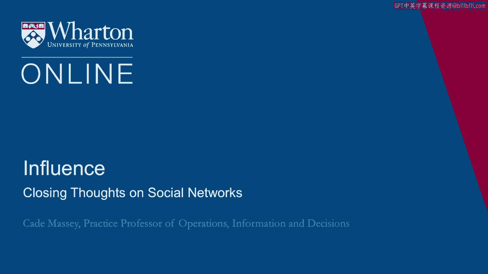
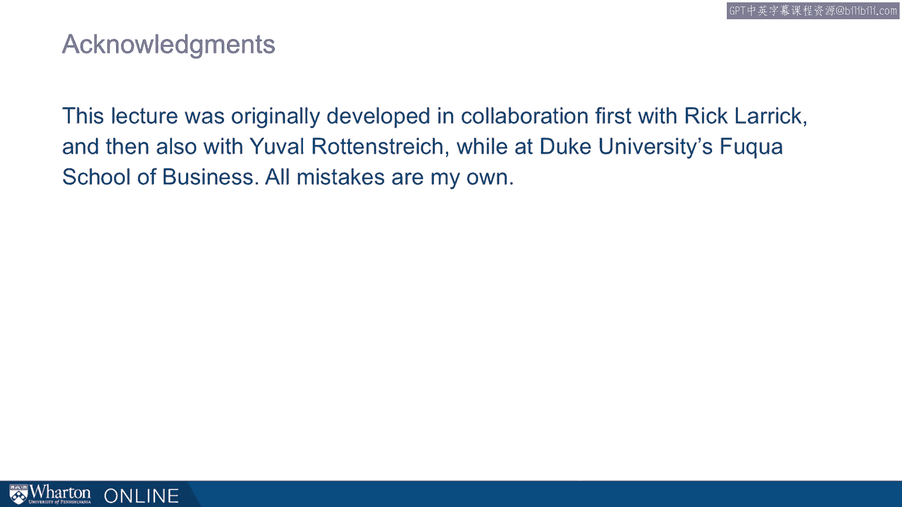

# 沃顿商学院《实现个人和职业成功（成功、沟通能力、影响力）｜Achieving Personal and Professional Success》中英字幕 - P86：22_关于社会网络的总结.zh_en - GPT中英字幕课程资源 - BV1VH4y1J7Zk

 So a few key takeaways from our discussion of informal networks。

 The first is that networks are social capital。 They're the analog to your human capital。

 They're part of the portfolio that you bring to any situation， any organization。

 The effectiveness of the network depends heavily on structural holes。 This is the new idea。

 kind of the unusual counterintuitive， somewhat provocative idea， we're pushing today。

 It's one of the most important ideas in network theory that the efficiency and effectiveness。

 of a network， the power of that social capital， depends on structural holes， how disconnected。

 the network is。 And finally that networks are earned， not built。

 You can't do this stuff quite as ready-made， as intentional as we'd like。

 This is something you need as a way of life。 You create energy by thinking about it in terms of reciprocity going beyond the norm。

 of reciprocity。 Very much thinking about social networks as something you're doing on a daily。

 weekly， basis， not because you have an objective that has to be met by it right away。

 So the ideas we've been talking about on this topic connect to the rest of the course。

 Understanding the other party， for example， is an idea that we've been talking about throughout。

 the course。 It's critical for creating valuable resources， generating reciprocity。

 strategically managing， your network， recognizing trade-offs。

 This is something we talk about pretty much every step of the way。

 It would be nice if these were tactics that you could use without worrying about using。

 them too much or if you could use them all circumstances。

 But life has a little more complicated than that。 Influence is a little more complicated than that。

 There's going to be trade-offs associated with every choice that you make。 And finally。

 intentionality。 The building networks in a way that maximizes their effectiveness requires a little more。

 strategy and it might be a little more strategy than your comfortable bringing to your relationships。

 One way to think about it。 We would urge you to be intentional about your network and to be unintentional about your。

 relationships。 We understand the screamishness。 In fact。

 we advocate having screamishness about bringing too much intentionality to relationships。

 and individuals。 But I think we can sit comfortably about being strategically about the broader network and。

 the decisions we make about jobs， about where we sit， about how we spend our time while still。

 being unintentional and more human in the individual relationships that we build。 Early。

 far from being distasteful， increasing influence to your network is one of the key。

 ways to leverage your ability。 The development and use of power requires accomplishing and accomplishing almost always。

 especially these days， requires working through other people。

 You can't accomplish what others can if you can't work through other people。

 As Jeff Pfeffer puts it， failures of implementation are almost invariably failures to build successful。

 coalitions。 Thanks for watching。

 [BLANK_AUDIO]。

