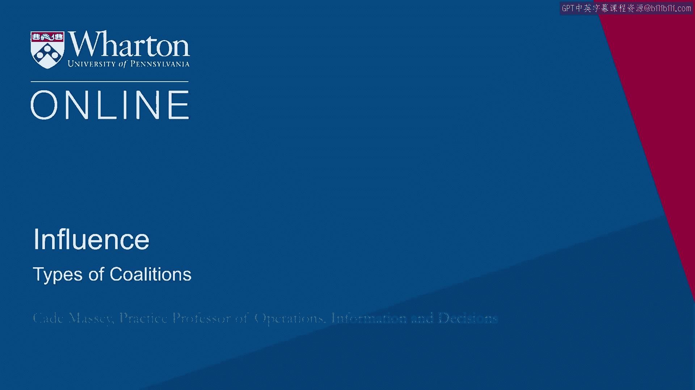
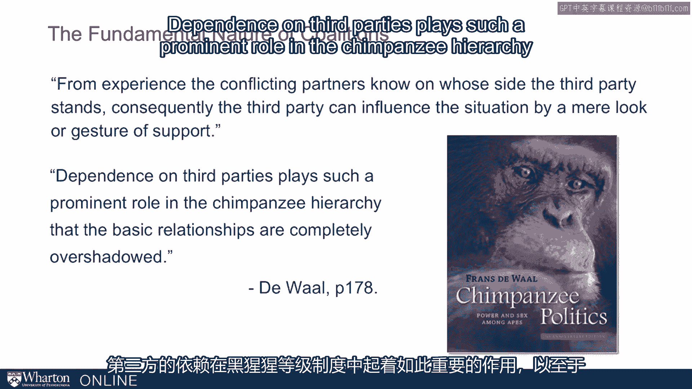
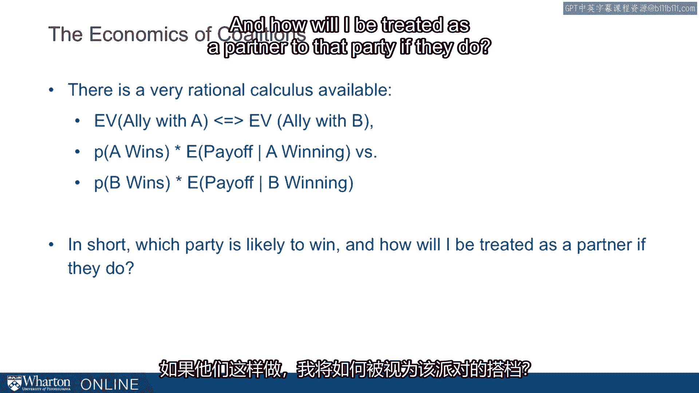
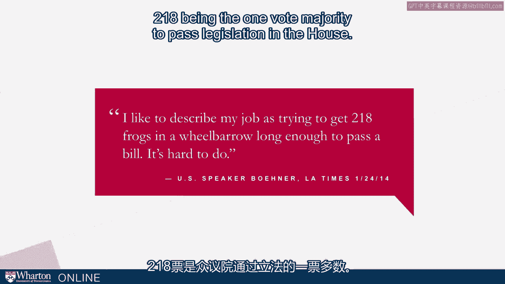
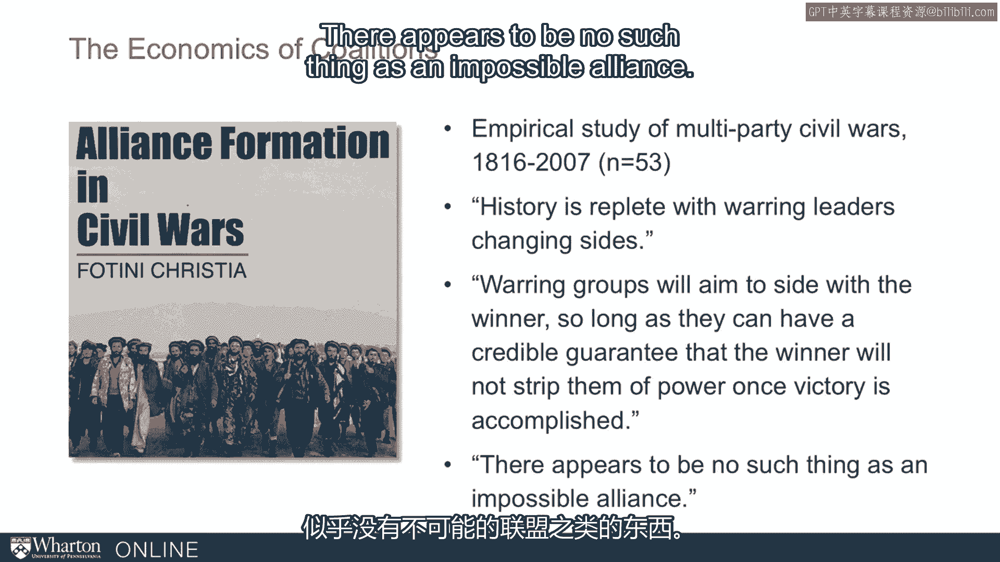
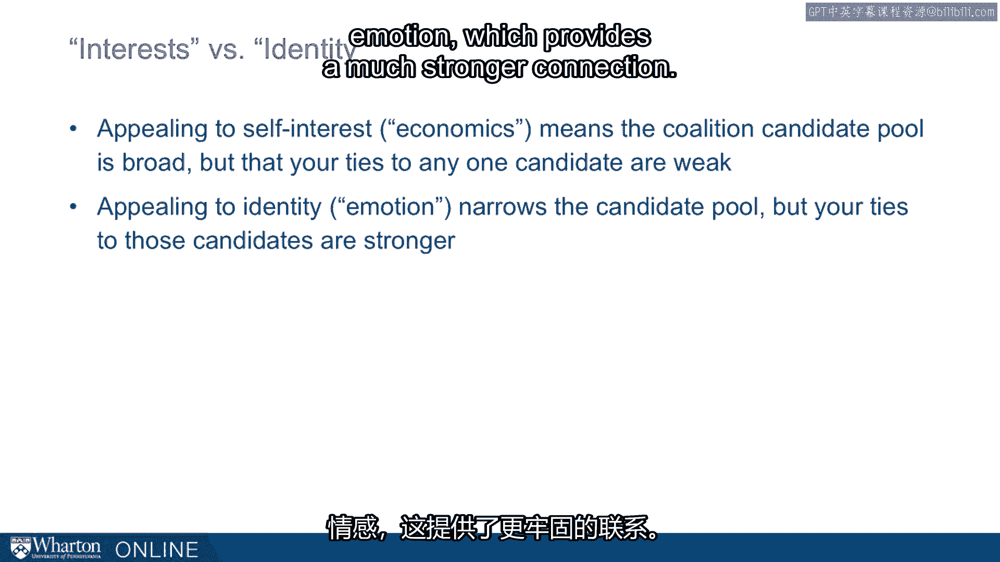

# 沃顿商学院《实现个人和职业成功（成功、沟通能力、影响力）｜Achieving Personal and Professional Success》中英字幕 - P88：24_联盟类型.zh_en - GPT中英字幕课程资源 - BV1VH4y1J7Zk

 The philosophy of coalitions is pretty intuitive and stated well by the political philosopher。

 Edmund Burke。 Whilst people are linked together， they easily and speedily communicate the alarm of any。

 evil design。 They are enabled to fathom it with common counsel and to oppose it with united strength。

 Whereas， when they lie dispersed without concert， order or discipline， communication is uncertain。

 counsel difficult and resistance impractable。 So clearly there are benefits and this is a pretty high minded intellectual description。

 of it。 But coalitions are also pretty fundamental。

 When we want to understand how fundamental human behavior is， we look for it in the primates。

 We look for it in lower forms basically。 We found by studying behavior in primates all kinds of psychological behavior that because。

 we see it there， we know that it is more fundamental to us。 We are hardwired to do these things。

 Such it is with coalitions。 So here is a quote from Franz Duwale。

 one of the best known primeontologists out there， has a great book called Chimpanzee Politics。

 He says， "From experience， the conflicting partners， the conflicting chimpanzee partners。

 no one who side the third party stands。 Consequently。

 the third party can influence the situation by a mere look or gesture of， support。

 Dependents on third parties play such a prominent role in the chimpanzee hierarchy that the。

 basic relationships are completely overshadowed。 This is especially dramatic given how hierarchical the chimps societies are。

 It's an influence that coalitions influence their behavior even there。

 It shows from Edmund Burke down to the chimps how important and fundamental coalitions are。

 to human behavior。 To dig into the kinds of coalitions and the ins and outs of coalitions。

 let's start with， an example。 This example is from a negotiation exercise called Three Way Organization。

 long-standing， exercise out of the Harvard Negotiation School。 We still use it every year。

 In this negotiation， there are three parties， Neptune， Pluto， and Venus， and they are trying。

 to decide how to divide up a pot， pot of money， pot of points， whatever you want to， call it。

 If they work together as a three-team organization， they have 24 points to divide。

 They could also just decide to work in twos， in which case there are different payoffs。

 Neptune and Pluto work together。 They have 22 to divide amongst themselves。

 Pluto and Venus work together。 They have 12， and then Venus and Neptune work together。 They have 18。

 We've laid the payouts out for you here on this little chart， so you'll see。 From these payouts。

 it looks like Neptune has more power in this negotiation。 They're the bigger party。

 I want to ask what you would do in this exercise。 We're not going to do this exercise today。

 but it motivates some of what we're going to， talk about。 If you were one of the smaller parties。

 Pluto or Venus， let's put you in the smallest position。 Let's put you in the Venus position。

 How would you go about this？ You would know that it's a coalition exercise。 Going in。

 you might think， "Do I form a coalition with Neptune， or should I form a coalition， with Pluto？"。

 Should I try to form a coalition with Pluto？ How do you think you would go about that decision？

 How would you even think about that decision？ You can go through the math and the points and think about it that way。

 but you might， also think about the individuals。 Who is in the role of Neptune？

 What relationship do I have with them？ What kind of trust do I have with them？ The same with Pluto。

 Take all this information in and then you would make a decision。

 Am I going to place my chips with the big guy， Neptune， or the smaller guy， kind of medium。

 science person， Pluto， as I go in and try to form a coalition。

 That decision captures the two main kinds of coalitions that we see in the world， one。

 being the balance of power。 This is the longstanding dynamic we see in political science where the presence of a。

 single dominant power leads smaller powers to band together。 In our example。

 we just came from Pluto and Venus want to work together to counterbalance， the bigger Neptune。

 But there is another kind。 Bandwagening is the other kind of coalition where the smaller powers buy with each other。

 in order to ally with the single dominant powers。 This is a Venus saying， "Hey。

 why might I want to go to little Pluto when I can go to， big Neptune， more likely to win that way？"。

 These are the two kinds that we see and this is often the decision that you face when you。

 are a smaller party trying to decide what kind of coalition to form。

 How do you know which way to go？ If you're going to form a coalition。

 do you go with balance of power or do you go with， bandwagening？

 Sometimes you're just observing this happen with other people。

 So how do you predict what's going to happen？ Is it going to be a balance of power or coalition or is it going to be a bandwagening coalition？

 If we can understand that， we'll better understand coalitions。 So broadly。

 there are two bases for coalition。 One is interest。

 Think of this as kind of the economics of an arrangement。 Another is identity。

 You can think of this as kind of the emotions of the arrangement or the coalition。

 So let's dive into both the interest-based coalitions and the identity/emotions-based， coalitions。

 So an example of interest-based comes with the very colorful name Baptist and Bootleggers。

 This goes back to 1980s research on U。S。 legislation and the particular example they're。

 talking about are in the U。S。 They're called blue laws where the distribution of alcohol is restricted on certain days of。

 the week。 So in some states or some cities， you can't sell beer and wine on a Sunday。

 So where does this come from？ Why do these laws， some of these laws still exist by the way。

 So the analysis says that basically there are quote， "babdas" are not necessarily actual， bad best。

 but they are religious leaders。 And what they bring to the coalition is the moral high ground。

 the explanation of the cause。 But they're also the bootleggers。

 And these are the people with the financial interest in making this happen。 So with these blue laws。

 they are the bar owners。 They would love for there to be no other place to get alcohol except bars on Sundays。

 And so their interest is financial。 And to make that happen， they can provide campaign funds。

 So you have this very powerful coalition。 You wouldn't necessarily expect together。

 They don't seem like the kinds of people that would work together。

 But because they have common economic interests， they form a strong coalition。

 And of course it's effective because from the legislators' perspective， you have the。

 moral high ground saying you're doing it for religious reasons， but you also get campaign。

 funds because the bootleggers can provide that as well。

 The Bruce Yandall who created this theory back in the early '80s says durable social。

 regulation occurs when it's demanded by both of two distinctly different groups。

 So it takes that complementarity but with a common economic interest to form a very strong。

 coalition。 So more recently， we've seen examples such as green energy where big financial interests。

 have come into back green energy， especially in say California。

 And it looks like it's for environmental reasons。 But in fact， if you look at the reasons。

 there's regulatory advantages and actually they're， in there for investment。 That's what they do。

 of course。 But because they've got kind of the moral high ground and the financial interest， it's。

 a complementary and strong economic based coalition。

 So there's a very rational calculus available when you're making these decisions based on， interest。

 What's the expected value of allying with A， party A， for example， versus the expected。

 value of allying with party B？ So just go through the math。

 What's the probability that A wins times the payoff to me if A wins versus the probability。

 that B wins times the payoff to me if B wins。 So this sounds very rational and very narrow。

 And that's the claim here that many coalitions get done on exactly those grounds。 In short。

 which party is likely to win and how will I be treated as a partner to that。

 party if they do。 So one of the challenges with these kinds of coalitions is that they're dynamic in that。

 people are kind of always hopping around trying to find a better deal。

 There's a great quote from Speaker Boehner， a longtime speaker in the US House who said。

 "I like to describe my job as trying to get 218 frogs in a wheelbarrow long enough to， pass a bill。

 It's hard to do。 218 being the one vote majority to pass legislation in the House。

 The reason it's hard is because he might get everyone lined up for a moment and then somebody。

 else is going to start trying to poach them。 And because they're doing this calculus。

 they might be able to raise the anti just enough， that they'll jump out of the wheelbarrow and form a coalition with somebody else。

"， My favorite example， one of the most powerful examples， comes from a study of alliance formation。

 in civil wars。 So this was done in recent years looking at civil wars， multi-party civil wars。

 So there's room for coalitions over an almost 200-year period of time。

 So the cover here is from Afghanistan， but in fact， they looked at civil wars in 53 different。

 areas。 And this is Fotini-Christia。 She writes， "History's replete with warring leaders changing sides。

 This is surprising to us because we tend to think， especially from the cover here， that。

 these would be religious-based conflicts， very moral， tribal-based conflicts。 But in fact。

 they observe that warring groups will aim to side with the winner so long as。

 they can have a credible guarantee that the winner will not strip them of power once victory。

 is accomplished。 There appears to be no such thing as an impossible alliance。

 This is great research。 This is not intuitive。 This is not what we would have expected。

 But they find that interest， this rational calculus， drives behavior so much that it can。

 overcome these very seemingly deeply held identity issues。 I've talked with special forces students。

 students who previously were in the special forces。

 who talk about being in the field and seeing men actually change sides during battle as。

 the calculus changes during battle and one side looks more likely to win。

 Now the other form of coalitions， the other basis on which coalitions get formed are identity。

 More emotion-based， could be loyalty。 And it leads one to sacrifice narrow economic interest in service for these other objectives。

 An example also from the military world comes from the UK and France alliance in World， War I。

 So they did not have a formal treaty when World War I started。

 They had some previous relationship but they didn't have a formal treaty。

 And when Germany invaded Belgium and then France， the UK had to decide whether to come。

 into the war on the side of France。 This is a memo from inside the Foreign Secretary Office in Great Britain。

 And they write， "The argument that there is no written bond binding us to France is。

 strictly correct。 There is no contractual obligation。 But the Entente has been made， strengthened。

 put to the test and celebrated in a manner， justifying the belief that a moral bond was being forged。

 The whole policy of the Entente can have no meaning if it does not signify that in a。

 just quarrel England would stand by her friends。 This honorable expectation has been raised。

 We cannot repudiate it without exposing our good name to grave criticism。"。

 So you see this is such a different basis for the coalition than the calculus we talked。

 about before。 In the morality， this is honor。 And indeed。

 Great Britain did join on the side of France。 We don't know what influenced this memo head but we know that there were people making。

 exactly this kind of argument。 Here's the same story in kind of visual terms。

 Emotions can play a big role， drive the abused parties， the smaller parties together to。

 team up an exact revenge。 So broadly we have this interest versus identity。

 Interself interest or economics means the coalition candidate pool is broad。

 You can bring anybody in as long as you can show that their economic interest are well， served。

 But it means that your ties to anybody you do bring in are relatively weak， relatively， shallow。

 Alternatively， you can appeal to identity or emotion which provides a much stronger connection。

 but it greatly restricts the number of people you can ally with。 These are the trade-offs。

 There's no right answer。 There's no better way to go。

 There's two different ways we see coalitions formed。 Both matter。

 One of the bottom lines is that it's risky to neglect either one。

 They're both opportunities for you to form a coalition and they're also risks to you。

 from others trying to post your coalitional partners。 Thank you。 Thank you。 [BLANK_AUDIO]。

