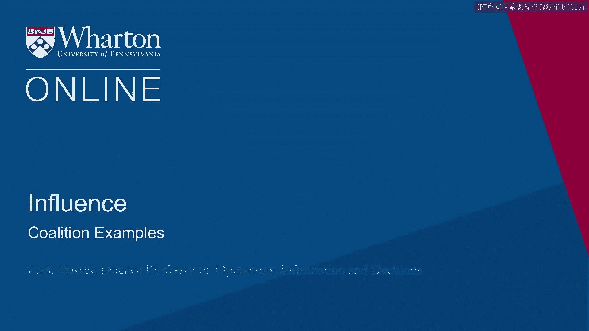
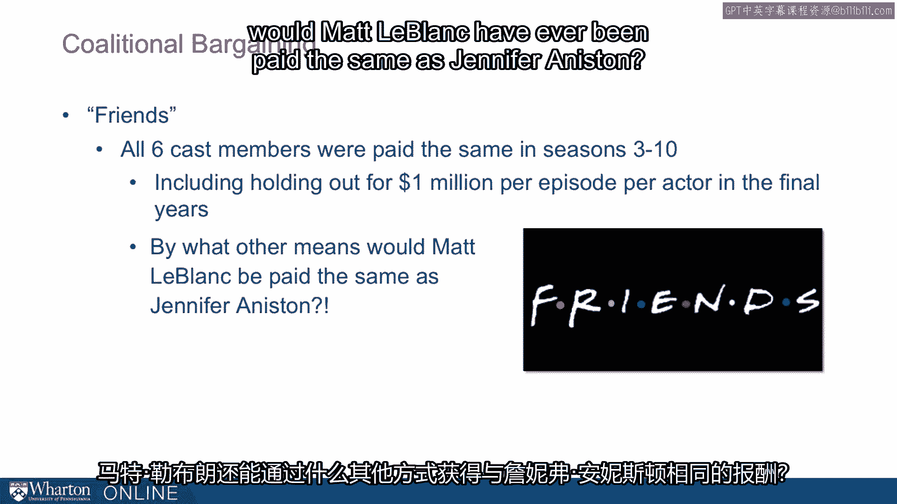
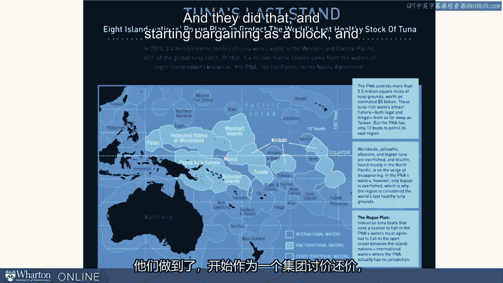

# 沃顿商学院《实现个人和职业成功（成功、沟通能力、影响力）｜Achieving Personal and Professional Success》中英字幕 - P89：25_联盟案例.zh_en - GPT中英字幕课程资源 - BV1VH4y1J7Zk

 So let's look at two quick examples from two very different places。 One is from television。

 the sitcom Friends。 This was a huge kind of a surprise hit in the 90s and before the show。

 started these six actors were essentially unknown and as is typically done on television。

 they negotiated their contracts individually。 However， the show really took off and then。

 the interesting thing that happened is that they started negotiating collectively。 It。

 was a single unit negotiating with the production company instead of six individual actors and。

 interestingly they all took equal pay。 So despite having quite a bit of disparity between the。

 celebrity of say Jennifer Aniston they were actually paid the same。 So in years three。

 through ten this was the arrangement and by the time they were done they were paid a。

 million dollars per episode per actor and they shot 20 or 24 episodes a year so these。

 guys were making 20 million dollars each through a coalition。 Now why would they do， such a thing？

 Why do you think they might accept equal pay？ Do you think they are better， off in the long run？

 Why would that be？ So some people think that it changed the dynamic。

 on the set that it preserved the relationships in a way。 Maybe they would never have made。

 it to year ten and done as well if they hadn't gone in with that kind of equal arrangement。

 But by what other means other than a coalition would matle block have ever been paid the same。

 as Jennifer Aniston。 Another example is from the tuna fisheries in the South Pacific。 This。

 example comes from a Slate magazine article and the story with the tuna fisheries is that。

 historically the fleets the big fleets have come down from Japan or the UK or the US and。

 gone in to these local the local waters the territorial waters are on these islands and。

 when you do that you have to pay and they would basically just auction these islands off against。

 each other who's going to charge us the least to allow us to fish in their waters。 And the。

 islands because this is one of the most important sources of revenue didn't have much bargaining。

 power and they got these fishing rights bid down and for years this was the arrangement。

 And then finally they realized well we need to work together essentially we need to form。

 a coalition and they did that and started bargaining as a block and completely turned。

 the bargaining table。 So now they were auctioning the fleets off against each other asking who。

 was going to pay the most to fish in our territorial waters。

 And they found they had so much bargaining， power that they were able to improve the health of the fisheries。

 In particular a tuna fleet， can fish in international waters nobody can restrict that but that's damaging to the tuna。

 fisheries down there because you know tuna don't know whether they're swimming in territorial。

 waters or international waters。 If you want to manage the the fishery as healthily as possible。

 you want to restrict in some way what's going on in the international waters。 By forming。

 this coalition the countries had so much bargaining power they were able to enforce。

 restrictions on what the fleets could do even in the international waters。 A fantastic。

 example of the power of coalitions and a smaller party seeing that and flipping the negotiation。

 table as a result。 Thank you。 [BLANK_AUDIO]。

