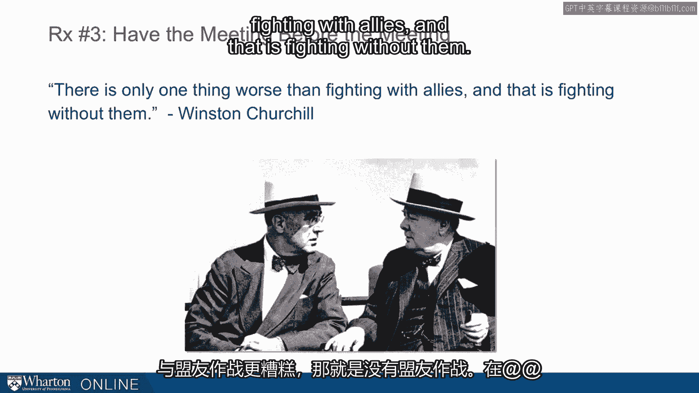
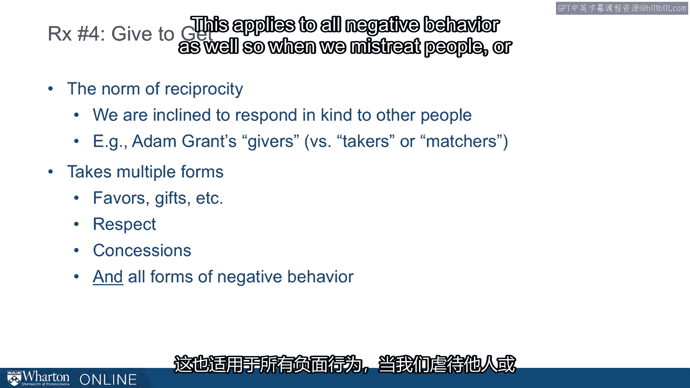
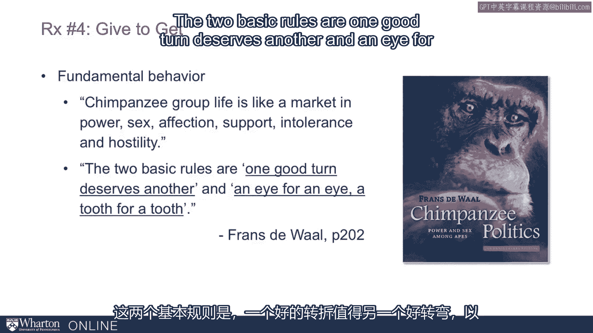

# 沃顿商学院《实现个人和职业成功（成功、沟通能力、影响力）｜Achieving Personal and Professional Success》中英字幕 - P90：26_联盟的处方.zh_en - GPT中英字幕课程资源 - BV1VH4y1J7Zk

 All right， in this lecture we want to talk about prescriptions for coalitions。

 What are the best practices we see out there？ How do you make a coalition？

 How do you hold a coalition？ We have four big ones for you。 Castowydnet， consider the metagame。

 have the meeting before the meeting， and finally， give to get。

 Let's talk a little bit about each one of these。 So Castowydnet。

 want to quote from Bruce Bueno de Mosquita。 He is a professor at NYU who， among。

 in addition to doing research， he consults to large companies， and countries。

 trying to predict what's going to happen on these big hard questions like。

 what's Iran going to do around nuclear bombs， what's the Pakistan military going to do。

 that kind of thing。 In his book， he writes， "In essence。

 the model looks for possible groupings of players who。

 would be willing to shift their positions toward one another if they thought that doing so。

 would be to their advantage。 In short， the model predicts coalitions。

 His model often produces surprising results。 It methodically works through not only the obvious coalitions we know and expect。

 but， also the invisible ones that we don't。 Years appearing at his model have shown him that conflicts almost always have hidden solutions。

 One of the things that's going on with his model is that he's looking as broadly as， possible。

 He's considering all possible coalitions。 This is not what we do naturally。

 And so one of the big prescriptions is think broadly， think creatively about coalitional， partners。

 Our colleagues at Harvard， Lax and Sebanius， in one of their books on negotiation in 2006。

 suggest who some of these parties might be。 So if you're negotiating with somebody， for example。

 you might want to think beyond just， the person who has to give formal approval。

 think about those who influence the decision， makers who might be in their ear， for example。

 who has the highest value for what you offer。 This is something that's terrifically important to entrepreneurs who are trying to sell into。

 an organization， a product or a service， who is it in that organization who would most。

 benefit from that product or service， possible coalitional partner， who can block decisions。

 who has misaligned incentives， who has to implement something that you negotiate。

 These are all critical members。 They might be helpful in getting over the hump or they might be necessary to actually。

 get something done。 Second prescription， consider the meta game。

 So you miss opportunities if you frame negotiations too narrowly。

 If you think you're only negotiating or trying to influence on a very particular matter and。

 you forget all the matters that are related to it that others might be thinking about。

 So if others are thinking about a broader coalition， broader interest， you're going to be exposed。

 to people they can bring to the table that you're not thinking about。

 So what are additional grounds for coalitions？ Well， we've named the economic side， the interest。

 the narrow， rational interest a party might， have， but they're also those emotional considerations。

 So identity， loyalty， in some cases spite or anger， in some cases， beneficence。

 So what's critical is that you know what the other party cares about。

 They don't necessarily care about the same things you do。

 You may think it's a strictly economic negotiation or a strictly economic coalition， but in fact。

 they might have these emotional or identity-based interests。

 Those are missed opportunities for you and it's an opportunity for somebody else who's。

 working against you。 Prescription number three， this is a very basic one but perhaps the most important one。

 Have the meeting before the meeting。 I'm always surprised to find professionals who don't use this all the time。

 This needs to be in your toolbox for sure。 So negotiations are always influenced。

 often constrained and sometimes even settled long， before the official talks begin。

 So in these advanced meetings you're going to do some intelligence gathering， temperature， taking。

 credibility building， groundwork laying， and some you're doing alliance creating。

 In this picture we see a couple of guys sitting in a bar， in a corner that doesn't necessarily。

 have to be the style of meeting。 This can be just swinging by somebody's office。

 knocking on the door， bumping into them at， the water cooler， texting them， giving them a call。

 dropping an email。 These all count as meeting before the meetings。

 These are ways of touching base with parties before you actually sit down。

 There's a great quote from Churchill， "There is only one thing worse than fighting with。

 allies and that is fighting without them。

 You want to know before you get into the meeting whether or not you have allies with， you or not。"。

 Prescription four， the fourth and final prescription， give to get。

 So this ties into a topic that's been studied in psychology and sociology for decades and。

 the human nature is we're inclined to respond in kind to other people。

 Been talked about very well by Adam Grant in recent years in his book， Give and Take， but。

 the general observation is that regardless of the form behavior takes， positive form， favors， gifts。

 respect， and negotiation concessions， we're inclined to give back in kind the supplies。

 to all negative behavior as well。 So when we mistreat people or when they mistreat us。

 we're inclined to respond。

 This is an opportunity for forming coalitions and it's a risk if you're using these negative。

 behaviors that will get in the way of your forming coalitions。 So this again we see in the apes。

 let's go back to Franz de Wall and his study of chimpanzees。

 looking at how fundamental coalitions are and how fundamental this reciprocity behavior is。 He says。

 "Champions' group life is like a market in power， sex， affection， support， intolerance。

 and hostility。 The two basic rules are one good term deserves another and an eye for an eye。

 a tooth for。

 a tooth。"， So again， we're wired this way， we're hardwired this way。

 we know it from watching it in the， champs。 Another example from de Wall talks about a primatologist。

 Tushashada Nasita describing， the case of an alpha chimp in the Mahali Mountains who maintained his rank for an extraordinarily。

 long time over a decade through an elaborate system of bribery。

 So a decade's ridiculous because champs are usually at the top of the hierarchy for 18。

 months or so。 So it's something like a three standard deviation event。 How do you do it？

 He distributed meat selectively to those individuals who support he could use against。

 potential challengers。 So apes are doing this， apes are using coalitions and it's making a difference in their influence。

 This is clearly something available to us。 One of the implications is that you might bear some costs in order to have a more stable。

 sustainable coalition。 So you might improve your long term position by accepting lower。

 perhaps what even might， be seen as unfair payoffs in the short term。

 So this may be one of the reasons we do see coalitions where the disparity in payoffs。

 is more equal than you might expect。 So one of my favorite examples comes from university athletics。

 collegiate athletics in， the United States。 Teams compete as a part of a conference。

 So schools group together in conferences and one of the things schools have to do is。

 decide how to share their television revenues。 This is the primary source of the revenues。

 A huge percentage of what they receive from college athletics come from these big television。

 contracts。 How do you divide that money across all the different members of the conference？

 Take for example two organizations in two different parts of the country in different。

 conferences in the University of Texas and the University of Alabama。 So Alabama Crimson Tide。

 this is the most successful football program of the last 10 or 20 years。

 and one of the most successful of all times。 They're kind of the flagship program of the Southeastern Conference。

 And the Southeastern Conference is known as being a stable， successful， probably the best。

 football conference in the country in the last 10 or 20 years。

 How do they divide their television revenues？ The primary source of revenues。

 They divide it equally。 Equals parts to each school。 So from big， strong Alabama down to little。

 maybe not so strong， Vanderbilt， they receive， the same television monies。 In fact。

 they have such a strong coalition that another equal share goes to the league， office。

 So much they value their coalition and they pay more equally there than you might expect。

 As a result， they have this incredibly， as a result of other things as well。

 But one of the factors is this equal split， they have this strong coalition。

 Contrast that with the University of Texas and the big 12。

 Known as being one of the most unstable coalitions。

 They've lost university affiliates over the last few years as they migrated away。

 One of the reasons schools often give， one of the reasons observers think this happens。

 is because they don't equal， they don't share their money equally across the school。

 So the University of Texas， kind of the flagship organization of big 12， has always demanded。

 and received far more pay from the television contracts than the other schools。

 We think that this is one of the reasons that they have a weaker one。

 Now Texas could argue it's fair， it's only fair that they get paid more but it comes， at a cost。

 It comes at the cost of a weaker coalition and in the long term they may end up with less。

 We don't know for sure but it's a great illustration of you might take a little bit less as the。

 bigger party at the table。 You might take a little bit less to secure a stronger coalition and a more sustainable。

 long term pay off。 So four prescriptions， cast a wide net， consider the metagame。

 have the meeting before the meeting， and give to get。 [BLANK_AUDIO]。

