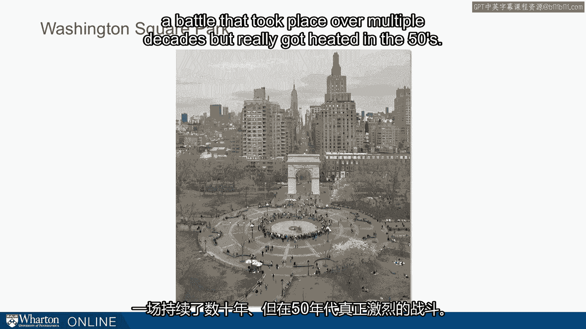
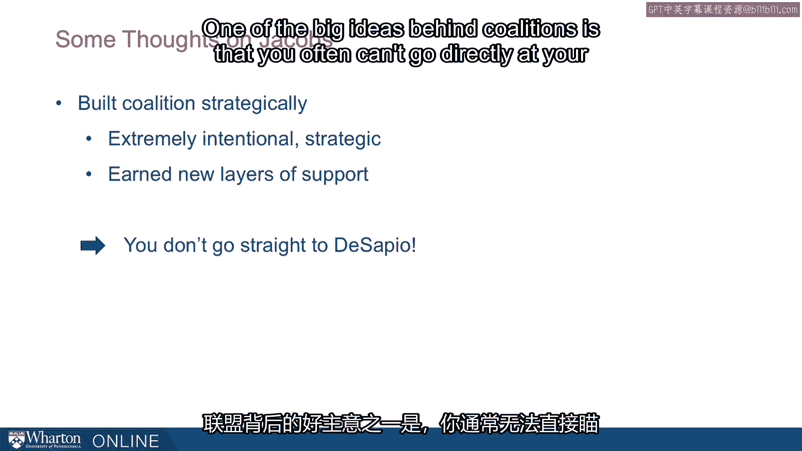
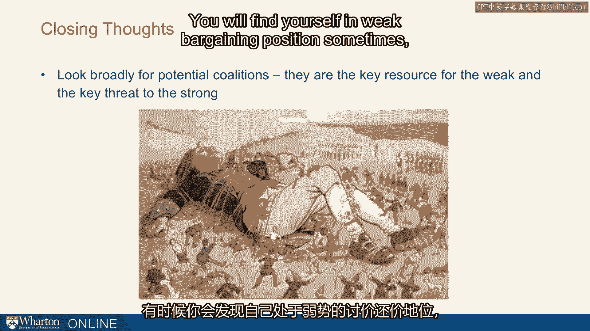
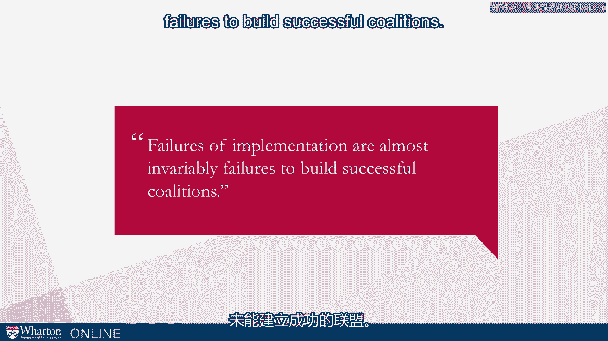

# 沃顿商学院《实现个人和职业成功（成功、沟通能力、影响力）｜Achieving Personal and Professional Success》中英字幕 - P91：27_华盛顿广场案例.zh_en - GPT中英字幕课程资源 - BV1VH4y1J7Zk

 Let's do a mini case study， real world example， and ask how you might have gone about forming。

 a coalition when one was needed。 The example comes from New York City。

 Washington Square Park in the heart of Greenwich Village。

 and a battle that took place over multiple decades but really got heated in the 50s。

 The key actor here is Robert Moses。 We've heard about Robert Moses in another lecture earlier in the class。

 but he was the， director of transportation， the transportation commissioner in New York for decades and known。

 as being one of the most influential men in the history of New York。

 He held power for something like 45 years。 He had never proposed a project that didn't get done until this point。

 What do you run into？ We ran into Jane Jacobs。 This is a picture of Jane from later in her life。

 This was in the 2000s， so this is a good 40-50 years after their battle。 Let's see what took place。

 The setup was that Moses wanted to take Fifth Avenue through the park。

 Fifth Avenue comes down from the north and ends when it hits the famous arc there in。

 Washington Square Park。 Moses wanted to run it through the park。

 He wanted to divide the park and it would have dramatically changed not only the park。

 but the neighborhood by increasing the traffic through that area。

 This is a highly congested recreational area and there was a lot of opposition from those。

 who lived in the area against this。 Jane Jacobs lived in the area and she was not the first to form this coalition but she was。

 early on in the coalition and she proved to be critical to it。 Ask yourself。

 if you were living in Washington Square Park in the 50s and Moses wanted to。

 build this avenue through your neighborhood， big four-lane busy street， what would you。

 have done about it？ You're facing the most influential guy in New York。 How could you stop him？

 How would you have gone about stopping him？ Think about how you would hopefully form a coalition。

 One of the reasons we believe in coalitions is that when you don't have power， when you're。

 in these relatively uninfluential positions， it's one of the best resources you have。

 What are you going to do？ One of the places you might think about， well。

 let's get my neighbors of course。 Form a petition。

 get some signatures and this of course is what they started with。

 That may or may not be sufficient depending on how strong the weight is behind the proposal。

 It turns out it wasn't sufficient。 What do you do next？

 They started trying to bring media in and they did it in creative ways。 For example。

 they had protests and being wise to the ways of the media， they tried kids。

 out and they really emphasized the impact on children。 Eventually people started writing about this。

 This was the dawn of the village voice by the way， the village voice， the first alternative。

 weekly newspaper in the US started in New York， started at this era and of course they loved。

 this cause。 They recruited those who wrote architecture columns for some of the bigger newspapers。

 the dailies to write on behalf of their cause as well。 They pulled the media in here。

 What else are they going to do？ They started working with young politicians。

 The big established politicians don't want to take on Moses but maybe some of the younger。

 guys would。 Ed Koch， for example， eventually the mayor of New York got involved because he needed a。

 cause to get his name out there。 They started thinking about celebrities。

 It turns out that one of the most famous women in the country at the time， Eleanor Roosevelt。

 lived in Greenwich Village and she was very happy to throw her celebrity behind the cause。

 With each of these steps， each of these additions to their coalitions， it added to their power。

 Eventually， and this was after years， eventually they had a strong enough coalition and enough。

 attention that they were able to go to probably the only politician in the area who could actually。

 stop Moses and that was Secretary of State De Sapio。 De Sapio was able to exert enough influence。

 He saw what these guys wanted and the power they had mustered over years and was able to。

 stop Moses from actually extending Fifth Avenue down through the park。

 So at the height of the battle， Moses in a final desperate and unsuccessful attempt to。

 keep the board of estimate from closing the part to the traffic said， "There is nobody。

 against this。 Nobody， nobody， nobody but a bunch of mothers。"， Well， it turns out mothers。

 if they're able to form a coalition， can be very influential。

 They had gone beyond mothers and children to politicians like Koch， Eleanor Roosevelt。

 and eventually to Secretary of State De Sapio。 Jane Jacobs， by the way。

 went on to much greater fame。 She has a book called "The Death and Life of Great American Cities。"。

 She wasn't even trained in urban policy， urban development， but she wrote the book。

 that public policy schools all over the country have used to teach in their schools。

 What do we learn from this？ Some thoughts from Jacobs。

 One reason her coalition was so effective is that it played at multiple levels。

 She had street level protests with individuals。 She had newspaper coverage and editorials。

 not just one newspaper， multiple papers。 She had political pressure from multiple offices and candidates。

 and she had celebrity， endorsements。 You see how many different levels there are to that。

 The best coalitions do play at multiple levels。 Moses was of course trying to do the same thing。

 Moses had all kinds of levers， and he would say one thing in press， and he'd have quiet。

 meetings behind the scenes also， so he was up against a lot。 They were up against a lot。

 It took that kind of sophisticated coalition to get it done。

 It was also an extremely strategic coalition。 She was intentional。

 They were intentional on how they built this thing。 They earned each new layer of support。

 They had to build it at one level before they could expand it to the next level。

 One of the big ideas behind coalitions is that you often can't go directly out your target。

 You have to go circuitously， indirectly。 These guys couldn't have gone straight to De Sapio。

 They just knocked on De Sapio's door on day one。 He wouldn't have listened to him。

 He wouldn't have cared， but they built enough support until he kind of needed to listen to， them。

 Some closing thoughts on coalitions。 The first， and maybe the main lesson here。

 is that you should look broadly for potential， coalitions。 They are the key resource for the weak。

 and they are the key threat to the strong。 You will find yourself in weak bargaining positions sometimes。

 The number one lever in those situations will be a coalition。 On the other side。

 you will sometimes be in these strong positions。 What is the greatest risk？

 The greatest risk is a coalition against you。 So we all need to be on the lookout from both sides for these coalitions。

 And finally， failures of implementation are almost invariably failures to build successful。

 coalitions。 It's a critical tool in your influence toolbox。 [BLANK_AUDIO]。

