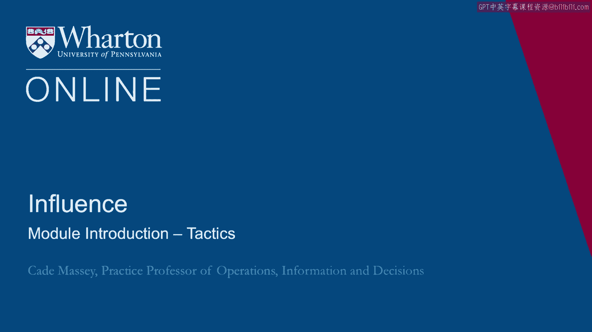

# 沃顿商学院《实现个人和职业成功（成功、沟通能力、影响力）｜Achieving Personal and Professional Success》中英字幕 - P92：28_策略模块简介.zh_en - GPT中英字幕课程资源 - BV1VH4y1J7Zk

 Welcome back to Influence。 We are heading into week three here and in this week we're going。

 to drop down into a little more detail on some Influence Tactics。 We're going to do it in two。

 parts。 First we're going to talk about Persuasion。

 Persuasion is one of these Influence areas that's。

 been talked about in research for literally millennia。 So let's understand the frameworks that are。

 useful there。 And then in the second half we'll talk about Influence Styles more generally。 Here。

 we're pushing against the notion of traits， physical， physiological dispositions being important in。

 influence and rather emphasizing behaviors and tactics。 To do that we're going to share with you。

 some empirical work that we've done over the last ten years to hopefully fill out your， toolbox。

 your Influence tactic toolbox。 Enjoy。 [silence]。

