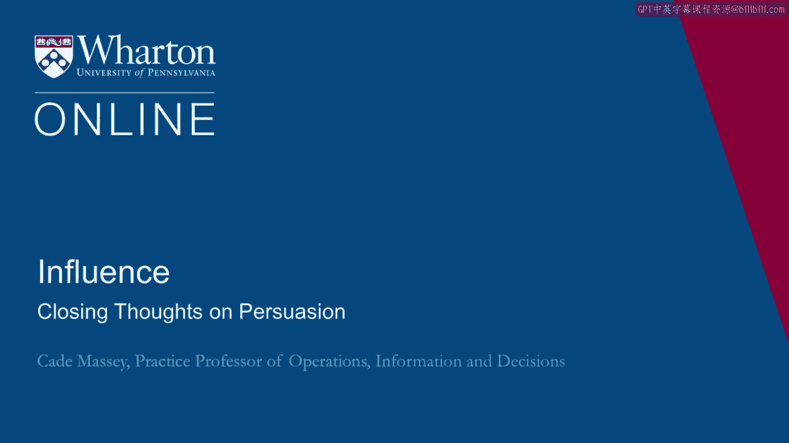
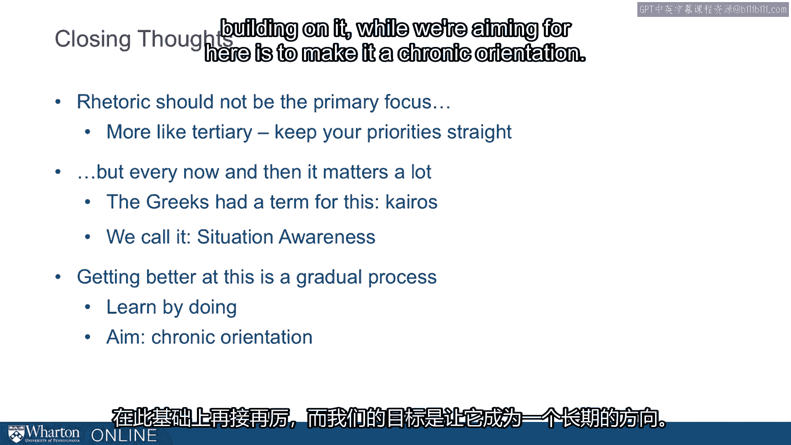

# 沃顿商学院《实现个人和职业成功（成功、沟通能力、影响力）｜Achieving Personal and Professional Success》中英字幕 - P97：33_关于说服力的总结.zh_en - GPT中英字幕课程资源 - BV1VH4y1J7Zk

 So a few closing thoughts on persuasion。

 First， one of the quotes that Heath and Heath gives us is that one of the worst things about。

 knowing a lot or having access to a lot of information is that we're tempted to share it all。

 I think of this as the fundamental presenters era and the prescription that comes out of it is。

 to find the core。 Cut， cut， cut， find the core and build around the core。 A second is that emotion。

 is key。 It isn't the case that more is always better。 You have to match the audience that requires。

 some sensitivity and preparation， but it is the case that we often underestimate the importance。

 of emotion， especially those of us in the business world， in the business education world。

 trained analytically。 We can neglect what turns out to be one of the most powerful levers。

 available to us， and that is emotion。 Finally， there's a message here that unseen power is。

 particularly influential。 Unseen persuasive efforts are particularly influential。 So if we can slip。

 below the defenses essentially， folks get defensive if they know you're trying to sell them something。

 If you can slip below the defenses， you're going to be a little bit more persuasive。 So social。

 influence is a great way of doing that。 Daily exposure， whether it's to the environmental settings。

 persons in， the language they're exposed to， the colleagues they spend time with。 These are all。

 ways that people are wildly influenced over time。 One of the reasons is the repeated exposure。

 Another， reason is because it's below their defenses。

 Another closing thought is that rhetoric shouldn't be， the primary focus。

 We didn't lead the whole course with this。 We're not putting undue emphasis on it。

 We think it's probably more like a tertiary consideration。

 but there are times and places where it matters a， lot。 The Greeks had a term for this， chyros。

 It's kind of the unappreciated fourth element of rhetoric。 They're talking about timing essentially。

 That an important consideration and a persuasive effort is， the time， right？

 We connect that to the notion of situational awareness。 We talked earlier in the。

 course about situational awareness。 You got to know when is the time to sit down and put a lot of。

 thought into that persuasive message because there will be those moments。 And then finally， let's。

 acknowledge that this is a gradual process。 You're not going to turn overnight from someone who。

 thinks about these things to someone who uses them all effectively。

 A big theme here is that none of， these things are that complicated。

 The biggest challenge is keeping them salient。 So you do that， by practicing。

 You do that by having a success early and then building on it。 What we're aiming for。

 here is to make it a chronic orientation。 To make it when you're presenting or when you're talking or。

 when you're writing a note， you realize you need to drop a little pathos in here。

 You need to find a， way to build your ethos in here and to do it in a manner that doesn't rug people the wrong way。

 Final message going back to the relief above the Yale Law School entrance is too much logos。 One of。

 the biggest themes across all of this work is there are just more ways to persuade than just logic。

 Most of us are trained in that way。 Many of us find it intuitive and therefore we use it too much。

 [BLANK_AUDIO]。

