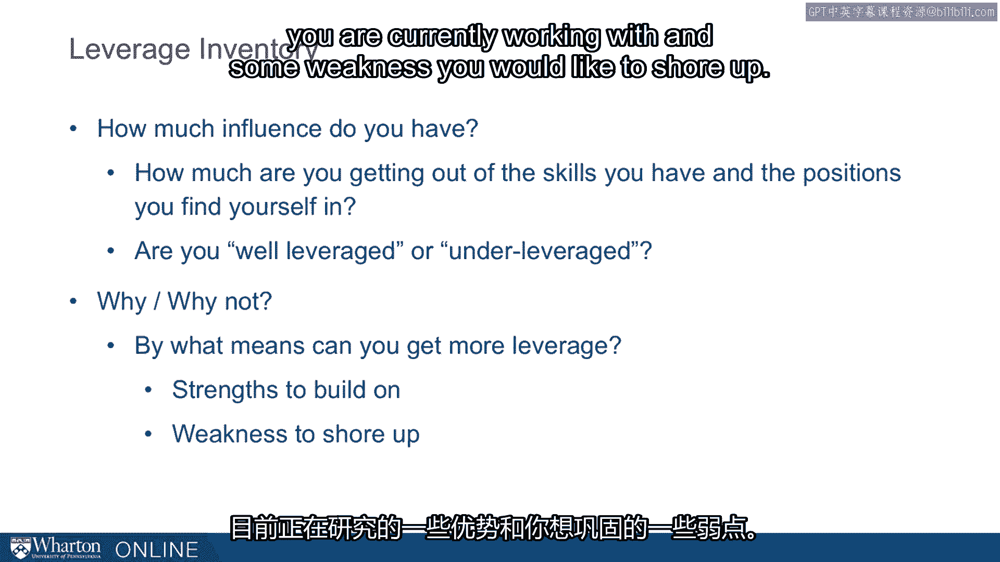
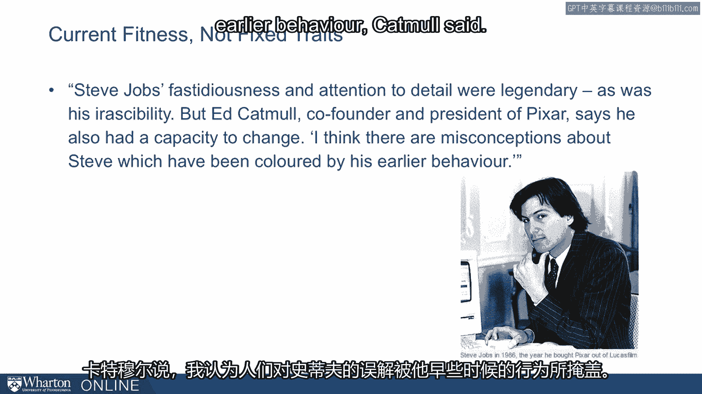

# 沃顿商学院《实现个人和职业成功（成功、沟通能力、影响力）｜Achieving Personal and Professional Success》中英字幕 - P98：34_评估影响策略.zh_en - GPT中英字幕课程资源 - BV1VH4y1J7Zk

 In this half of the module， we're going to talk about influence styles and we'll draw。

 on the survey you've done separately on the leverage inventory。

 So the leverage inventory is designed to help you understand how much influence you have。

 How much are you getting out of the skills and positions that you find yourself in？ Generally。

 are you well leveraged？ Are you under leveraged？ So more importantly， why and why not？

 We want to dig into why and why not so that you can understand what you need to do to。

 increase your leverage and have more impact。 In the end。

 we're going to ask you to identify some strengths you are currently working with。

 and some weaknesses you'd like to shore up。

 So remember， that's where we're aiming。 We're going to talk through the survey。

 We're going to talk through some results we've seen with this survey。 But ultimately。

 we want you to reflect on based on your survey and your understanding of these。

 different tools what it is you need to work on and what it is you can leverage。

 So it's important in this discussion to remember that we're talking about kind of current fitness。

 We're not talking about fixed rates。 This is not a DNA test。

 This doesn't say you are this type of person and you will be for the rest of your career。

 This is the current state you're in。 I like to give the example of Steve Jobs who of course was famously strong-minded。

 but even， Steve Jobs was malleable。 In an article in the Financial Times after he died， they write。

 "Steve Jobs' "Fistidiousness， and attention to detail were legendary as was his irascibility。

 But Ed Catmull， co-founder and president of Pixar， says he also had a capacity to change。

 "I think there are misconceptions about Steve， which have been colored by his earlier behavior，"。

 Catmull said。

 "What people missed was that Steve was so smart。 He realized a lot of those things weren't working well for him and he altered his behavior。

 So for the last 15 years of his life， the same people stayed with him。

 People can change and he's demonstration of that。 A good illustration for us。

 There is nothing we're about to talk about that you couldn't change about yourself if。

 you wanted to and if you focused on it。 The leverage inventory's overarching point is that there are multiple approaches to influencing。

 people and the most successful influencers draw on a range of them。 Most of us。

 as you advance and you gain more responsibility， you need more and more of these， influence tools。

 We typically have go-to moves。 You've been successful in your life using these moves。

 You tend to go back to it。 Some people are good with spreadsheets and they always want to be the person working。

 in the numbers。 Some people are very demanding and they bring a hammer and they can beat people over the。

 head。 Some people are just the opposite。 They're kind of backslapers。

 They want to take people to lunch and get to know people and be friends。

 These are very different ways to influence people。

 They're all available to all of us but we tend to stay within a relatively narrow range。

 We tend to stay with our go-to moves。 Another motivation today is to help round out your influence toolbox。

 Last reminder， this is not a DNA test。 This is like， say， if we ask you to run an 800 meter today。

 Right now， get some shoes on， let's go out and do it。 It doesn't say that's the fastest you can run。

 Some of you might be at your peak condition。 You're ready to do it and that's about as good as you can do。

 Many of you have it run 800 meters in a while and it's probably not reflective of what you。

 could do at your best。 That's where we are。 Look at your current state and then ask you to reflect on what you need to shore up。

 [BLANK_AUDIO]。

