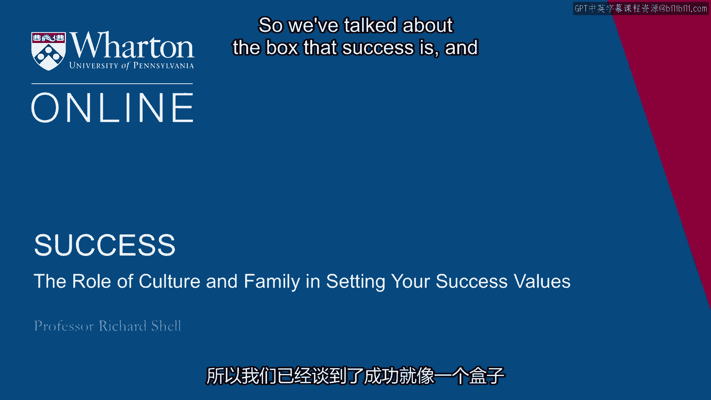
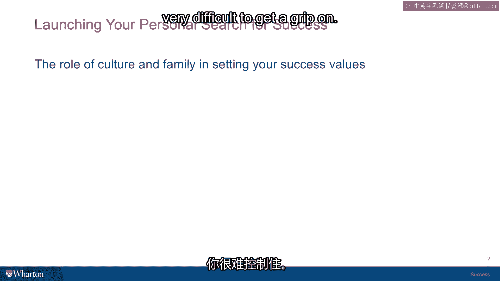
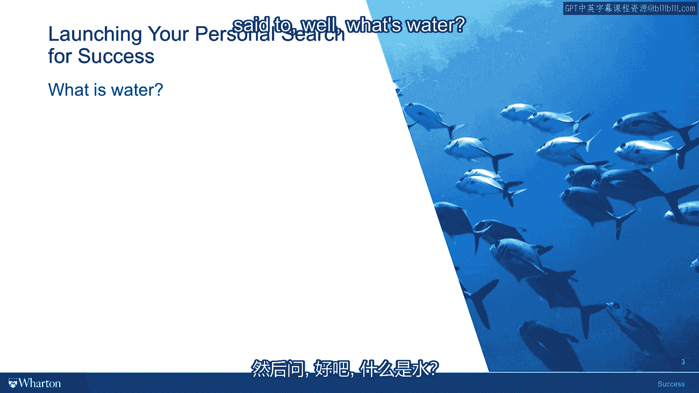

# 沃顿商学院《实现个人和职业成功（成功、沟通能力、影响力）｜Achieving Personal and Professional Success》中英字幕 - P9：8_文化和家庭在塑造你的成功价值观中的作用.zh_en - GPT中英字幕课程资源 - BV1VH4y1J7Zk

 So we've talked about the box that success is and that inside the box you find two other。

 boxes， the inner life of happiness and fulfillment and the outer life of career status and achievement。

 But you might ask yourself how did this box get filled up？ Who put it all there？

 And the most important next layer you have to penetrate as you begin thinking about what。

 success really means to you is the sources of these values。 And you immediately confront a very。

 very important cultural source for the values。 And within any given culture。

 your family will be like a prism that will focus certain aspects。

 of the cultural values that are sailing it to your families into your sets of assumptions。

 about what you ought to be doing and what counts and what doesn't count and what will。

 earn you praise or what will earn you disappointment。 So culture and family。

 two really important things and very difficult to get a grip on。

 There was a novelist， David Foster Wallace， a modern novelist who gave a commencement。

 address at Kenning College in 2005 and he told the story that I think illustrates why。

 this is such a difficult subject to get a grip on。

 And in the story he said that there was an old fish that was swimming along in the water。

 and two teenage fish came swimming around and passed him going the other way。

 And as the two teenage fish went by him， the old fish said to them， "How's the water？"。

 And the two teenage fish were a little upset with being spoken to by a stranger and they。

 didn't really know what to do so they just kept swimming。

 But about ten yards away the one teenage fish turned to the other teenage fish and said， to， "Well。

 what's water？"。

 Now that question of course is the kind of question that teenage fish would have more。

 trouble answering because the older you get， the more experience you have， the more different。

 life events have happened to you， the more you become aware that you're swimming in your。

 own culture with your own cultural assumptions and that you are motivated by， impel by， almost。

 obsessively seeking validation within the cultural and family values that you've been。

 surrounded by your whole life。 They are part of you just the way that your heart is part of your body。

 So separating yourself from that， getting perspective on that so that you can embrace， modify。

 reject the cultural and family values that have defined success for you， a very。

 important part of the journey that studying the subject and thinking about success has， in store。

 [BLANK_AUDIO]。

