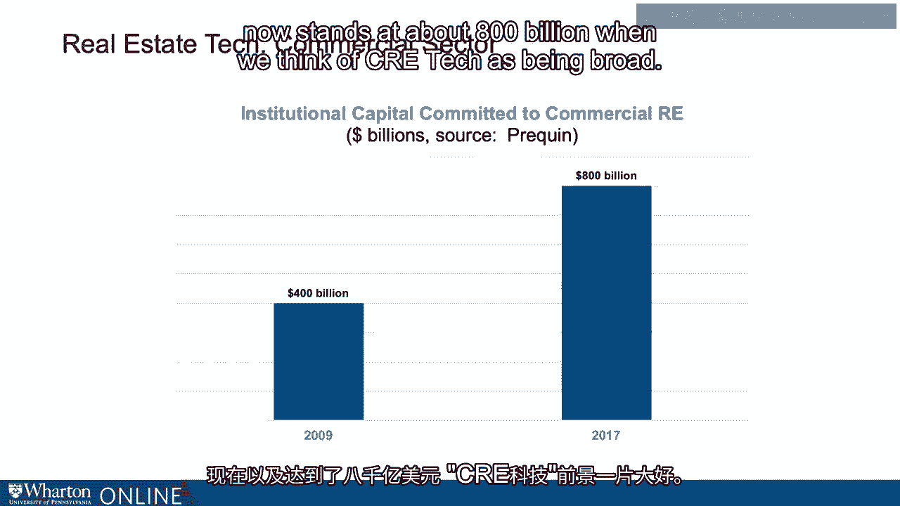

# 沃顿商学院《金融科技（加密货币／区块链／AI）｜wharton-fintech》（中英字幕） - P100：13_商业房地产领域.zh_en - GPT中英字幕课程资源 - BV1yj411W7Dd

 Now let's talk about the commercial side of the industry。

 It's a segment that is dramatic in size。 Real estate tech for the sector otherwise known as CRE tech。

 commercial real estate tech， also saw a substantial investment。

 Last year almost $10 billion of investment flowed into CRE tech。 That's a drop from the 2017 level。

 However， that was an outlier， some might say in 2017， resulting from soft banks， multi-billion。

 dollar investment in WeWork。 CRE tech also goes beyond apps， algos and websites。

 It includes all kinds of value added， technologically related tools like IoT， Internet of Things。

 inherent in the commercial space and of course also in the residential space。

 Nest tag for example offers key Fox to control home functions， smart thermostats， home automation。

 photovoltaic glass to save on energy while also generating and putting solar cells inside。

 glass and then tech enabling construction， maintenance， monitoring， aggregating information。

 not just for a given office space but across buildings or multiple buildings residences and， so on。

 The increase in institutional capital flowing into the space has both motivated and provided。

 for this kind of innovative technology R&D historically and we see it in today's values。

 For example， between 2009 and 2017， that's just eight years， we saw a doubling of institutional。

 capital committed to CRE tech。 400 billion now stands at about 800 billion when we think of CRE tech as being broad。

 [BLANK_AUDIO]。

