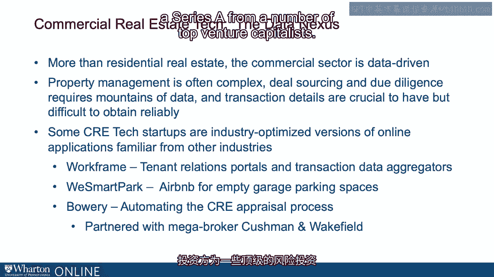

# 沃顿商学院《金融科技（加密货币／区块链／AI）｜wharton-fintech》（中英字幕） - P101：14_数据.zh_en - GPT中英字幕课程资源 - BV1yj411W7Dd

 Although the advent of both value-added and disruptive technology in the residential space。

 involves both the aggregation， disaggregation， and democratization of data， certainly more。

 than residential--the commercial sector has been historically and today data-driven。 For example。

 managing commercial properties is often extremely complex， and that ranges。

 from sourcing deals to doing due diligence to managing property really requiring copious。

 amounts of data and transaction details that are challenging to maintain and to make useful。

 in the aggregate。 It's no surprise then that a number of CRE start-ups are focusing on this space and increasing。

 efficiency， optimizing， and so on， those from other industries。 For example。

 management information systems in the form of firms like Workframe。

 Protocols or portals or platforms for commercial tenants to gain information into access contracts。

 and to provide data and share data back and forth with commercial real estate managers。

 Transaction data aggregates。 All examples of what's going on in the commercial real estate space。

 Here's an example。 We SmartPak。 That is an Airbnb style firm for garage parking spaces。 Again。

 aggregating data， redirecting data， providing for those who are purchasing。 Here's another one。

 Bowery。 This is automating appraisal processes in the commercial real estate space that has been。

 very， let's say， old industry paper-based for many， many years。 Kushman Wakefield。

 the large commercial broker， is partnered with Bowery and the firm， although。

 it's only four years old， has recently raised $12 million in a Series A for a number of top。

 venture capitalists。

 [BLANK_AUDIO]。