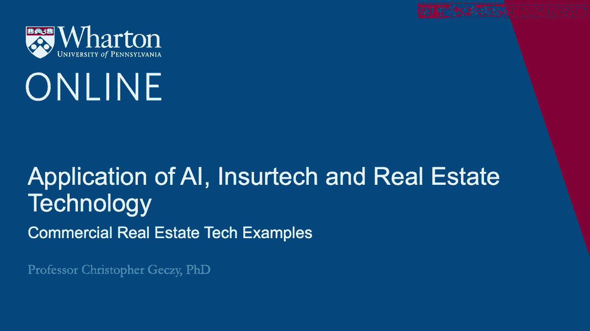
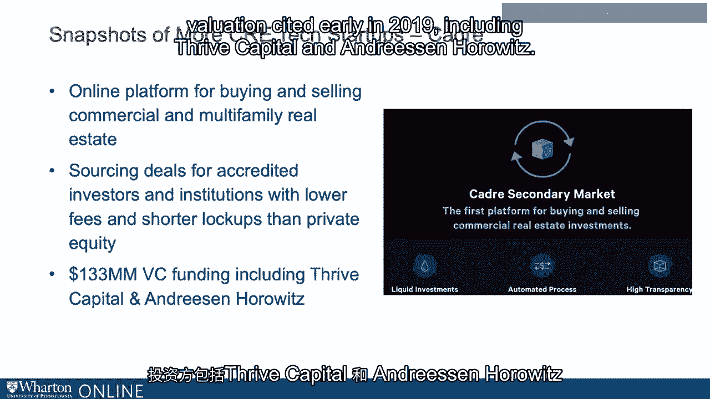
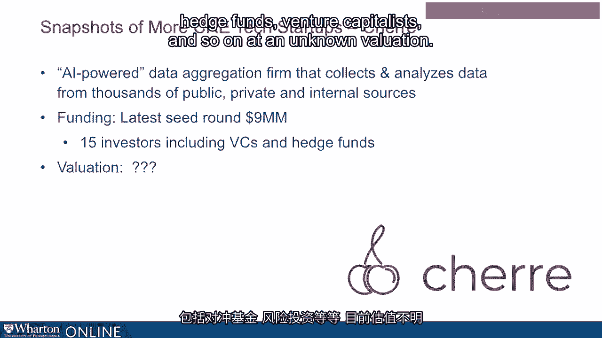

# 沃顿商学院《金融科技（加密货币／区块链／AI）｜wharton-fintech》（中英字幕） - P102：15_商业房地产科技实例.zh_en - GPT中英字幕课程资源 - BV1yj411W7Dd

 A couple other examples would be useful to understand some of the segmentation that we've。

 been discussing。 Take for example， cadre。 Cadre allows for the buying and selling of multifamily real estate。

 apartment buildings， for example， as well as commercial real estate。

 The idea here once again is sourcing deals for accredited investors and institutions。 Again。

 accredited investors is generally defined in the US as those who have a million dollars。

 of invested capital。 Historically， it's also referred to those who have， let's say。

 individually $200，000 of， income over the recent multi-year period in the expectation of having that going forward。

 Accredited investors are interesting because under the Jobs Act， Jumpstart， our Business。

 Act that arose from the Dodd-Frank set of regulation changes post-financial crisis in。

 the US have highlighted accredited investors as being those who can transact on platforms。 Here。

 cadre is reporting to try to lower fees， lockups， and so on for investors providing。

 greater liquidity than private equity。 Interestingly enough。

 Chair Kushner is one of the founders of cadre。 Top-line venture capitalists put up around $133 million at an $800 million valuation。

 cited early in 2019， including Thrive Capital and Andreson Horowitz。

 Another startup， Fundrise， which received just under $60 million of funding from Ren Ren。

 Guggenheim Partners， and other investors， institutional investors， presented a crowdsourcing。

 platform for portfolios of different kinds of real estate， not limited only in this case。

 to accredited investors with a minimum investments of $500。

 a democratization of real estate investing， for those who have small amounts of capital。

 And at around $2。5 billion worth of invested real estate with a recent valuation of about。

 $800 million。 Part of a disruptive， let's call it democratization of what has been historically a much more private。

 investor orientation in commercial investment。 Another one is Cherry。

 which is along the AI vector in FinTech。 Data aggregation。

 but also an analytical data visualization firm that puts together and provides。

 analysis on thousands and thousands of public， private and internal data sources for clients。

 They received a small round recently about $9 million， 15 investors， including hedge funds。

 venture capitalists and so on， and an unknown valuation。

 Again， applying latest purportedly artificial intelligence technologies to data in the。

 commercial space， which is so critical for those actors who are buying， selling， leasing。

 or brokering commercial real estate。 [BLANK_AUDIO]。

