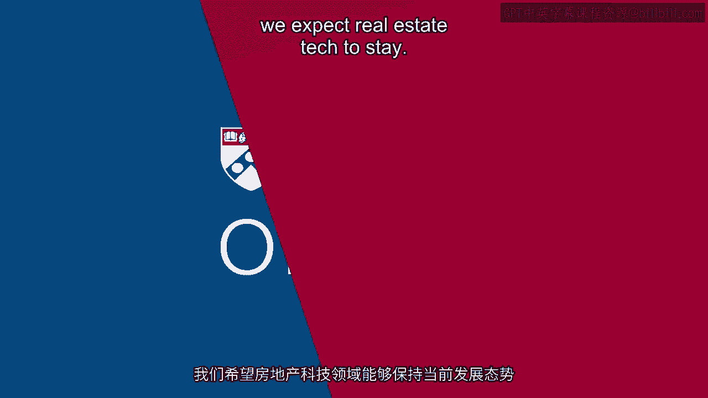

# 沃顿商学院《金融科技（加密货币／区块链／AI）｜wharton-fintech》（中英字幕） - P103：16_总结.zh_en - GPT中英字幕课程资源 - BV1yj411W7Dd

 So while some pundits continue to suggest that CRE tech and real estate technology generally。

 has not yet been fully disruptive and has a long way to go， I think we can clearly see。

 that new models， platforms and a democratization is afoot。

 The economic implications of all of this are vast， again because the real estate industry。

 globally is so large。 Innovation financed by venture capitalists are a key part of it。

 Start-up and innovation and entrepreneurial activities have been critical。 However。

 there are large entrants， including CBRE， that are coming into the space。 We talked also。

 for example， about Cushman Wakefield。 Some of the basic technological innovation that we might see in other parts of life。

 IoT， smart houses， smart properties are going to increase the advent and the availability of。

 data and that's going to lead to ongoing technological disruption and it's going to， become。

 we think， a fairly large sector， again because of the scale at stake。 Just a few years ago。

 let's call it less than 10， it was a tiny sector。 However。

 today it grown dramatically to the tune of billions of dollars of annual funding。

 and expansion of volumes of business done。 Like the rest of the FinTech industry。

 the primary financial goals in CRE and other kinds， of real estate tech include efficiencies。

 profitability， increasing margins from greater， aggregation， applications of low cost technologies。

 operational efficiencies， as well as through， disintermediation of otherwise old school technologies and the human element of real estate。

 Both has been rapid， it's hard to estimate what the future will portend， especially given。

 economic cycles， however I will say this， we expect real estate tech to stay。 [BLANK_AUDIO]。

