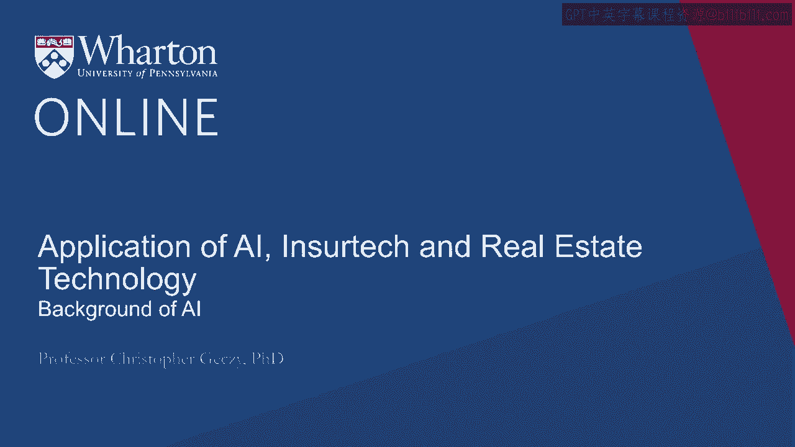
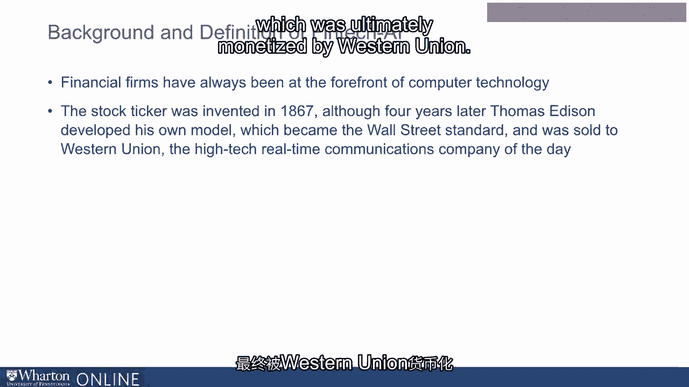
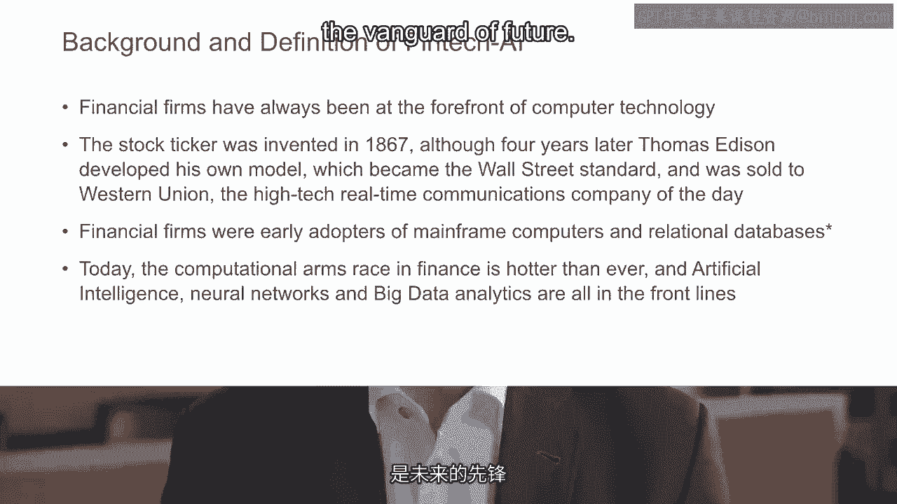
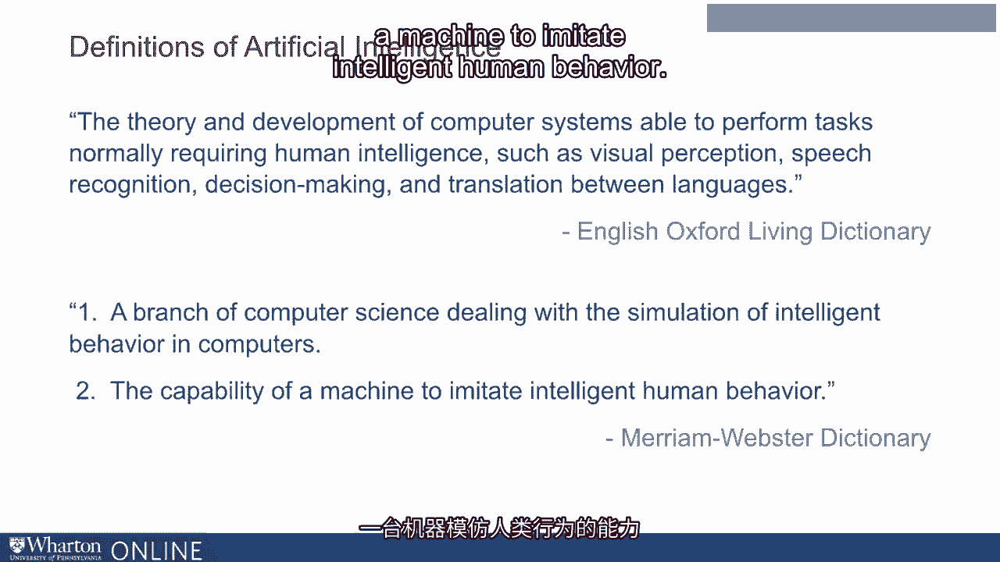
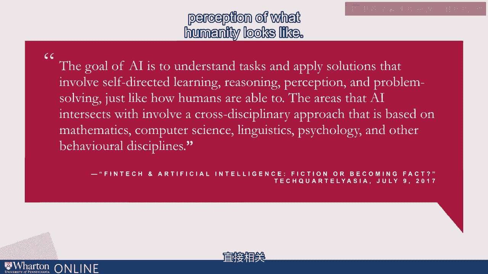

# 沃顿商学院《金融科技（加密货币／区块链／AI）｜wharton-fintech》（中英字幕） - P104：17_人工智能背景.zh_en - GPT中英字幕课程资源 - BV1yj411W7Dd

 Hi folks， welcome back。

 This is Professor Chris Gates again。 In this module we'll be talking about what some have come to consider to be the backbone。

 of FinTech today and certainly in the future， artificial intelligence。

 We'll take a very high level view， a general view of the role of artificial intelligence。

 in the area of financial services， FinTech， Roboadvisory and related adjunct arenas。

 Here's the thing you need to think about as we talk about the role of artificial intelligence。

 At its core， it's about dimension reduction， it's about efficiency， it's about seeing。

 patterns in data or input information structured or unstructured that lends value in financial。

 services。 Artificial intelligence has had a notable history in science and economics。

 Some identify the famous scientist Alan Turing in the 1940s as having developed the first。

 theory underlying the notion of sentient algorithms or sentient machines in defining artificial。

 intelligence。 Turing again famously thought of a machine that could program itself and learn from inputs。

 and experience to simulate humanity。 A famous test called the Turing test is a baseline notion of a self recognizing machine intelligence。

 For example， if an algorithm or an evaluator cannot tell the difference between two parties。

 it has not yet seen say a human and a computer， then the machine via conversation could be。

 considered to be displaying intelligent behavior。 So one of the oldest definitions of artificial intelligence makes direct reference to humanity。

 Of course， our conversation about what it ultimately means to be intelligent or self aware。

 comes down to your metaphysics， it comes down to your ideological beliefs。

 It involves philosophical issues beyond that which we're going to cover here。 However。

 many have treated this over the years， both thinking about the possibilities and。

 potential the challenges and dangers of machine sentience。 In recent times。

 that's arisen in conversations about regulation， auditing and safety of algorithmic。

 approaches in all parts of life。 A colleague recently asked me a question that I felt was surprising。

 He asked me about big data and finance。 Specifically， he asked the question。

 does finance ever deal with big data？ And my response of course was that， well。

 finance invented big data。 That might not exactly be true from all viewpoints。

 but it's certainly the case that financial， firms have involved technology for decades and perhaps even hundreds of years。

 For example， in the late 1800s， the first stock ticker was invented just before Thomas Edison。

 developed his own model for tickers which was ultimately monetized by Western Union。

 Financial firms also were early adopters of computers back then， what we call mainframe， computers。

 as well as databases that could house and rapidly retrieve structured data， in the form of numerics。

 Today， this arms race is hotter than ever and artificial intelligence， natural language， processing。

 the reading and understanding of unstructured data including images， neural。

 networks which represent those who are technically oriented， non-parametric regressions， big data。

 analytics are all at the cutting edge， the vanguard of the future。

 Twenty-five years ago， if we were thinking about accessing various finance databases。

 like the famous Center for Research and Security Crisis Database， the CRISP database or others。

 we typically needed to bear the cost of both time and monetary expenses for direct access。

 We have to have a computer terminal and maybe a license。 Today。

 accessing big data is achievable rapidly in smaller formats and even on phones which。

 are today of course ubiquitous。 All that having been said。

 most areas of finance are still oriented around humanity。

 Some would call it not a quantitative pure model but a quantum mental model and ultimately。

 with respect to advisory activities unless you believe that three million years of human。

 advancement has resulted in simply an app。 The idea of interaction。

 the ability to trust activities has confronted the notion of algorithms。

 algorithmic trust in the role of humans。 Computers can simulate humanity especially in routine tasks like onboarding。

 accounting， reporting in some cases regulatory， oversight and so on but the human almost surely has not。

 yet lost its role。 Now the core definitions of artificial intelligence range among various characteristics across official。

 sources。 The Oxford Living Dictionary describes artificial intelligence as "the theory and development。

 of computer systems that are themselves able to perform tasks requiring under normal circumstances。

 direct human intelligence" and that could be understanding of images， recognizing text， or speech。

 making decisions in an unstructured environment with or without partial rules。

 or the advent of partial structures including translation across languages and not just human。

 languages but various languages understandable by machines。

 The American Webster's dictionary describes artificial intelligence as a branch of computer。

 science dealing with again the simulation of intelligent behavior， human behavior in computers。

 presumably or the capability of a machine to imitate intelligent human behavior。

 Others have identified artificial intelligence as aiming to try to understand tasks， processes。

 and of course products that encode them toward the application of solutions that involve self-directed。

 learning which some would suggest is the equivalent of reasoning， self-awareness， perception and。

 problem solving in a manner that is at least from an observational perspective how humans。

 are able to perform。 Areas in which artificial intelligence relate to other disciplines like mathematics。

 computer， linguistic， psychology and other sciences link back directly to the notion and perception。

 of what humanity looks like。

 Thank you。 [BLANK_AUDIO]。

