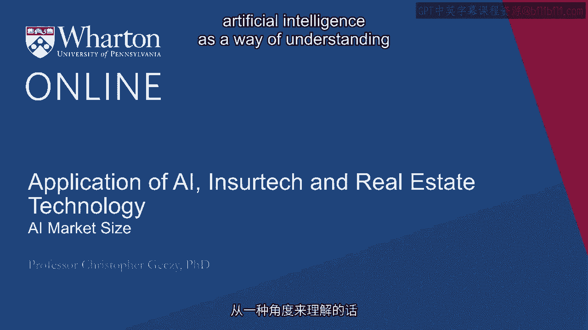
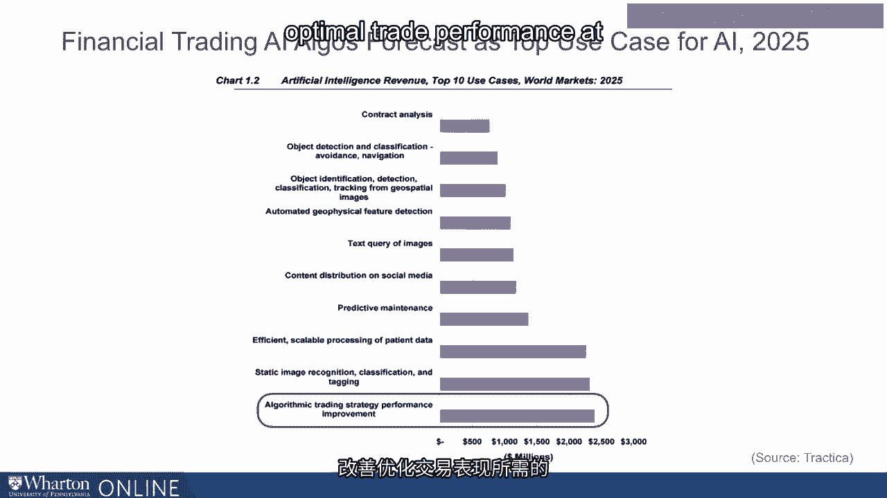

# 沃顿商学院《金融科技（加密货币／区块链／AI）｜wharton-fintech》（中英字幕） - P105：18_人工智能市场规模.zh_en - GPT中英字幕课程资源 - BV1yj411W7Dd

 Now the market size of artificial intelligence as a way of understanding its impact confronts。

 a challenge of how we exactly define what artificial intelligence is。

 Some with a broad view like Forrester Research suggests that more than a trillion dollars。

 worldwide has been invested in some form of computing technology that brings to bear a。

 notion of cognition， whether it's related to direct existing human activities or is new。

 or is confronting or using unstructured information。

 Trappicah Research suggests that the size of AI， again not just in Fintech but more generally。

 is about $37 billion by 2025。 The consulting company Accenture writes that more than $8 trillion in market value will。

 have been invested in artificial intelligence by 2035。 Finally on the finance side。

 Bank of America Merrill suggests that artificial intelligence。

 based systems have or will have about a $70 billion market cap by 2025。 Again。

 your aspect ratio or your definition of industry sector purpose and so on in defining。

 artificial intelligence will give us a sense of how narrow or broadly we define what the， market is。

 But one sense of the scale comes when we realize that artificial intelligence can be applied。

 in nearly every arena whether we're talking about entertainment or finance or even fundamental。

 traditional industries， manufacturing industries and so on。

 The new IoT or Internet of Things concept of devices， tracking data and sharing data across。

 them in a network setting could itself be related or define cognition， self-driving vehicles。

 healthcare bots， wearable devices and so on brings to bear the idea that everything could。

 be connected and so that artificial intelligence will affect every aspect of life。

 Now different observers have identified different areas where revenues and applications are dispersed。

 Drilling down into those provides a kind of view additional to what we mentioned a second。

 ago about some of the specific use cases that may harbor advantage for firms， for financial。

 services professionals and ultimately customers。 Another of the idea of analyzing contracts using artificial intelligence and the attorneys。

 who are listening may be a little bit nervous at hearing this or regulators might be happy。

 to hear about it or compliance officers may be happy as well。

 The idea that algorithms are able to read the texts of contracts and identify areas of risk。

 or areas of commonality with other contracts or discontinuities and so on is an area of。

 rapid expansion and possibility。 The idea of detecting objects， classifying objects physically。

 understanding motion size， understanding how to avoid objects。

 for example with self-driving vehicles is certainly a part， of our future。 Finding imagery。

 detecting identity， classifying， tracking images and objects in real time or。

 in retrospect represents a very large area of current research and possible monetization。

 For example， a series of research projects at the University of Pennsylvania and elsewhere。

 have identified that pictures posted on Facebook can be useful in identifying individual。

 personality but can also be aggregated to identify health risks and other aspects that。

 in a more structured environment would require the intervention of humanity。

 The ability to understand geophysical features or querying of images in efficient manners。

 across perhaps thousands of objects is another area of potential advancement and then preferencing。

 or customizing on social media or elsewhere content including advertising and marketing。

 content is already and will certainly continue to be valuable for those innovators who are。

 bringing to bear the techniques。 Being able to identify normal or abnormal use to be able to predict maintenance requirements。

 ranging from smart homes to vehicles even potentially to your portfolio。

 Another area of identified revenues。 Healthcare applications of artificial intelligence have been made famous by a number of players。

 some of whom will talk about in just a bit but the idea that the processing of patient。

 data specifically or in the aggregate giving rise to potential treatments of very intractable。

 challenges like sepsis or healthcare challenges including outbreaks even specific cases of。

 patient wellness doing it quickly doing it at scale and doing it a way that provides structure。

 which under normal circumstances would either be prone to frailties and biases that humans。

 naturally have for example doctors making different diagnoses based on the time of the。

 day in which they see patients but also again aggregating trends in a way that may provide。

 betterment in general healthcare。 Classifying static images or what we call unstructured data in real time or in delayed。

 fashion adding tremendous potential revenue value over time and then finally the area。

 identified often as the area for greatest investment in the financial industry algorithmic trading。

 I often hear complaints about how individual investors feel they aren't able to keep up。

 with so-called algorithmic trading on exchanges。 Well let me just say this if you make a trade even if it's through say a discount broker。

 almost certainly there are trades being executed for your own specific directions algorithmically。

 It's hard to imagine any trades having today that aren't somehow bolstered by technical。

 algorithms and electronic connections but the next generations will improve the dimension。

 reduction required for optimal trade performance at an ever faster rate and with more accuracy。

 Thank you。 [BLANK_AUDIO]。

