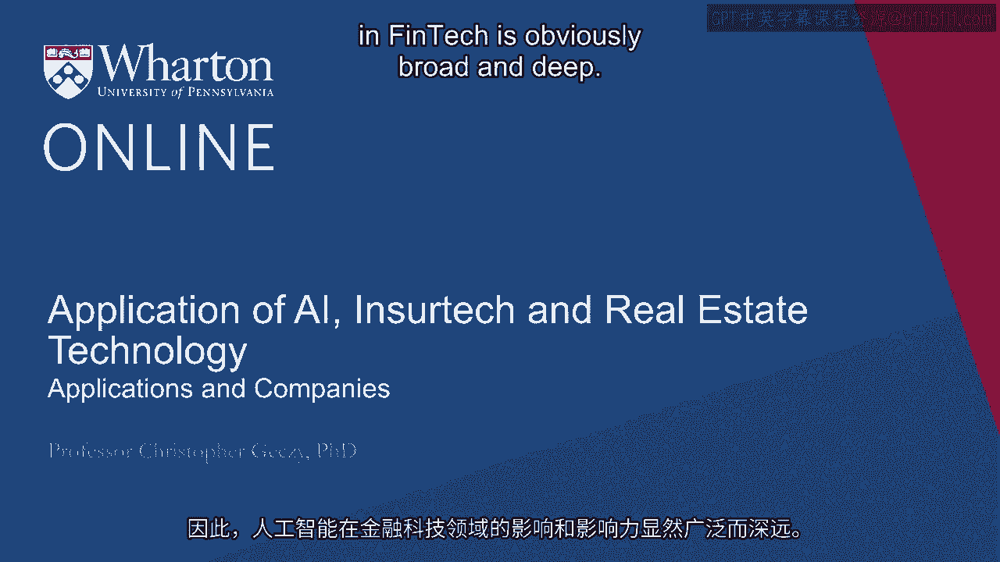
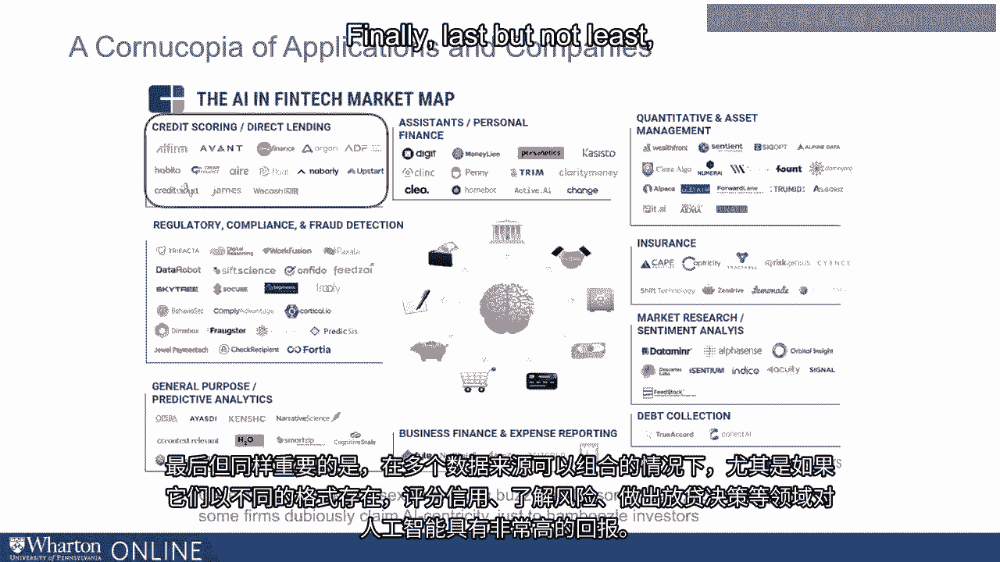
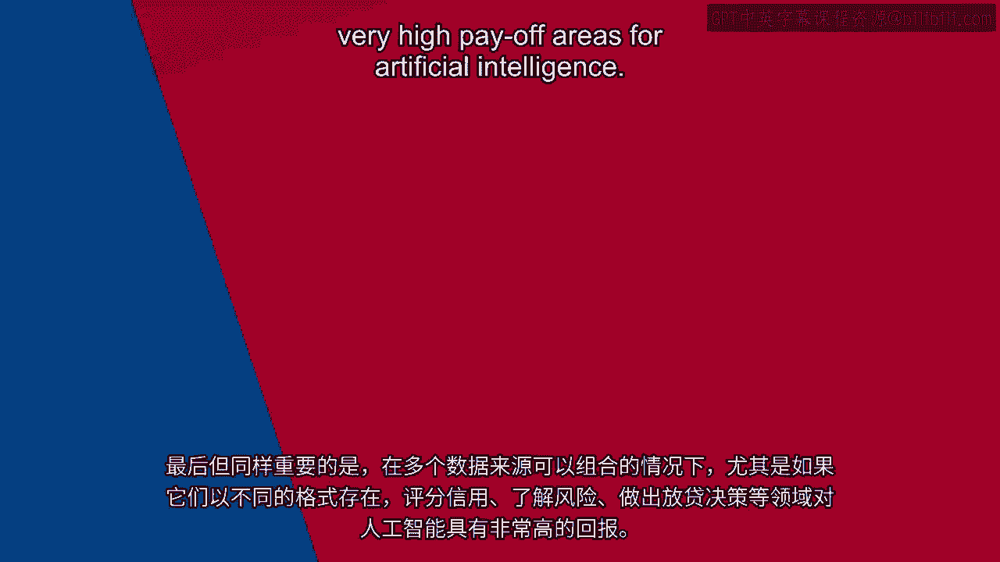

# 沃顿商学院《金融科技（加密货币／区块链／AI）｜wharton-fintech》（中英字幕） - P106：19_应用和公司.zh_en - GPT中英字幕课程资源 - BV1yj411W7Dd

 So， the reach and impact of artificial intelligence in FinTech is obviously broad and deep。

 To get a sense of the various kinds of applications and a number of companies that have targeted。

 activity in those areas， it's useful to take a look at a map like the CB Insights AI in。

 FinTech market map。 Some companies have focused on the B2C market in providing personal financial advice or financial。

 assistance in some cases providing aggregation services or financial advice or wealth management。

 services。 Others have focused more directly， although in some cases still in the B2C arena on quantitative。

 asset management， either again at the trading level or at the general portfolio allocation， level。

 Insurers find all kinds of uses of artificial intelligence ranging from credit risk management。

 to claims integrity across the value chain in the industry。 Market research。

 including the analysis of market sentiment， has become a burgeoning。

 area of both investment and product development。 The ability to reduce the dimensionality of very complicated structured。

 including numerical， data as well as unstructured data ranging from news streams across multiple languages to。

 images and so on delivered to the desktop of financial professionals is really quite raging。

 Debt collection and the ability to follow people who have debts across time and across。

 geographies is an advancing arena of both investment and activity。

 In the mundane task of expense reporting and tracking， business activities has become a。

 natural arena in which artificial intelligence has the possibility of improving outcomes for。

 its users。 Predictive analytics， which is about as broad an areas one can imagine。

 has seen tremendous， investment and also has promised some substantial outcomes， again。

 including unseen possibilities。 As a personal example。

 a couple years ago at a conference for the Jacobs Levy Center， that I run at Wharton。

 we had a paper describing how the financial crisis potentially could。

 have been better identified as far back as 2005 based on predictive analytics and big。

 data analysis of both statements and financial reporting from financial services firms。

 Using internal or external data， the artificial intelligence applications for detecting fraud。

 regulatory compliance， the bailiwick of chief compliance officers and others is a natural。

 locus for artificial intelligence applications。 In the gray area of aggressiveness in disclosures。

 accounting statements and corporate activity， has been linked back to analysis of unstructured data。

 For example， some articles have been published， including in the top accounting journals。

 suggesting， that C-suite executive behavior， which is detectable using pictures which represent levels of testosterone。

 in executive biologies are related to， again， accounting aggressiveness and in some cases， fraud。

 Finally， last but not least， the ability to score credits， understand risks， make lending。

 decisions， especially when multiple sources of data can be combined， especially if they。

 are in different formats， or very high payoff areas for artificial intelligence。 [BLANK_AUDIO]。

