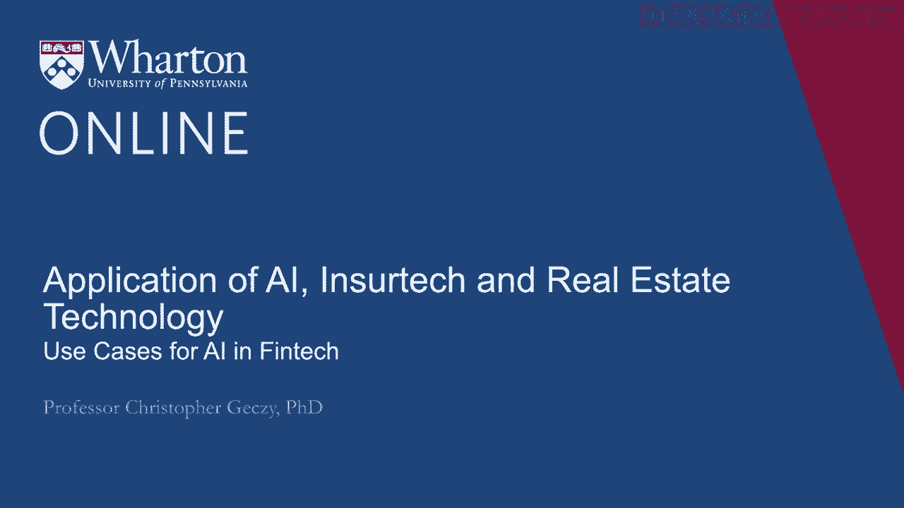
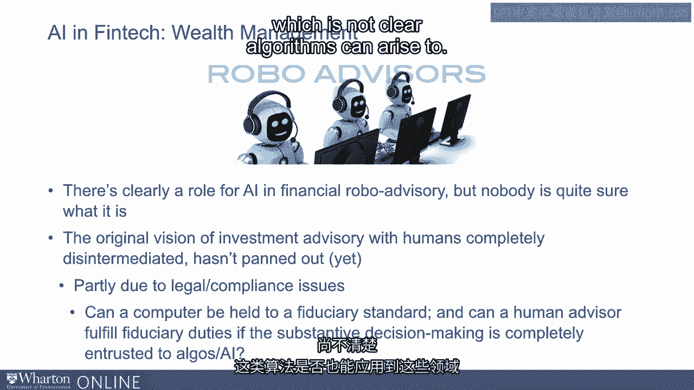

# 沃顿商学院《金融科技（加密货币／区块链／AI）｜wharton-fintech》（中英字幕） - P107：20_人工智能在金融科技中的用例.zh_en - GPT中英字幕课程资源 - BV1yj411W7Dd

 So what is the traditional argument for how artificial intelligence can provide value。

 in areas that have been traditionally occupied by human intelligence？ For example。

 general decision making。 Well， the first thing is lower cost and the ability to operate at scale and operate efficiently。

 For example， well-known human biases that include order effects， in other words， in。

 humans make different decisions for the same challenges or questions based on the order。

 in which they see them， effects related to time of the day or mood， the impact of individual。

 experiences。 For example， a doctor gets into a crash on the way to the office。

 Turns out that can affect decision making。 Well， algorithms ostensibly not only allow scale and speed but a kind of regularity that。

 would otherwise not necessarily be in place for human decision making。

 Machines may not be only less error-prone than humans but could do all of the above faster。

 and again at greater scale。 Another fascinating area where artificial intelligence has seen success in use cases is automated。

 customer support。 Some of you might have had the experience in which either through a chat bot online or。

 even speaking on the phone， you've encountered algorithmic counterparts or decision trees。

 that appear to take a kind of human character when you interact with them。

 Having a kind of personal touch or the ability to be relatable。

 It's clear to see how this might lower costs because the marginal cost of an algorithm。

 might be nearly zero whereas the marginal cost of a person may be related to wages and。

 benefits and so on。 In addition， 24/7 availability may augur the case for algorithms in customer support for。

 the rest of time。 Now there are some controversies。

 Clearly we see in the RoboAdvisor industry applications involving AI in a future for， AI。

 However it's not so clear exactly what the role will be in equilibrium and in fact whether。

 equilibrium is stable or constant at all。 There have been some who have suggested that the entire investment advisor industry will。

 move away from humanity and toward algorithms， interaction with chat bots or RoboAdvisors。

 and ultimately disintermediate humanity。 In part due to legal and compliance issues however at least currently it's unlikely。

 in the near term that a computer can be or will be held to a fiduciary standard which。

 is required in most countries including the US by laws。

 For example the investment advisor act of 1940 requires a kind of fiduciary duty or the。

 employer retirement income securities act， ARISA which governs pension related activities。

 in some cases requires a kind of fiduciary duty which it's not clear algorithms can arise。

 to。 This controversial area will certainly be addressed in the next several years。 Thank you。

 [BLANK_AUDIO]。

