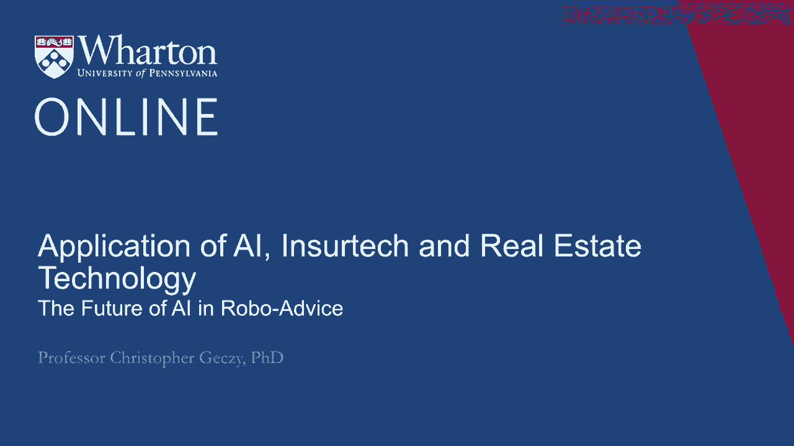
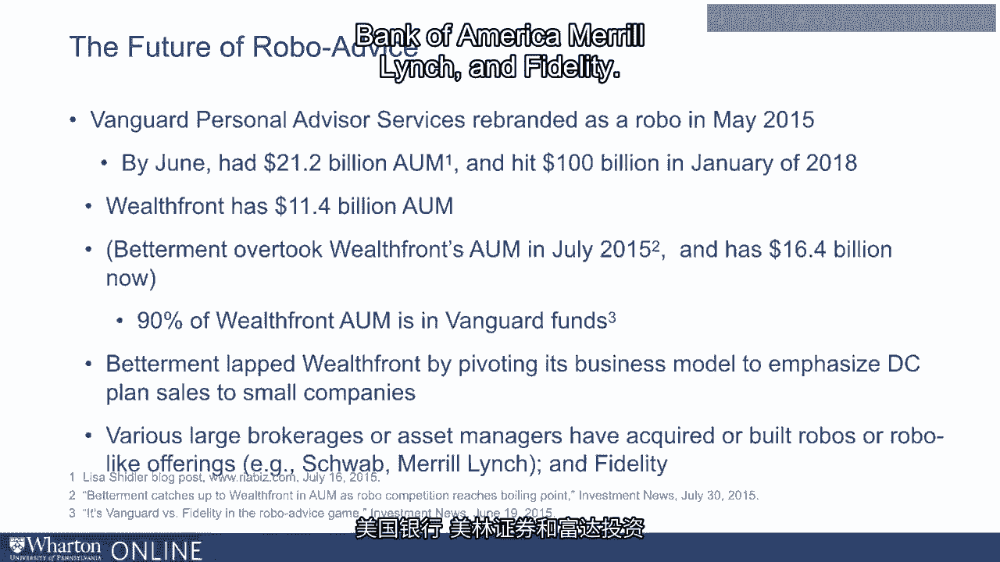

# 沃顿商学院《金融科技（加密货币／区块链／AI）｜wharton-fintech》（中英字幕） - P108：21_机器人投资建议的未来.zh_en - GPT中英字幕课程资源 - BV1yj411W7Dd

 So let's talk about the future of artificial intelligence in RoboAdvisor， especially as。

 it relates to interactions with customers directly。

 The definition of RoboAdvisor and RoboAdvisor-y activities is fairly fuzzy。

 It originally meant a kind of business model organized around algorithms to reduce costs。

 of client service， disintermeeting humans。 However， today that definition has changed。

 Now we think of it as a financial advisory firm， a practice， an enterprise in the financial。

 services industry using an algorithm to build a customer allocation based on automated and。

 usually online inputs。 Those so-called RoboAdvisors usually provide capture of client information。

 their goals， their capacity， their preferences or their tolerance for taking risk。

 It includes output of portfolio allocations or a set of portfolio allocations or options。

 for clients to choose。 It could also include automated rebalancing of positions across time or across market。

 conditions changing or it could involve， and in some cases， reportedly does， tax loss harvesting。

 or optimal rebalancing of taxable portfolios。 And finally， of course。

 automated reporting which in an industry that has found automated。

 reporting to be at least historically challenging， a welcome feature。 Theoretically speaking。

 because algorithms and artificially oriented bots can learn from， experience。

 perhaps they can become more personal and more human and therefore more relatable， across time。

 Perhaps they can also make more responsible decisions。 However。

 recent market experience including across periods of market volatility suggests。

 that most clients are comfortable without human oversight at some point in part that comes。

 down to trust or the lack of trust in algorithms especially in the face of uncertainty about。

 the outcomes of the algorithm。 Two of the largest so-called Robo's that are independent of larger firms namely Wealthfront。

 and Betterment both have client services representatives as an example。 As far as we know。

 no pure vision of the original Robo notion has been achieved。 However。

 the model is incredibly useful because it sets a baseline and ultimately a cost-based。

 competitor to the traditional human-only model。 Almost surely where it's all going will involve what we now call a bionic model linking humans。

 and algorithms and hopefully the best of both worlds together。 As you might recall。

 growth has been tremendous in this area。 Vanguard personal advisor services rebranded as a Robo in May of 2015 then had around $21。

 billion in assets。 As of 2018 it had over $100 billion。

 Wealthfront the independent Robo currently has over $11 billion and Betterment now has， 16。5。

 90% of Wealthfront's assets are allocated to Vanguard funds。

 Although the business strategies of these two large independent Robo firms has differed。

 for example Betterment recently shifted its business model to emphasize defined contribution。

 retirement plan activities as opposed to purely non-taxable B2C business both have seen。

 traumatic growth。 In addition， traditional brokerage firms including discount brokerage firms have offered Robo。

 like offerings including Schwab Bank of America Merrill Lynch and Fidelity。

 Thank you。

