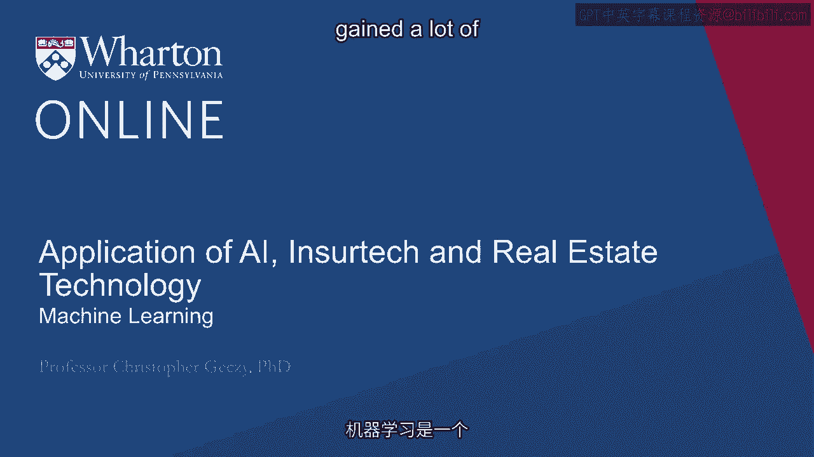
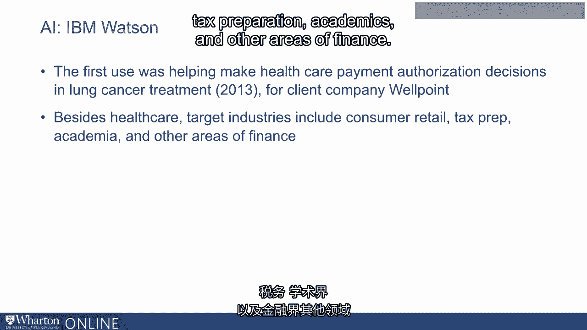

# 沃顿商学院《金融科技（加密货币／区块链／AI）｜wharton-fintech》（中英字幕） - P109：22_机器学习.zh_en - GPT中英字幕课程资源 - BV1yj411W7Dd

 One area of artificial intelligence that has gained a lot of traction and attention is machine learning。

 Essentially the idea that using neural networks or related technologies allows computer algorithms to so-called learn across time。

 The idea behind machine learning at its core is to allow computers using structured algorithms to acquire knowledge。

 extracting patterns from input data rather than following rules themselves。 In other words。

 pattern recognition based on input data which is structured in the form of say numerics or unstructured in the form of language text images and so on。

 In the insurance industry for example， there are some insurers and others in the distribution chain who are using machine learning。

 However， the National Association of Insurance Commissioners has identified that most insurers are only using 10-15% of the data that collect from customers and from the environments in which their customers operate。

 Machine learning potentially could allow insurers to extract more information from this large sample set of data they have。

 For example， they potentially could analyze claims data better。

 They could understand the risk of their businesses better。

 They can use mathematical models including machine learning models to predict the man for products and of course to estimate premiums more accurately。

 As we've mentioned in other lectures， detecting fraud。

 identifying patterns of behavior that are not obvious to human adjusters who classically use their understanding of human behavior to detect fraud along with identification of fraudulent image provision。

 Processing claims ensures using machine learning to make more automatic claims reporting and processing。

 improving potentially customer satisfaction。 And ultimately one of the most important jobs of an insurance carrier making underwriting decisions。

 Analyzing data， collecting data from applicants individually and in the aggregate。

 perhaps flagging errors or inconsistencies that underwriters themselves may not be able to see。

 Or see irregularly。 In addition， computers can check external sources such as social media to verify accuracy of data and also provide estimates of risk。

 As we mentioned earlier， algorithmic trading and portfolio construction by institutions represents one of the largest areas of growth for artificial intelligence。

 A recent survey by Barkley Hedged found that more than half of hedge fund surveyed are currently using artificial intelligence or some form of machine learning to help create portfolio strategies。

 trading algorithms and make investment decisions。 About 25% of money managers themselves and not just their brokers are using it for trade execution。

 monitoring and decision making。 Now understanding exactly what AI is to all participants is a challenge。

 In fact， not necessarily every algorithm could be classified as artificial intelligence。 However。

 responses to a survey which is ultimately made public is likely to mask the true depth and breadth of the penetration of artificial intelligence in the trading world。

 And of course， there are numerous well-known examples of hedge funds like Renaissance Technologies。

 Bridgewater or DE Shaw that are often mentioned as pioneers and have been for decades in the area of artificial intelligence machine learning。

 However， due to confidentiality concerns， presumably details are limited。

 Another area of both academic research and industry interest is the area of textual analysis。

 reading news stories， financial press releases， firms release of quarterly reports known as 10Qs or annual reports known as 10Ks as well as other regulatory filings that are available in public databases。

 In recent years， several hedge funds launched specifically focusing on exploitation of this strategy。

 However， we haven't heard much about their success or failure which should not be a surprise to anyone。

 Now perhaps the most famous brand in all of artificial intelligence to date is the IBM Watson。

 Watson， which gained its name from legendary CEO Thomas Watson。

 began as a computer which beat human opponents on Jeopardy nearly a decade ago。 Later。

 IBM took the famous IBM Watson name focusing on an AI system capable of collecting。

 curating and analyzing data， including natural language and natural language processing。

 ultimately designed to beat the Turing test。 A number of products across different types of businesses has resulted。

 The first use for IBM Watson's team as far back as 2013 was assisting in healthcare payment authorization decisions in cancer treatments。

 This was for a client company called Wellpoint。 In addition to healthcare。

 other target industries purported for IBM Watson including retail， tax preparation。

 academics and other areas of finance。

 Thank you。

