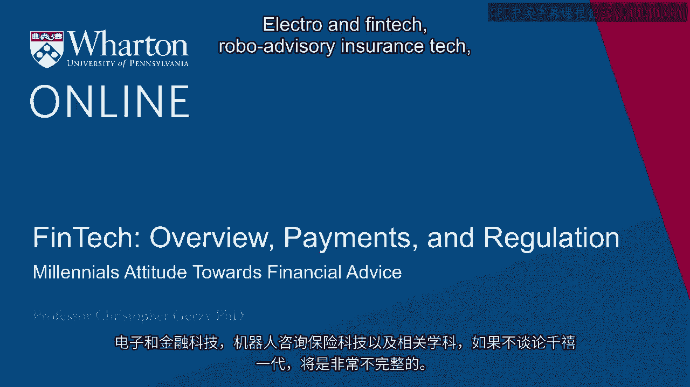
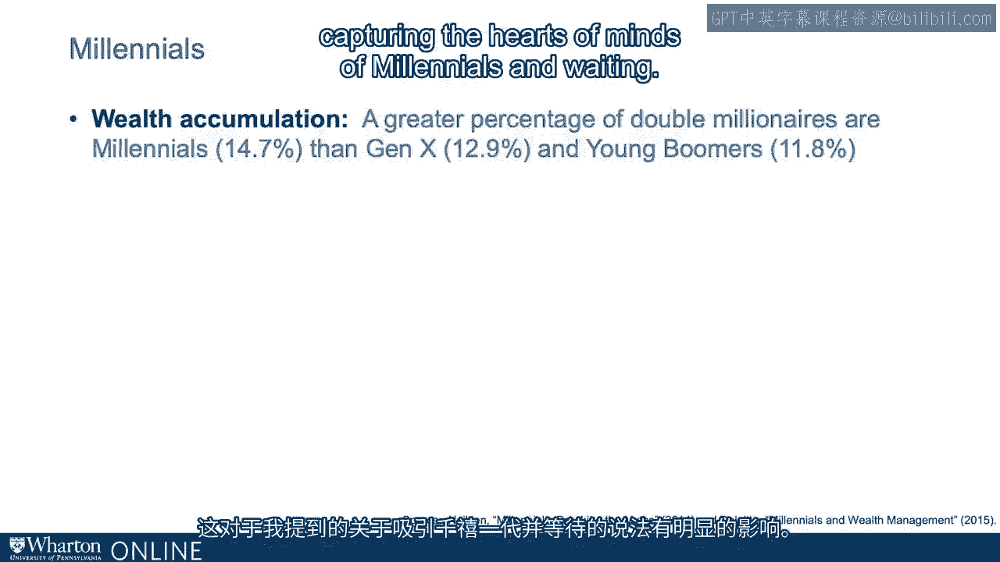
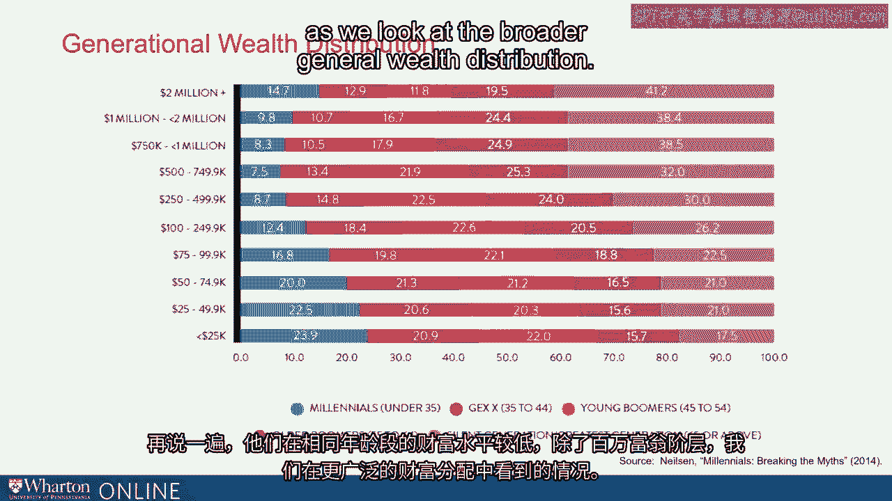
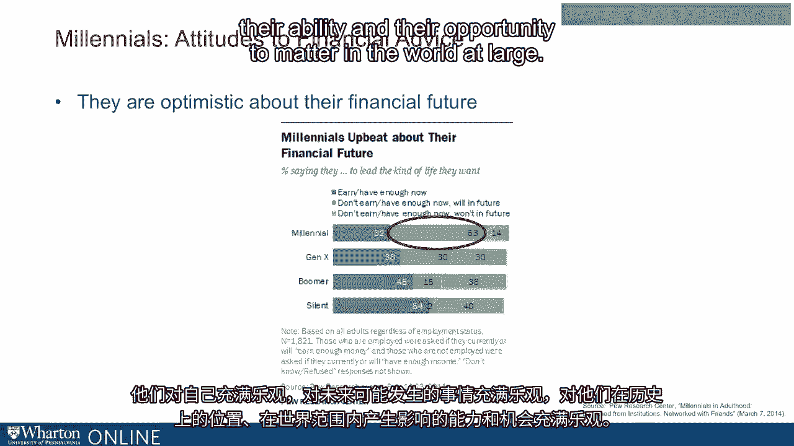
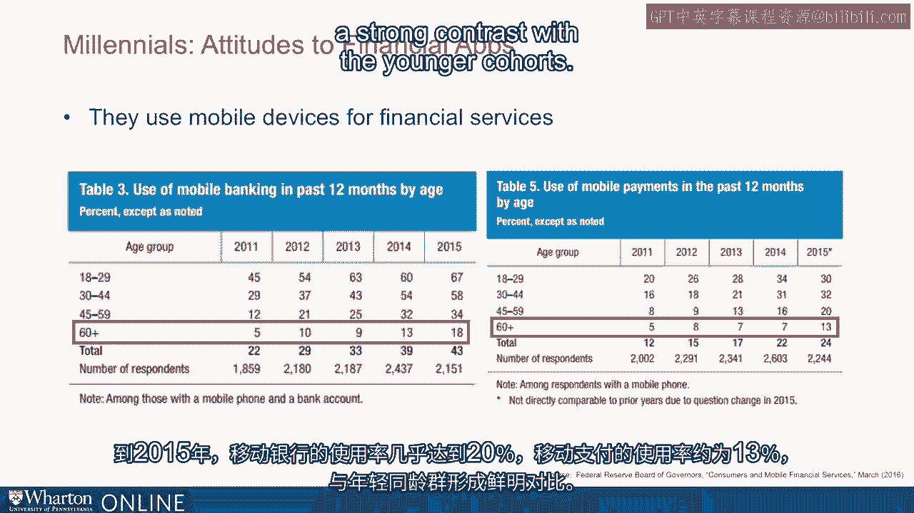

# 沃顿商学院《金融科技（加密货币／区块链／AI）｜wharton-fintech》（中英字幕） - P10：9_千禧一代对金融建议的态度.zh_en - GPT中英字幕课程资源 - BV1yj411W7Dd

 A lecture on FinTech Robo-Advisary Insurance Tech and related disciplines would be wovelling。

 complete without talking about millennials。 In part because the financial advisory insurances and other FinTech industries are so keenly。

 aware of how important the millennials will be。 In part because they're going to be inheriting so much wealth and because of their very fast。

 adoption of technology。 In the words of one FinTech founder， a major FinTech founder。

 they're going to disrupt， the industry。 They're going to target clients and in particular they're going to target millennials。

 I asked this founder， are they going to pursue a bionic approach， a fully bionic approach。

 and the answer was no。 In fact， this particular Robo-Advisor founder wants all advisors non-Robo-oriented dead。

 It's a strong statement。 How is he going to do it？

 He's going to wait until millennials inherit the wealth， having captured their hearts and。

 minds early as customers。 Well， millennials are those individuals born generally in the late 1970s through the mid-1990s。

 There are various definitions。 Some describe them as being born in '77 through 1995。

 but they're roughly 20 to 40 years old， give or take a year。 Of course。

 there are many gradations of those millennials and of course， we're also abstracting。

 fairly broad when we talk about them。 But as many know very well。

 they represent large portions of the US population。

 Almost 85 million members of the US population as of 2015。

 That's 25% of the US population would be self-defined as millennials。 Globally。

 it's even a larger proportion。 Just about 40% of the global adult population in 2015。

 we would classify as millennial。 Nielsen's， the well-known consumer research organization。

 describe millennials as diverse， expressive， and optimistic。

 They have a number of differentiations within their own demographic， including with income。

 The medium income was $25，000 for those under 28 years old， and for those above about $50，000。

 just about twice the younger millennial level。 25% were married in 2015 that contrasts strongly with previous generations。

 like baby boomers， who saw 42% of their demographic married at the same age。

 They're also more ethnically and racially diverse than previous generations。 Interestingly enough。

 they are not poor on an asset level compared to previous generations。

 Nielsen reports a greater percentage of double millionaires are millennials， 14。7%， than。

 Gen X and young boomers， 12。9%， and 11。8%， respectively。

 This has clear implications for the statement that I mentioned about capturing the hearts。

 of minds of millennials and waiting。 The wealth distribution of millennials is broad and diverse and to be distinguished from。

 the wealth of other generations。 The Nielsen data stratify those who are millennials。

 which they define as those under 35。 Generation X 35 to 44。 Boomers on the young side 45 to 54。

 older baby boomers， essentially， traditionally retirement， age anyway， 55 to 64。

 Then the silent generation， sometimes known as the greatest generation， 65 or above。

 Millennials are in the blue。 What we see is that a larger proportion of millennial millionaires exists as of that。

 date compared to Generation X or the young baby boomers。 However。

 there's a much larger proportion of millennials who have under $25，000 in total， wealth， about 24%。

 In other words， they are more diverse and are more diverse， especially in the extremes。

 To say it one more way， they represent at the same age lower levels of wealth except。

 in the millionaire class as we look at the broader general wealth distribution。

 In addition， millennials have what we might characterize as a skeptical view toward financial。

 advice。 They are generally characterized as having optimism about their future。

 Yet half millennials think there will be no money for them from government subsistence。

 programs like Social Security when they retire。 Only 6% of millennials expect to receive Social Security payments at levels available。

 to current retirees in a recent survey。 According to US Trust。

 about 2/3 of millennials see their investment decisions as a way to。

 express impact in a way that goes beyond purely that which is financial。 In other words。

 environmental， social， political values may be expressed in by way of impact。

 investing or ESG investing using their assets。 Meanwhile， in 2015。

 a survey held that one-third of advisors are not likely to represent an， impact investment。

 In other words， there seems to be a mismatch between traditional advisory practices and。

 the hearts and the minds of millennials。 That having been said， in other words。

 70% of advisors are reporting inquiries about， impact。

 Additional recent data tell us that about 70% of millennials here defined as those born。

 in '81 through '96， and this slight disagreement about the range that covers millennial birth。

 cohorts。 They felt confident and well prepared to handle the money that they will either earn or inherit。

 from their families。 That distinguishes themselves dramatically from previous generations at the same age。

 For example， 73% of generation Xers， 86% of boomers， and almost 90% for the silent generation。

 felt confident to handle their family's money。 However， 80% of millennials own a smartphone。

 90% of millennials check their smartphones within the first 15 minutes of waking up。

 What are they doing？ They're checking social networks。 They're also extremely entrepreneurial。

 More than half in the reported surveys and that comes from U。S。 Trust， Deloitte， and the。

 Federal Reserve have started a business plan or their own businesses。

 Almost under 30% report being self-employed in some way。 That having been said。

 some recent research from the Federal Reserve Bank of St。 Louis。

 in its income stability unit has found that 60% of U。S。 millennials have zero exposure。

 to public equities。 That may be inherently contrasted with the fact that they may own their own businesses。

 or have entrepreneurial aspirations。 When they do hold public market equities。

 they hold only about $7，600， which is significantly。

 lower than the Gen X reported value at the same age。

 Millennial households had an average net worth of $90，000 in 2016 compared to $130，000 for。

 Generation X in 2001。 In other words， once again， at the same age。

 The Federal Reserve data found that 81% of millennial workers don't believe Social Security。

 will be there for them。 And in fact， more than half expect nothing。

 This is from the Pure Research Center。 More than that。

 more millennials believe in UFOs than believe that Social Security will， persist。

 And yet they are optimistic about their own personal future and their desire and ability。

 to matter in the world at large。 However， trust is an issue。

 which for those of us who live through the great financial。

 crisis and market shocks that were potentially viewed by millennials is not that much of。

 a surprise。 A characteristic of millennials is a perennial low level of trust， not in themselves。

 but， in others。 The Pure Research Center has been tracking this for decades。

 What we see when we look at the boomer generation versus the silent generation in Gen X is as。

 time has progressed and as they have been at younger ages more exposed to dramatic volatility。

 in markets， trust levels have gone down。 What you see here is from a question asking。

 generally speaking， would you say that most， people can be trusted or that you can't be too careful in dealing with people asked of。

 respondents in those categories？ Recently， 40% of boomers responded that generally speaking。

 most people can be trusted。 37% of the silent generation， 31% of Gen X， however。

 less than 20% of the millennial respondents， responded that people can be trusted。 However。

 while they may be skeptical and less trusting about others and although they may。

 generally have lower levels of wealth than income currently compared to previous generations。

 they are nonetheless the most optimistic generation about their financial futures。

 The research from the Pew Center we mentioned a second ago revealed that only 32% of millennials。

 said they currently have enough to live now。 That compares and contrasts fairly strongly with Gen X boomers and the silent generation。

 respondents。 40%， approximately 40% of width， 45% of which and 54% of which responded that they currently。

 have enough to live the kind of life that they want。 However， while they don't earn enough now。

 they expect to in the future 53% of millennials， responded in the positive whereas 15% of boomers said the same thing。

 Now of course there are age and cohort effects here but it is undeniable that millennials。

 are at a base level optimistic about their own futures。 They're optimistic about themselves。

 They're optimistic about what the future may hold and they're optimistic about their place。

 in history and their ability and their opportunity to matter in the world at large。

 So then why does FinTech hold promise for millennial customers？

 Well in part it's because of their adoption of technology which has increased over time。

 and differentiates itself from adoption by other cohorts。

 The Federal Reserve Board of Governors continued their research in a recent survey focusing。

 on consumers and mobile financial services highlighting the use of mobile banking and。

 mobile payments in an amplified context so to speak。

 The younger millennial generation here listed as 18 to 29 was the greatest adopter of both。

 mobile banking and mobile payments in the survey period and of course as we move along。

 the age distribution from younger to older in any given period covered by the survey which。

 ranged from 2011 to 2015 we see that we have decreasing adoption and use of mobile banking。

 and mobile payments。 Let's first treat the time pattern。

 Let's take for example the millennial young generation 18 to 29 we see in 2011 45% of that。

 cohort use mobile banking。 20% use mobile payments。

 By the end of 2015 it had gone to almost 70% for mobile banking and about 30% for mobile， payments。

 That's an increase of 50% for mobile payments and about 40% for mobile banking。

 As we go from the 18 to 29 year old cohort to the 45 to 59 or the 60 plus cohort we see。

 a small fraction of the same level of adoption。 It is not the case that adoption of financial technology by way of mobile apps is a millennial。

 only phenomenon or the growth rate can be only attributed to millennials but it's predominantly。

 a millennial thrust。 For example if we look at the 60 plus cohort in 2011 only 5% reported using mobile banking。

 apps and 5% reported using mobile apps by 2015 that had gone to almost 20% for mobile。

 banking and about 13% for mobile payments。 A strong contrast with the younger cohorts。

 So millennials are reported by researchers to be optimistic， to be diverse， to be interested。

 in how they fit into the world and their impact。 They're viewed to be optimistic about their futures although they may as a matter of fact。

 have less financial capability currently and they've adopted technology。

 As a side question but one that turns out to be fairly important we might ask where do。

 the time variation come from。 Sociologists certainly will continue to research the matter but we do have some。

 knowledge from our understanding of the implications and the impact of market volatility on behavior。

 That's the area of risk aversion or risk tolerance and it turns out that with respect to the millennial。

 cohort but also more generally market volatility has probably changed behavior and we can see。

 it in the numbers。 [BLANK_AUDIO]。

