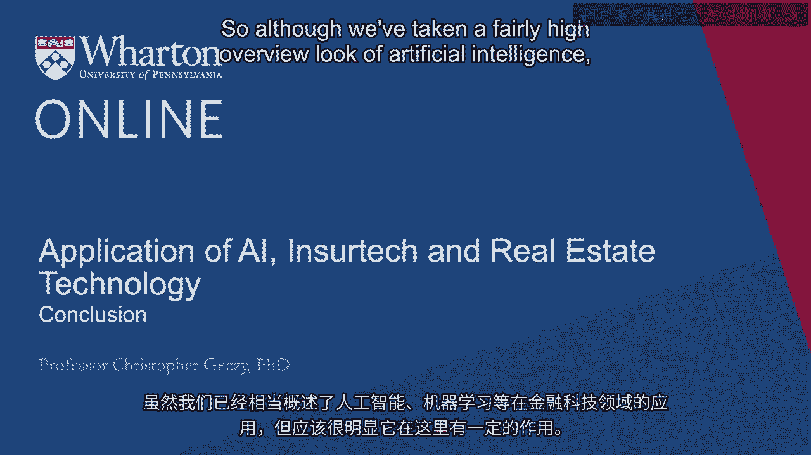
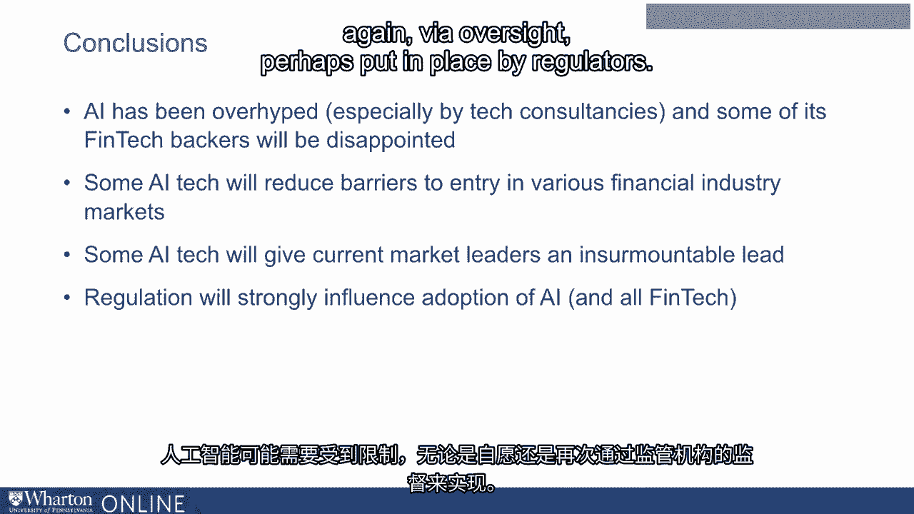

# 沃顿商学院《金融科技（加密货币／区块链／AI）｜wharton-fintech》（中英字幕） - P110：23_总结.zh_en - GPT中英字幕课程资源 - BV1yj411W7Dd

 So although we've taken a fairly high overview look of artificial intelligence， machine learning。

 and so on in financial technology space， it should be fairly clear that it has a role， to play。

 In fact， perhaps even a definitional role today and no doubt in the future。 However。

 we also have to recognize that some of its utility is sort of mundane。

 The scope of which is perhaps some might say old school， despite the appeal of thinking。

 about the overarching self-aware intelligence made famous in a number of movies over the， years。

 The actual business case for artificial intelligence is perhaps more regular。 For example。

 as opposed to traditional customer service representatives， chatbots don't call， in sick。

 they don't have human biases necessarily， they might work 24/7 without complaint， and。

 perhaps don't care about the marginal cost paid to them， which might be close to zero。

 While it may be possible to look at the landscape today and sit back and make prognostications。

 about the future， in part because the cost is so low， it's actually challenging to develop。

 a legitimate forecast with conviction about where it all might go。

 Basically the possibilities seem endless， but it does take a lot to get there。 AI has been hyped。

 especially by technology consultancies and by academics and by fintech， backers and notably。

 expectedly， some will fail。 We expect that with any kind of technological revolution。

 Some AI technology will， however， be successful。 They may reduce barriers to entry。

 They may increase the benefits of cost reduction and advancement of scale。

 To those who are first movers， it may give them a kind of advantage that may prove to。

 be insurmountable to others。 The possibility that artificial intelligence may need to be reigned in。

 either voluntarily， or again via oversight， perhaps put in place by regulators。

 At the end of the day， it's an exciting arena。 It's a core area。

 It's an area of rapid advancement and a lot of excitement。

 It's improving the state of the industry everywhere。 It may hold a lot of promise for the future。

 but that will also be an empirical question。 [BLANK_AUDIO]。

