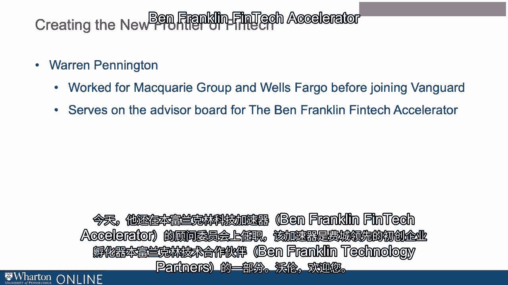

# 沃顿商学院《金融科技（加密货币／区块链／AI）｜wharton-fintech》（中英字幕） - P111：24_打造金融科技先锋-Vanguard.zh_en - GPT中英字幕课程资源 - BV1yj411W7Dd

 Now we have a special guest， an executive on the cutting edge of FinTech innovation。

 He's Warren Pennington and his global head of investment management FinTech strategies。

 for the Van Garda group。 Van Garda， as you probably know。

 is one of the world's largest asset managers with approximately， $5。3 trillion in assets。

 Van Garda is also the world's largest robo-advisor。

 That division is called Van Garda Personal Advisor Services and it has $115 billion。

 in client assets。 Warren is an experienced banking executive having worked from a quarry in Wells Fargo。

 before joining Van Garda。 Today， he also serves on the advisory board of the Ben Franklin FinTech Accelerator。

 which。

 is part of Ben Franklin Technology Partners， Philadelphia's leading startup incubator。 Warren。

 welcome。 Thank you， Chris。 Great to be here。 Warren。

 so I gave a bit of your background in your introduction。

 Can you tell us a little about how you came to the position that you currently have。

 overseeing what by all accounts is a leading edge and substantial effort in the FinTech， area？ Sure。

 I think it's always easy to connect the dots looking backwards。

 I did come out of college with an engineering background， so I'm an engineering educated。

 person that went into finance as my career path。 I think there's always been a connection between applying technology to solve really complex。

 financial services problems。 At Van Garda in particular。

 I think the size and the scope of the firm and the opportunities， that presented itself。

 it was a good match。 The timing was right。 Technology is at a certain stage and the ecosystem is out there and we made the case。

 that it would be a good thing for Van Garda to pursue。 Did you always want to be in this area？

 Did it even exist？ It didn't really exist and I think that that's。

 so I can't say I always wanted to be in this， area。 I think it was just a natural progression。

 I've always had teams that have explored and experimented with applying technology to solve。

 problems and have been very fortunate to work with really talented people throughout。

 my career and at Van Garda at that moment in time， things kind of lined up and it was。

 something that we moved forward with。 It sounds like you're advocating both practical experiences as well as formal education。

 Practical and formal and very hands-on。 It's experiential learning。

 That sounds ironic to someone who might think without really delving into it。

 This is really about computer science and it's about the math and the models of model。 Yeah。

 I think the math and the models along give you really powerful tools。 It's really up to that。

 the artist to figure out how to apply the tools and we don't think， it's quite that mechanical yet。

 So let's start with the basics。 How do you define FinTech and that can be from a personal perspective or officially from。

 the Van Garda perspective？ What is it？ How do we think about it generally？

 It's a handy name to apply to just marrying all the new technologies and financial services。

 business。 So it's a pretty wide ranging term。 I think that we kind of look at it in terms of their sort of two aspects。

 One is the way that financial services are delivered to clients or customers or individuals。

 So that's sort of the retail end of things。 There's a lot going on there。 Personal advisor services。

 So advising anything that gets directly to perhaps like your mobile device and makes。

 things simpler to integrate financial services into your personal life。

 The other part is the more I think in some ways a little bit more deep and complex technologically。

 which is sort of that institutional side of things。

 So for asset management it's how do the markets work？

 How do you interact trading globally with all sorts of different asset classes？

 Same thing insurance and banking。 How do the businesses work together and the utilities and all that。

 And does it have to do with classical areas？ Is this about reconciling trades or is it about the generation of trade ideas？

 Is it about reporting？ Is it about compliance？ I think it's sort of about all those things where the technology that's applied isn't。

 quite adequate yet。 Where the legacy way of doing things was invented before tech evolved。

 before data science existed。 And so it's time to rethink the way things work。

 I think that that's another aspect of FinTech。 It's an opportunity for people who have an understanding of technology。

 who are creative， who have an understanding of some deep expertise area to really rethink it。

 To ask those basic fundamental questions of why are we doing this？ Why is this working this way？

 It could be great for somebody working in a reconciliation team to rethink everything。

 they're doing and to explore other technologies。 A big term there is robotic process automation where creative。

 clever people used to solve， it on their own with Excel writing macros or something。

 That same attitude is really useful and you can just now apply more powerful tools to that， space。

 And it could go all the way to trading ideas where you're evaluating interesting new data。

 coming up with new ideas based upon that new data and analyzing it in a different way。

 And you could start a hedge fund based on that basic premise that there's something out。

 there that people don't know about。 It sounds like you're arguing that it's not just automation。

 It goes far beyond that。 It really is a rethinking， a retooling， a process reengineering even。 Yeah。

 In fact， I think you want to start with a business strategy。

 You don't want to start with technology necessarily。

 You want to start with like there's a big opportunity or a big problem to solve。

 And how do we do it now and then start to figure out how you might change that。

 Assume it's possible。 Assume that there is some technology out there that does exist。

 And then FinTech means now I take that new idea and I start exploring the technologies。

 and make it work。 So you sound really excited about it。

 What specifically about all of this gets you excited？

 I think it's in some ways it's not necessarily a plug for Vanguard， but it's a relationship。

 between a mission that you believe in and the opportunity to change the way things work。

 So that's technology really empowers individuals with the ability to make a big impact。

 You can leverage the skill of a single person with technology。

 And when you marry that to a nice mission， many firms have those， then you can start to。

 think about how to make things work differently。 For our case， the markets themselves。

 the way they've evolved over time， a market needs。

 to have a place and a time for people to gather to buy and sell something。

 And that used to be accomplished and still is in some ways by having just the right people。

 and you know who to call。 Some of the biggest trades and the largest funds still work that way。

 But that doesn't necessarily mean that the investor gets the best price or has the best。

 information。 Usually what that means is the intermediaries have the most information and they can have。

 the advantage in making a decision。 So anything you can do to help get the investor or the firm that needs to raise capital and。

 give them a better chance to get the best outcome， that's something worth trying。

 And it sounds like that really hits home for you。 It does。 It does。

 And I think our team inside Vanguard is similar to investment banks have always been really。

 clever and creative in deploying technology， insurance firms， actuarial science。

 There's a lot of legacy technology and skill that has been applied in finance。

 I think now it's just opening it up even more widely to more and more participants to try。

 it out and really to try and just change the way the markets work or change the way a product。

 is designed ultimately hopefully to benefit some end user of that service or product。

 The language you're using is partially the language of disruption。 And it's also a kind of。

 you're making ongoing references to historical techniques and processes， at the same time。

 Do you view it as disruptive per se or what's your view on what this means from a revolution。

 perspective？ In the short term it's evolutionary。 It's incrementally fixing or changing the way things work。

 But I do think that maybe that's the reason why fintech has become more and more predominant。

 The term， the usage， the startup community capital raising is ultimately this is revolutionary。

 The trick is figuring out what does that revolution end up delivering and what does it look like。

 at some stage in the future。 That part is hard to predict。

 If we didn't think it was revolutionary or at least possible to be revolutionary in a。

 positive sense we wouldn't be doing it。 Are there areas of fintech that you can see from your perch that hold special promise perhaps。

 over others？ Yeah， I think industry it's kind of a little bit industry specific。

 I think that rethinking things like what is money and what is banking and what does that， mean？

 If we started from today to solve the problems that banks fulfill or asset managers fulfill。

 or that exchanges fulfill would we design it this way？ Generally the answer is no。

 So then the question is what do you want to do about it？

 We start generally with and I think you have to。 You have to start with many existing players and that's where you get that sort of evolutionary。

 piece but everybody is somewhat focusing on their own objective and their own ideas and。

 while we're cooperating we also are there some alignment and there's some areas where。

 you know over time things will change and diverge。

 Are there areas that you think either for Vanguard or perhaps your own personal view that dominate？

 Yeah， I do think that the individual sort of the move towards peer to peer， fill in the， blank。

 The idea that individual investors or individual consumers can connect more directly with the。

 natural supplier of the product or service in terms of finance it would be maybe money。

 or capital or insurance or real estate that's really exciting。

 There's a lot of activity going on in there。 There's a lot of experiments that we watch。

 big firms watch that we would never do partially， because we think that there are flaws in the business model。

 Maybe it's something that if it was done at scale wouldn't be legal。

 Maybe there are regulatory things that these small companies don't participate in but we。

 think that's incredibly powerful and it kind of does go back to the direct to consumer。

 model that Vanguard really got active in decades ago。

 On the flip side it's the design of markets themselves。

 So whether it's an insurance exchange or whether it's a global bond market。

 The building in operation of markets that are more efficient is something we're really。

 excited about。 It sounds also like you're speaking about democratization of March of what has often。

 been the rare air of the cell side of intermediaries or distribution channels。

 I think that it's fun to read history in this space too because it helps keep us grounded。

 The invention and the creation of mutual funds， 1930s effectively。

 That's an incredibly powerful democratization tool， a product to allow any individual investor。

 to get access in the past to exposures and portfolios that they individually wouldn't。

 be able to do。 So we think that that's a nice thing that says that what's happening now isn't totally。

 revolutionary but now the idea is what about other asset classes？

 What about opening up things that are still rare air for institutional investors only。

 very wealthy people？ Ideas that could help everybody benefit in terms of their financial future in creating。

 ways to get them exposure to that。 Alternative assets。

 I heard I think what I thought was a failed reference to cryptocurrencies。 In there。

 what's your view of Bitcoin and all the related？ We learn by doing and we learn by exploring hands-on。

 We've definitely looked in those spaces and it's probably a great example of those areas。

 where we're saying that I'm kind of glad that it's happening。

 It's not something that we see as a true investable asset。 As a firm。

 we don't believe gold is an investable asset。 So much less Bitcoin or a cryptocurrency。

 But what we do see is it's an incredible mechanism for the democratization of transactions。

 on a global basis without the need for intermediaries。

 So probably not in the exact form it's in right now， but it's an interesting space。

 to watch and the kind of experimentation that's happening in that space is something that。

 we want to look at。 And does that telescope back to distributed ledger technologies and related ideas？

 So there's generally a lot of references made comparing blockchain distributed ledger。

 to the internet， but anything that gives you the chance to directly connect digitally。

 with lots of other parties around the world has high security， can make the interaction。

 more efficient， can reduce the need for intermediaries， things like that。

 So we're very excited and working hard on blockchain。 It's a potentially disruptive technology。

 So some of the existing players that work in the markets that we are engaged with have。

 different views than we do。 But in general， it does feel like blockchain has a great amount of promise。

 So we're working on it a lot。 And perhaps without giving away any secrets。

 So what kinds of things are intriguing about blockchain and other related technologies？ Yeah。

 I think going back to， you know， we initially started off sort of in a stealth project。

 trying to learn it and build effectively a trading platform/exchange all in one。

 Focusing on blockchain， it was an internal thing we worked on and found out that that。

 wasn't a good idea for various reasons， technical limitations at the time that could change。

 over time。 But what it did do is it gave us enough hands-on experience to say。

 now we understand the， core technology， which I think is really important。

 really hands-on experience with that technology。 We matched it with a couple of different opportunities that we see。

 So if you want to run things high efficiency， then you need to have low costs。

 So one of the things we could do is automate。 So but not robotic process automation。

 more of a true automation starting from scratch。 So the creation of an asset or a data point。

 the instant sharing of that， the automation， of collecting those things into something that might look like a portfolio or an index。

 And then that can lead to other things downstream。

 So we have been public that we have already started to automate our index fund operations。

 by doing that through a distributed ledger， a way we've applied distributed ledger， blockchain。

 And that was our US equity index funds， one of the index providers。

 That leads later to the ability to do something we call tokenizing。

 And that's more of a common term。 So take an existing asset that is not digital。

 It's traded electronically perhaps， but it doesn't actually exist in digital form。

 And creating a token of that in a blockchain space。 That's not a revolutionary idea either。

 There's many people looking at that， but that's the space we're going in。

 That would be sort of our phase two。 And then phase three is hopefully。

 if all these things work out， it's the true digitization， where the legal framework。

 the regulations， the operations， the asset itself is the digital。

 representation that's in the network。 Right now， some people think that's what a cryptocurrency is。

 But we're saying that we're looking at even traditional assets and thinking about how to。

 digitize them。 Banks with cash， asset managers with assets。 So for listeners。

 can you walk through for each one of those three stages， current stage， stage two， stage two？

 What do you think the benefit to clients， people， society， your firm？ What would that mean？ Yeah。

 I think the ultimate benefit that we see is it puts much more power back into the。

 end user consumer。 So as a retail investor， if a fund manager like Vanguard can automate running an index。

 fund， that still may be something that a retail investor doesn't do themselves。

 It still may be something that we want to have specialists do because they have lots。

 of other things that they're focusing on。 But that automation， obviously at lower cost。

 it could improve the product。 We believe it'll improve the quality of the product。

 And when you ultimately get to digitization of assets， we actually think it improves， it。

 gets back to valuation of things too。 If you have what we would call fixed the liquidity problem。

 for me， liquidity and for the firm， liquidity means does everybody that wants to buy or sell something know everybody else。

 that might want to be on the other side of that transaction and can they connect in an。

 efficient way？ So right now you cannot do that。 Even in the most electronic markets you can't in the equities market。

 So if you could start with a blockchain type solution and automate the operation of something。

 with the data， and then you could expand that out to integrating with a market， maybe changing。

 the way the market works， and then executing transactions， you pretty much have continuously。

 operating， self-sustaining automated financial products that would be helpful for clients。

 and consumers。 Are there risks in this area or more generally in FENTAC and specifically the ability to。

 have oversight and regulation or other areas that you see are important？

 I think that there's kind of a balance。 So I think I mentioned a little bit earlier。

 it's nice to let some startups go out and， do some crazy things that we believe have flaws。

 The risks are when those things grow and people can get hurt because we do think that smart。

 regulation is incredibly helpful to the markets。 The incentives out there to make a lot of money fast don't always。

 never almost align， with the long-term interest of the investor for example。

 You can do things and make decisions that aren't fair。

 So I think the idea of fairness in the markets is helpful whether that's insurance， real， estate。

 financial products。 So we think there are risks but the main one we would say is if we over-regulated it too。

 soon then you stifle the ability to do something revolutionary。

 And if you don't catch up quickly enough then you allow something that has negative impacts。

 to people to grow too large。 I think we didn't always anticipate what perting a personal lives for free into perhaps a Facebook。

 What could that mean to us in the long term if you extend it way out？ Hard to predict the future。

 So let's get to some of the meat of the topic。 How does Vanguard incorporate FinTech？ All right。

 so we do it in a number of ways。 So you mentioned personal advisory services。

 So for that retail client interaction and the technology that could work there， there。

 are a number of things going on in that space。 One of the areas is working on digitizing advice。

 So there's initiative there， quite a large initiative there working on that kind of expanding on。

 what we've done in PIS and globalizing it。 So there's activity there。

 There's something that Vanguard started up in the city of Philadelphia called the Innovation。

 Studio a couple years ago。 That one has a broader mission around truly being innovative。

 And the idea there is again facing clients。 So looking at the ways that Vanguard creates and distributes and interacts with our clients。

 the products that we sell。 And so there's teams there that are thinking of the newest next thing that might be out。

 there mostly from the retail standpoint。 There are other initiatives around there where we modernize our websites and the way we interact。

 with clients that side。 So that's kind of a core， that's the big part of Vanguard。

 Number of head counts and all that sort of thing。 For our team。

 this is we're housed inside the investment management group which is the part。

 of Vanguard that runs the money that manages the over 5 trillion as of now roughly of assets。

 and the hundreds of funds that we supply globally to our clients in addition to the fact that。

 we have external advisors to those clients。 So I'm part of a team that was created a couple years ago。

 Tim Buckley was actually the CIO at the time。 Starting up the Innovation Studio。

 there was sort of a question like can the Innovation Studio。

 do both facing out to the retail clients and can we solve the problems of the investment。

 group and thought was no， they're very different。 The complexities of the investment space are much different and so we created a team and。

 we started off as an experiment realistically。 Again， hard to predict the future。

 So the experiment was to go see can IMG， can the investment group find ways to really be。

 disruptive in the future。 So yes， the disruptive part is part of the mission and can we help the individual employees。

 the crew， can we empower them。 So the idea of being technology is a great。

 it's leverage for an individual and their， skills and their knowledge。

 So that's been the way we've approached it。 We've gone down the path of saying it's really about talent。

 Yes， technology is critical。 That's the toolkit but it's really about the talent to figure out creative ways to use。

 it and deploy it and to build it。 And we have to build things。 We're not a think tank。

 we're not a consulting group， we're actually building。

 So the way we've gone about that is by saying that the smartest people will be all over。

 the place so we have to make it easier for a big company like Vanguard to work with those。

 people whether they're in the academic world， research institutions whether they're with。

 large incumbents， banks， stock exchanges or whether they're startups， startups in the。

 venture capital community。 So most of those things were pretty new。

 Most large companies don't have a lot of ability to be nimble to interact easily with。

 small companies。 So that's kind of been our mission is to find ways to make it easier for both to scout those。

 folks out and then to make it a lot easier to work together and to help jointly solve。

 a problem that really suits Vanguard strategy。 So it's really interesting because we often think about Vanguard as a big index fund although。

 there are actively managed activities within the firm and outside the firm with sub-advisors。

 What's the aim of the technology？ Is it really about scaling cost？ Is it about generating ideas？

 How does it add value within that regime？ So we're called FinTech Strategies because we start off with what is the strategy？

 What is the business strategy？ The three strategies that we have are looking for new and better insights。

 They're sort of the wrong ingredient to make an investment。

 So that's your sort of your data analytics alternative data sources but the whole purpose。

 is can we come up with a newer better insight？ Another areas platforms and visualization。

 So once I have all these insights what do I do with them？

 So I need a way to work on that space and so that's the idea of there is there a technology。

 platform that I can integrate all of that data and operate things and run funds， manage， money。

 And the third space is new and better markets。 So the financial markets exist are different in terms of the way they run。

 Every asset class has its own market effectively。 You have over the counter markets like bonds where basically every bond is its own market。

 or you have exchange traded instruments where they're electronic but all of them could be， improved。

 So when you work on the new and better markets it opens up the idea of new asset classes， as well。

 So maybe we could tokenize or digitize alternative asset classes and give that exposure to the。

 retail consumer， the retail client。 Allows them to have a better diversified portfolio。

 have a better chance of hedging against negative， events to have uncorrelated exposures the portfolio theory。

 And the more you can incorporate that the better it is and that's available to only a。

 few now and Vanguard's mission is that retail client to democratize the opportunity to invest。

 So those are the three areas we line up around those three strategies。

 And it sounds like you're not really picking passive versus active per se。

 It really is about the betterment of whatever strategy or area you're talking about。

 Can you give us a couple examples with some specifics？ So we look at passive as a term。

 It really just means it's a highly efficient and scalable process。 So S&P 500， the footsie， indices。

 crisp， those are all investment strategies， mostly related， to market capitalization。

 You build an index， you put certain size companies together， generally there's other kinds of。

 indexes。 And that investment portfolio is created in a more open process。 And we execute that。

 Vanguard and other passive managers execute it。 But it's still an investment strategy。

 It still starts off with a premise。 You have to create an index based on some methodology。

 So active is maybe a more custom methodology and those things are things that we do internally。

 as well。 We don't necessarily look at them that differently。 Ultimately you have to have data。

 you have to have your investment strategy， you have。

 to create a portfolio and you have to implement it by executing and trading and monitoring。

 and all that。 A specific example I gave earlier which was you start to automate running an index fund。

 passive。 Somebody else has given us the portfolio。

 We just make it much more efficient by automating the data and ultimately the data becomes your。

 portfolio。 There are other areas in the over the counter space where we're saying the markets aren't。

 that efficient。 So in the sort of the new and better market strategies。

 are there ways that we could make， them more efficient。 There are lots of ways to approach that。

 New exchanges pop up。 Electronic trading venues are popping up but we don't think that they're actually solving。

 the root problem which is connecting more directly connecting all the investors with。

 each other more efficiently。 One area is applicable to a lot of spaces。

 It's natural language processing。 So there's the big role of data science which has a lot of meanings but really data science。

 is the idea of you take a quantitative approach which has a theory behind it。 You build a model。

 generally they're linear models and then you have some error and you。

 implement the model and then you put data into it to test the model and refine it。

 Data science simply put I think is just flipping it over。 It's empirical。 It's take a bunch of data。

 intelligently create models from that data and then do something， with it。

 One area that's exciting is NLP natural language processing。

 It helps you get in some cases the best and the first use cases to speed up things。

 If a credit analyst's job is to understand as much as they can about a particular firm。

 or a sector they're doing a lot of reading。 The reading is there to extract all the relevant information。

 They generally look at similar sources。 You want to have highly credible information sources。

 regulatory filings， earnings， transcripts， press releases。 In potential in real time。

 In real time would be good and that's generally hard for a human being to do。

 More than one reading one thing at a time is hard enough。 If you can automate that。

 if you can partially automate that， we get to the space that we。

 call augmented intelligence which is the idea that you've given the experts much more information。

 much more quickly and you've helped automate some of that work。 Natural language processing。

 reading regulatory filings， extracting key information。

 Are you guys reading unstructured new streams？ We are。 We're exploring that。

 That's been around the while。 We're just figuring out how to deploy it in a way that makes sense for us。

 But yeah， we're reading unstructured new streams， websites， discussions of products， announcements。

 marketing materials。 There are a lot of experiences in this space。 Multiple languages。

 interestingly very challenging。 We're doing it in a way that's sort of parallel。

 You kind of have to start over again。 If you're going to read English。

 there's some ability to translate some of that to another， alphabet based language。

 Still hard to do。 Then you work in Asia and you go with character based symbolic systems。

 Different approach。 We do that。 The good news for us in Vanguard is most of the investments we make。

 there's an English， version of it， so we can get a lot done， you know。

 high 90% coverage even just within， English effort。 It's again， it's early days。 Later on。

 we expand each other languages。 Some have emphasized how certain groups define perhaps by demographics like millennials have。

 a special preference for using FinTech or various aspects and characteristics of FinTech。

 How has this idea impacted yours and/or Vanguard's thinking？

 I think that it's kind of tied to the whole idea of behavioral finance in general。

 I think that certain people are more comfortable relying on technology more fully and that。

 might be because of an age bracket。 It might be because of a personality。 It could be many things。

 But yeah， there's always a search to try to understand your customers in the longer term。

 but for us， that customer is also a future crew with what we call employees at Vanguard。

 So that's always out there。 The comfort with digitization in general。

 the comfort with relying less on people， fewer， interactions with people is growing。

 There's always a need。 In fact， you gave the example of Vanguard's robo-advisor。

 which is actually a hybrid model， mostly， because there's an aspect of only so much you can really glean through a question。

 or a digital interaction。 There's a lot of information that you still can get as a human being to human being having。

 that interaction。 So I think that there's always a blend and we look at that and say there's opportunities。

 But is that information then curated back into， say the AI or the robo-advisor？ Yeah。

 It is to a degree， but to a certain extent， you're never going to truly replace an expert。

 with an artificial intelligence machine。 To do that。

 you have to have 100% of all of the relevant factors in a digital format in。

 a way that you can process it with a computer。 And while there is a lot more out there that's digital。

 whether it's photographs or videos， or things that now there are cool techniques to look at。

 that computers can look at that， information， there's still just too much that can't be digitized。

 So I think that's really why we call it。 For us， AI is augmented intelligence。

 It goes back to the '50s too。 If you want to read history， this has been an ongoing debate。

 Should you look at replacing humans or should you look at giving them tools that make them。

 more powerful？ So you really are adopting a kind of bionic model。

 which is also a reference to something， like the '70s。 Yeah， nothing。

 Most of this isn't actually new， which is the fun part。

 The concepts have been out there a long time， but now what's happening is cloud computing。

 more and more data available， more new techniques。 So some of these old ideas。

 we can actually build things with them now。 Let's stick with the end client for a second。

 At the same time， FinTech is evolving。 The financial services industry is evolving by itself。

 perhaps as a result of some technological， developments。

 but also because of what appears to be a growing model of client centricity， in customer centricity。

 It's come with it in many countries by changes in fiduciary or related regulations， by increased。

 knowledge on behalf of end clients， the UBO， ultimate beneficial owners of assets。

 I wonder what your thoughts are about the ecosystem in which ultimate clients live。

 Is this about financial wellness？ At the same time， it's about technology。 Yeah。

 I think it ultimately is about financial wellness， but then the challenge becomes what does that。

 actually mean？ The way that Vanguard created itself as a firm with its client ownership structure。

 mutual， ownership isn't unique or revolutionary。 It was and is unique in the asset management space。

 The alignment of our interest with our end client was part of that was to ensure the financial。

 wellness in terms of meeting the future needs， the financial future needs of a client in terms。

 of how they invest。 That's always been part of the way we've structured our business。

 I think all firms have that idea， what is the future need of an individual client？

 What does that retail client's need？ How broadly that is defined becomes how you define personal financial wellness。

 There's ideas that it includes health， it includes savings for events， it includes emergencies。

 it includes all sorts of things， family trust， estate planning， taxes， kind of a long way。

 What about physical wellness？ What about behavioral or psychological wellness？ Yeah。

 Insurance companies have always had to sort of dance that a little bit with physical health。

 and the risks that an individual poses to the firm， but it also helps in theory， it helps。

 modify behaviors。 I personally don't want to card in my car monitoring my driving behavior。

 but my physical health， could be benefited if I did that。 But more generally， perhaps physical。

 financial， emotional， well-being， all those things are， connected。

 So maybe should it all live at Vanguard or should it all live at United Health Group or some。

 other firm？ Maybe we're defining an ecosystem at the same time technology is coming to play a very big。

 role。 So I think that the safer place， so the short answer is I think it depends on an individual's。

 own preferences。 So you kind of have to understand and find groups of people that would have a common definition。

 And for some people that might be everything。 That might be saying that not Vanguard。

 but another company， a health company might decide。

 that they want to provide that offering to a sort of set of clients。

 I think one of the theme that technology brings and it's kind of a fintech related subject。

 to ties back is this idea of ecosystems。 You've talked about。

 you've mentioned that word a couple of times and truly believe that。

 that might be the best way to go about that。 It's saying， hey。

 there are uniquely qualified firms or people out there to solve particular。

 problems and they might not all be in the same firm。 So the way we've gone about looking for talent。

 there's a similar idea about how you might， come up with defining a broader product offering。

 And that through product and strategic partnerships is something that goes on there。

 And there's a lot of that happening。 The news is out there about some of those strategic partnerships。

 Not just Vanguard。 I mean， more than a million the industry is a rat shift。

 Amazon's JP Morgan's Vanguard's and then getting out of the US。 Similar。

 Do you see technological innovation specifically in fintech happening mostly in the US？ Definitely。

 Or do you see it being led and driven even in the medium term elsewhere？ Yeah。

 I don't know about lead and driven。 I don't know that there's one spot。

 It does feel like there's a lot happening in the US。 That's great。 Our education。

 our universities are incredible。 The venture， the ease of capital to support startups and to create businesses。

 You sort of have wonderful peer research。 You have a great ability to create companies and do a lot of experiments through those。

 companies and then ultimately influence the way markets work。 It's pretty hard to beat。

 But definitely not unique。 I think kind of goes back to smart people live all over the place。

 And if you give people a computer and access to data and the ability to work together。

 it kind of doesn't matter。 So a lot of the firms that we work with in fact are really virtual。

 The blockchain firm that we're partnering with has one of their key engineers who lives， in Norway。

 They're working in Amsterdam。 They've got folks in New York。

 It's getting the people together to create things。 It's really the key。

 There are regulatory environments that have different angles。

 So Singapore versus the UK versus the US。 It has a firm like Vanguard handle that。

 It's a very complex landscape。 It's complex landscape。

 What we do is we have sort of our normal current business and we make sure we tailor that to。

 the regulatory environments that we operate in and what we do in Fintech for our strategies。

 We say let's look at if we want to do something， let's look around the world and find out where。

 the easiest place to try it out would be and work with that environment。

 So we might do an experiment in France because of regulatory framework， a couple of partners。

 that are ready to go and maybe some ultimate investors or retail clients that are predisposed。

 to be uncomfortable with that。 So we might do it there even though we really want it to be global。

 We want it to be in the US and want it to be all over。

 You've mentioned a number of times the idea of doing experiments in learning。

 Is that part of how people should approach or business-age approach Fintech？ I think it's yes。

 I mean that's an easy one。 I think it's yes because it's really about innovation and I think that it's pretty hard。

 to try to think of a grand scheme and spend a lot of time designing and planning it and。

 then attempting to do it all at once。 We look at it as tech firms do， as researchers do。

 it's an iterative process。 So you have an idea。 I think I want to automate something。

 I want to open up a brand new asset class and create new markets。

 I don't know exactly how we're going to get there。

 So you start off with small bite-sized pieces and you do it quickly and you learn each step。

 of the way and you keep moving on。 That's the way a startup works and big companies sometimes emulate that。

 They wish that they could be nimble。 It sounds like another testament for agility。 Agility。 Yeah。

 strategic agility。 Absolute tactical agility in essence。

 That's why it's hard to predict whether revolution leads because you're doing it one step at。

 a time。 Right， exactly。 For those who want to go into FinTech， what's your advice？

 What's your thinking？ If you were sitting here with someone watching the series。

 what would you tell them？ I think it's just an acknowledgement that the financial services industry on mass has。

 a lot of opportunity to catch up and to play technology。

 That other areas of the economy and other firms have really been out there for a longer。

 period of time。 So if you're interested in finance， that's important。 If you're curious。

 that would be a critical factor。 Give yourself skills。 Understand a bit of technology。

 Understand a bit of data analytics。 Learn what data science means。 Learn what finances。

 Pick your area of expertise that you might think you're interested in and learn about， it。

 But I highly say the critical thing there is just do something。 Build something。

 It's all about getting your hands on doing something and creating things and learning。

 from that experience。 Any area of innovation， if you look at the history of innovation。

 has been accompanied， by challenges。 That's especially true， I would guess。

 if those are disruptions。 But even with evolutionary approaches， we see challenges。

 What are the challenges that you see especially in FinTech？

 I think that one of the key challenges is just discomfort。 The more you do something that's really。

 really out there on the leading edge， creative and， potentially disruptive。

 the more problems there are in terms of just getting communication， clear。

 Getting things you do in finance always evolve in ecosystem。 So you have partners that are involved。

 Getting together， making sure people are clear about what it means。

 That's an important characteristic。 The ability to translate complex new ideas in a way that people can understand and get。

 comfortable with is critically important。 Regulatory frameworks are a bit of a challenge。

 but we see countries almost competing to try， to create a regulatory framework that's friendly to financial innovation。

 There are always challenges in getting talent。 Finding the smartest people。

 aspects of what is that ideal candidate， building teams， collaborating， talent is critical。

 Then continuous learning is a critical factor for this too。

 That's where you have to say that's the mindset of a person。

 Figuring that out early on because you work together， you build something， you invest。

 in folks over a long period of time and you don't really know until you've been together。

 for a while。 Do you have any concerns？ Like those of us of a certain age might have。

 they saw a movie called "Soilint Green"， where without getting too much into the gory details of the movie。

 it was a food product。 It was a food product that had to induce its own intelligence and machines。

 What about oversight of the machines？ I think oversight of the machines。

 the good news for that is it's such a blaring problem。

 People seem to be really worried about that right now and I'll just stick with the investment。

 space。 Again， I think that the mutual fund industry per se is really positioning itself well here。

 It's nice that you can have black boxes and there's a space for those black boxes meaning。

 I don't understand how the model works and it's hard to have oversight of something that。

 you don't know how it works。 The regulatory environment has created safe spots for those。

 The hedge funds， the sophisticated investment vehicles。

 But it's a characteristic some would say of much of AI machine learning where as you describe。

 them linear models don't capture all the potential patterns that are inside it。

 So that leads to possibilities of errant data mining and finding what we call animal spirits。

 or noise instead of signal but also machines running themselves potentially。

 How do we have oversight of them？ Yeah， I think that's where there's a good role for a regulatory framework to have oversight。

 of that。 So， you know， model oversight is a long running challenge in the banking industry。

 There's global regulations around model oversight。

 Now you've created models that even the creators don't know how they work。 So。

 I think that the data bias is good。 There's conversations happening in that space。

 I think over-reliance is probably where we get to as the biggest challenge。

 It's always the model works until it doesn't。 Nobel prize winning economists create amazing models and then they build hedge funds and。

 then something happens and they blow up。 So the smartest people with the best models they still have。

 We can explain anything that we look at enough at it， right？ That's right。

 But those may not have relevance for the future or in different circumstances that we haven't。

 seen before。 How do we deal with， rationally deal with， well。

 things that might relate to irrationality， in markets or are involving sparse data or things we haven't seen before？

 Well， I think that's why we believe heavily that augmented intelligence is the best you， can do。

 And that human factor and the ability to have the， there's an ultimate judgment that has。

 to rest with a person。 And some cases， there's a lot of things that lend themselves to fully automation。

 full， automation。 That's where you're not using judgment。

 not a particular expertise that's required。 It's a lot of connecting dots。

 And if you connect the dots， it's a deterministic problem。 There's only one answer。

 But now I think this is， to me， there's nothing new about this thing we're talking about。

 I agree with you。 It's a challenge， but it's non-stationarity。 The conditions change。

 the data changes。 One of the things that we've been watching is the tendency for folks to want to monetize。

 a new data source。 And the new data source comes out and it's got two years worth of data or less。

 And then if you're a long-term investor， that's probably not a good idea to do that。

 But if you're just a high-frequency trading shop， then maybe that data's helpful。

 So using it appropriately is also a key。 Right。 So the idea that it's different this time。

 may or may not be true。 It may look different， but we still know。

 If you look at any history of data， a one small snapshot looks different from everything， else。

 potentially。 But it's just not。 You can build a model that makes that work。

 but it's not a good model。 Right。 So again， that comes down to the combination of humans and machines。

 Humans and machines。 And the sort of the ongoing fact that it's just too complex overall to really automate。

 it。 And I started before I worked when I was in university。

 I was working in a research institute in Boulder， Colorado called the National Center for Atmospheric。

 Research。 And some of the scientists at the time said， "If I just had a more powerful computer。

 I already have my model。 I could actually predict the weather。"。

 And we still can't predict the weather。 And that's a physical thing。

 So if you put in human beings and behavior， I think it's probably not a good idea to let。

 the models run themselves。 Right。 Right。 So we need some oversight。 We need hygiene。

 We need care and feeding。 But those also reflect the skills you identified for anyone who's interested in the space。

 Yeah。 That's what I think folks that would be more traditional quants。

 This is not replacing them either。 This is actually， hopefully。

 there's enough of those folks that have these skills that。

 are just continuously learning and they're understanding these cool new data science techniques。

 And they take the maturity and the rigor of their approach and they apply that to the。

 new models too。 Warren， thank you so much for being with us and sharing all your ranging insights。

 I really appreciate it very much。 I'd like to thank Warren Pennington again for joining us and sharing his insights as leading。

 FinTech executive with the Vanguard group。 Thank you。 [BLANK_AUDIO]。

