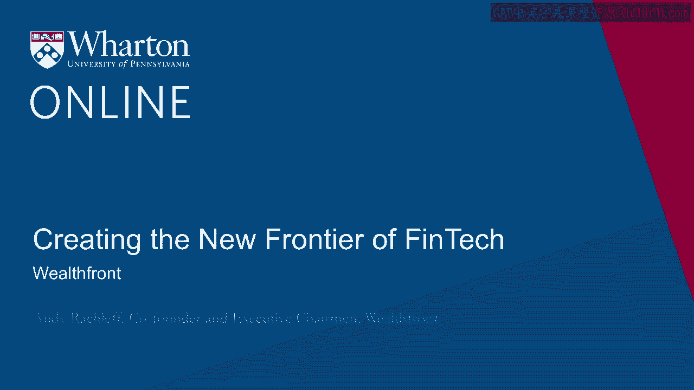
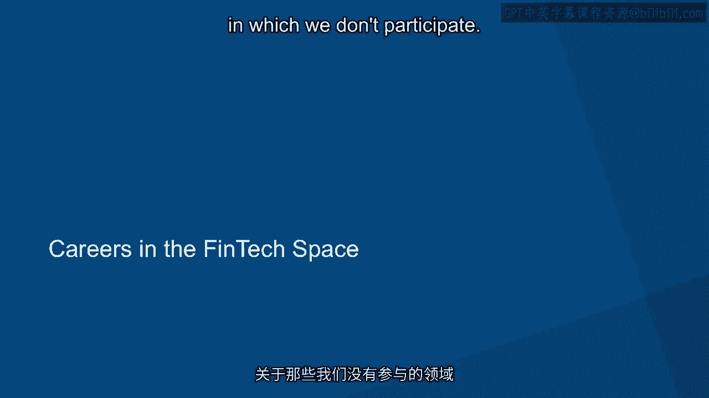

# 沃顿商学院《金融科技（加密货币／区块链／AI）｜wharton-fintech》（中英字幕） - P112：25_打造金融科技先锋-Wealthfront.zh_en - GPT中英字幕课程资源 - BV1yj411W7Dd

 My name is Andy Radcliffe。

 I'm the co-founder and CEO of Wealthfront。 Wealthfront pioneered the idea of automated investing。

 And now we're applying those same principles to deliver automated banking services。

 The inspiration for starting the company was to democratize access to sophisticated financial advice。

 Most people don't have available to them the same kind of investment options that very wealthy people have。

 which to me just doesn't seem right。 And through technology。

 we are able to deliver a really compelling set of investment services。 Today。

 we've applied that same level of automation and advice engine to solving people's banking needs。

 so that we can in effect deliver all of your personal finance needs。

 The vision for the company is to offer self-driving money。 Now， by self-driving money。

 I mean that you'll be in a position very shortly to direct deposit your paycheck with us。

 We will automatically pay your bills and then route the remaining money to the most appropriate account。

 for your particular situation and goals， either inside Wealthfront or outside。

 So you won't have to spend a minute thinking about your finances。

 We will take care of everything for you and deliver the best financial products to host all of the money that you're saving。

 The key to our ability to deliver a better service than what you could find elsewhere。

 is our significant investment in automation and optimization。 So on the automation side。

 we've invested very heavily in a brand new banking and brokerage infrastructure。

 that allows us to automate things that traditionally couldn't be automated。 You know。

 the brokerage infrastructure is 40 years old。 And so that does not enable you to build new products very quickly。

 Our major investment in our banking and brokerage platform allows us to deliver new features at a very。

 very rapid rate。 An unprecedented rate， actually， in the financial services industry。

 And our very significant investment in our advice engine， PATH。

 allows us to deliver advice based on data， so that you don't have to meet with someone。

 There have been numerous studies that have shown that data leads to much better decisions than experts。

 By linking to all of your financial accounts， we actually know more about you than any financial planner。

 or financial advisor could and therefore can give more personal advice and do it immediately。

 The future is self-driving money。 We need to build out a number of new features in order to deliver on that promise。

 A few months ago， we introduced our FDIC-insured high yield cash account。

 We've been very gratified to see that in just two and a half months it's attracted more than $1。

3 billion worth of deposits。 So now that we have that in place。

 we need to add other banking features。 Before your end。

 you'll see us offer an ATM and debit card so that you can access your money immediately。

 We'll offer automated bill pay and direct deposit。 And then also before your end。

 we will launch our automated optimization where our advice engine。

 based on data from all of your other financial accounts will route your money to the most appropriate place。

 without you having to do a thing。 I'm often asked this question。

 The problem is there is no such thing as FinTech。 FinTech means very different things。 For example。

 we are in the next generation banking and investment services space。

 There are people who are just in the lending space。

 There are other FinTech companies that are involved with payments。

 All of these businesses are unrelated。 And so I can't tell you about the future of all of them because we don't really know about the areas in which we don't participate。

 You know， the funny thing about FinTech is that most of the participants are big on Fin and little on tech。

 We're the opposite。 We're little on Fin and big on tech。

 We recruit from consumer internet companies。 So we look for that kind of experience。

 If you want to work in a technology driven company。

 be it in finance or education or healthcare or hospitality。

 what you really want is a background in consumer internet。

 And there is no vocational program for that。 What you want to do is first and foremost build up your technical skills。

 And then if you're not in engineering， you want to get experience out of consumer internet company。

 The biggest misperception about Wealthfront is that we pursue the same customers as everyone else。

 Nothing could be further from the truth。 Actually。

 the biggest differentiator of our service is that we focus on millennials who。

 have less than a million dollars who want to delegate the management of their finances。

 In other words， millennials who save。 All of our competitors are primarily focused on baby boomers。

 Why？ Because that's where all the money is。 I believe that baby boomers have something on the order of 16 trillion managed on their behalf。

 Millennials have far less。 But in the next 30 years。

 millennials will have far more because there are more。

 millennials than any generation in the history of this nation。

 If we can do a really good job serving them and deliver on the promise of self-driving money。

 then why would they ever want to move their money if it's all handled for them？

 So that's the biggest difference。 It's that we're totally focused on millennials。

 where for others it might be a sideline。 Absolutely。 As a matter of fact。

 that's been the goal for all financial services companies for at least， the past 40 years。

 40 years ago， Merrill Lynch innovated with its cash management account。

 This was the first time that a financial services company combined banking services with。

 investment services。 And it catapulted Merrill Lynch into the lead。 20 years later。

 Charles Schwab did the same thing， combining banking and discount brokerage。 Again， 20 years later。

 we're trying to do the same thing as are others to try to become your， financial hub。 Now。

 unlike other people who are trying to become the financial hub。

 we believe the big difference is that we've earned our client's trust。

 If you look at the average amount invested with us， it's over $60，000。

 The other people who are vying for that position have something less than $1，000。

 But even more importantly， our clients delegate the management of their finances to us。

 No one else has the trust of their clients to do that。

 And we think that that trust and client's willingness to delegate the management of their。

 money to us puts us in a great position to become that financial hub in the future。 [BLANK_AUDIO]。

