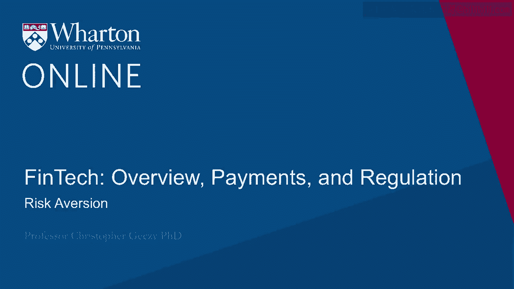
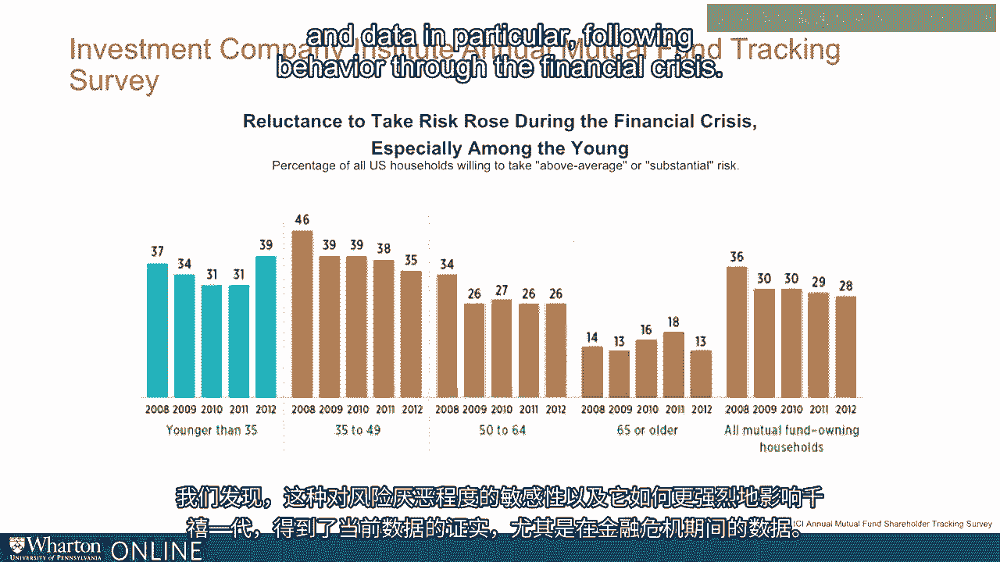
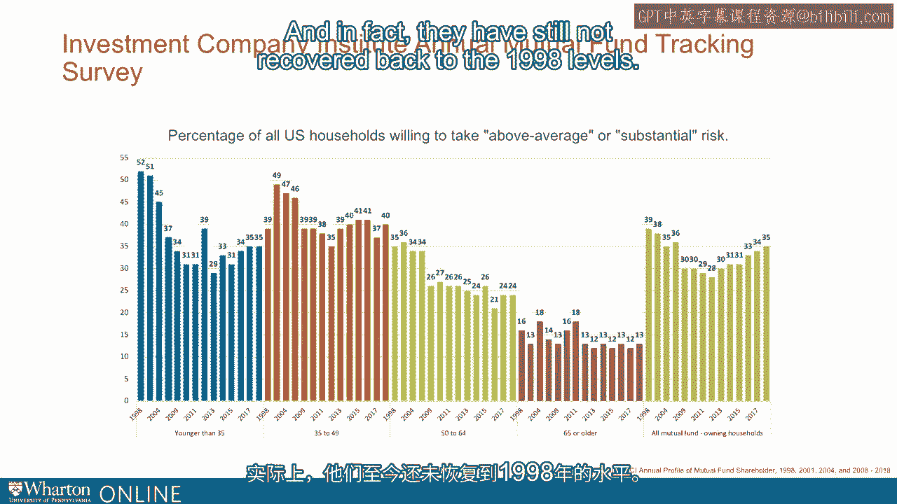

# 沃顿商学院《金融科技（加密货币／区块链／AI）｜wharton-fintech》（中英字幕） - P11：10_风险规避.zh_en - GPT中英字幕课程资源 - BV1yj411W7Dd

 One doesn't have to look very far back in history to know that we've come through substantial。

 market volatility。 Although we've had and enjoyed one of the longest runs of equity bull market experience。

 in history， we still have had equity market volatility over recent horizons and over。

 and across the great financial crisis and the market volatility associated with it during。

 and after。 It turns out that this affects investors and is a critical piece of what we might think。

 about in the FinTech space， both with respect to clients like the millennial generation。

 but also across the entire range of demographics。 Part of what we know has been informed by the concept of the depression baby effect。

 Sociologists know this effect as being the behavioral characteristics and actions taken。

 or not taken by those who lived through the great depression in the United States in the。

 first part of the last century。 Or in fact， as it turns out， the behaviors of their progeny。

 They're often reported as being less tolerant of risk and being people who save more。

 Some sociologists tell us that they're actually less careless and perhaps at the margin might。

 be more introverted than previous generations。 Research has found that this characteristic is not one only of deep market volatility or。

 market crashes or economic depressions， but may in fact be a characteristic simply of。

 traditional levels of volatility as well as the extremes。 A couple years ago。

 Mommandier and Nagel published an article called "Depression Babies Do。

 Macroeconomic Experiences Effect Risk Taking，" in which they examined the experiences of investors。

 across large periods of time， studying their market experiences， volatility in markets。

 and then their subsequent willingness to take risk。

 What they found was that investor market experience clearly impacts risk aversion， risk capacity。

 and the actual subsequent taking of risk in financial markets。

 They found that investors who have earned low stock market returns in the past are less。

 likely to take financial risk， are less likely to participate in the stock market when they。

 are taking risk and investing less more generally given that they have had recent low stock market。

 returns。 It turns out that more recent experiences have stronger effects on investors' risk appetites。

 and that especially when these risk experiences happen earlier in life， they can have longer。

 lasting effects。 What they found was that when they compared differences in previous stock market returns。

 to future stock market participation， a positive relationship resulted。 Of course。

 lifetime effects or life cycle effects have to be handled。 In other words。

 traditional financial planning thinking suggests that when investors are older， they can。

 shouldn't do， take lower levels of risk。 In part because they have a shorter horizon in which to make up any shortfalls or losses。

 compared to when they are younger， when they have a longer horizon they are more apt or。

 able to bear risk。 What Mommandier and Naikle cleverly did was integrate out the old versus young effect。

 What we find when we look at their results in the graph in front of you is a positive。

 and strongly statistically significant relationship comparing previous market experience market。

 results to future stock market participation。 In other words。

 when stock market returns were low in the past， future stock market participation。

 was low when market returns were high in the past， future market participation was high。

 In other words， people's ability to take risk was not just about the great depression。

 It was about market experiences and the continuum of market experiences。

 Well we find that that's also true， construed across cohorts。

 We find that this sensitivity to risk aversion and how it affects millennials most strongly。

 is borne out by current data and data in particular following behavior through the period of the。

 financial crisis。

 In the graph in front of you provided by the investment company Institute's annual profile。

 of mutual fund shareholders， coupled together by us going back to 1998 through the periods。

 ending in 2018， we see that well as financial planning tenants would tell us， those who。

 are older are less likely to take risk。 The question specifically asked whether you are willing to take above average or substantial。

 risk in your investment portfolio。 So the data from 1998 say that 16% of those who are 65 or older would be willing to take。

 above average or substantial risk corresponding to the traditional logic。 When you're older。

 you're less likely and you're less able to handle risk given your， life expectancies。

 If you go to the 50 to 64 crowd， well 35% or interested or willing to take above average。

 or substantial risk。 If you go to the 35 to 49 crowd， it goes up to 39%。

 If you go down to the younger than 35， you're all the way up to 50%， more than 50%， 52% of。

 those younger than 35 or willing to take above average or substantial risk in your portfolio。 Fine。

 However， what you see when you look at volatility across the financial crisis， so for example。

 if you could look at 2004 but then especially in 2009， 11， 15 and 17， the younger generation。

 and the millennial segment rapidly fell in their willingness to take risk in their portfolios。

 Between '98 and 2011， the number went from 52% to 31%。 Compare that to the 65 or older crowd。

 for example， that went from 16%。 In fact， in 2011 to 18%。

 their interest in willingness to take risk went up。 For the 50 to 64。

 '98 to 2011 went from 35 to 26。 The 35 to 49 went from 39 in 2018 to '38 in 2011。

 The momentier and negative results were borne out。

 The younger cohorts had a greater effect in their experiences facing market volatility。

 than older cohorts。 And in fact， they have still not recovered back to the 1998 levels。

 It turns out one of the most important target markets of FinTech activities is not only。

 risk averse today compared to historical levels， they're most sensitive to risk。 And as MOMANDI A。

 NEGAL remind us， it could take decades for them to move back into risk。

 That holds open the promise for Robo-Advisary， representing both a tailwind but also a potential。

 headwind to the actual activity of risk taking and financial advising。 [BLANK_AUDIO]。

