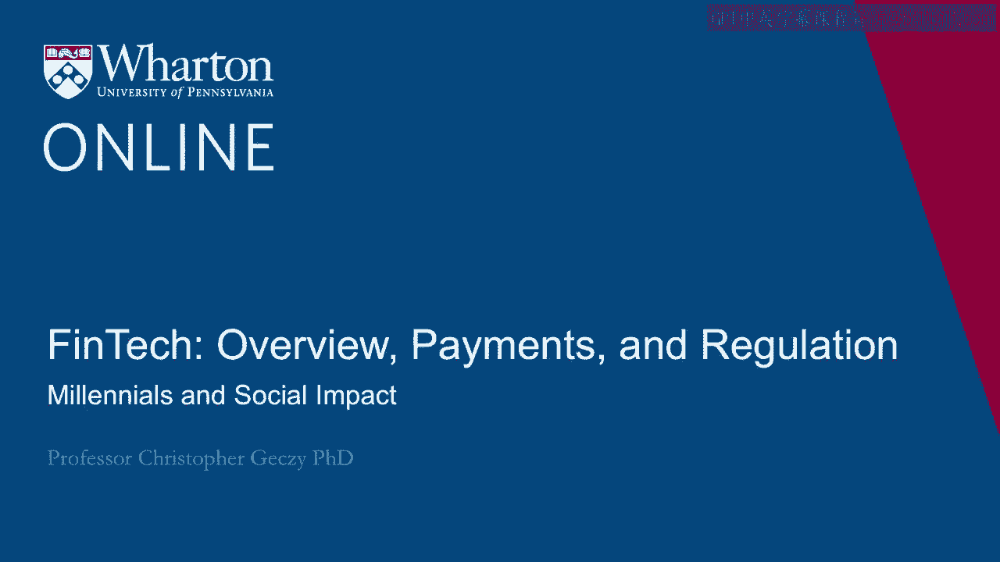
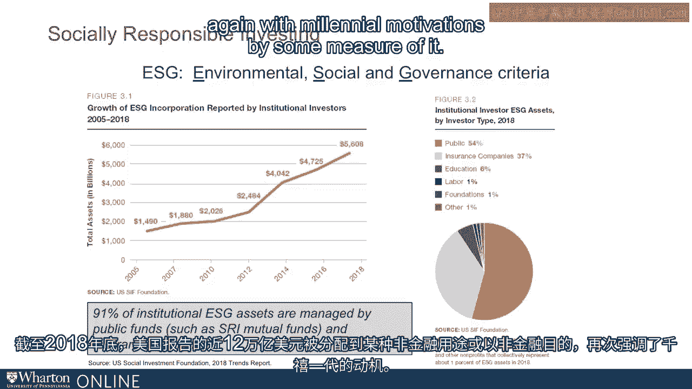

# 沃顿商学院《金融科技（加密货币／区块链／AI）｜wharton-fintech》（中英字幕） - P12：11_千禧一代和社会影响.zh_en - GPT中英字幕课程资源 - BV1yj411W7Dd

 So， millennials are optimistic。

 They're hopeful。 They're hopeful about their financial future。

 They may be currently less trusting of one another and certainly of financial services， firm。

 more than a footnote of importance to fintech entrepreneurs and clients。

 They also experienced the GFC very vibrantly and in in in tech full technicolor。

 To say it another way， as you saw in the data a second ago， their risk aversion clearly。

 shifted as the empirical evidence preceding it suggested they would becoming less tolerant， of risk。

 more averse to taking chances in the financial markets。

 And although there's not a bevy of research specifically identifying the GFC in the market。

 volatility as a point of discontinuity， the anecdotal evidence suggests that we see a。

 generational shift in social attitudes that have motivated millennials to have a greater。

 desire to matter in the world。 To say it another way。

 impact investment strategies have risen to high level of importance for， millennial asset owners。

 not just today but in the way they answer questions about the， future。 For example。

 a recent US Trust survey found that almost 90% of millennial respondents。

 either currently owned or are interested in owning in the future investments that allow。

 them to express their values， their missions and social impact concerns。

 That focuses on environmental sustainability， it focuses on social responsibility， issues。

 of ethnicity， race， gender in investments and a whole bevy of non-financial concerns。

 A recent World Economic Forum survey of about 5，000 investors across almost 20 countries。

 showed results suggesting that over a third of millennial respondents felt that improved。

 society should be the top priority of business。 That contrasts with what Milton Freeman is often described as suggesting which is that。

 the only social responsibility of business should be producing profits。 If you look at the data。

 purpose and profit were the top two scored primary purposes of。

 businesses for that millennial demographic。 If you look at the lowest scored response。

 it was creating wealth。 So， millennials want to matter and they want to matter through their investments as well。

 as through other activities。 And we can see， as you can see in the graph from front of you。

 how environmental， social， and governance activities and purposes and pursuits have increased at essentially the。

 same time we've seen an increase in interest in FinTech。

 The growth of ESG incorporation reported by investors of all varieties， including mutual。

 funds and institutions and so on， has been dramatic。

 Almost $12 trillion in the US was reported at the end of 2018 being allocated in some。

 non-financial capacity or with a non-financial purpose， again， across environmental， social。

 or governance criteria， again with millennium motivations by some measure of it。

 Thank you。 [BLANK_AUDIO]。

