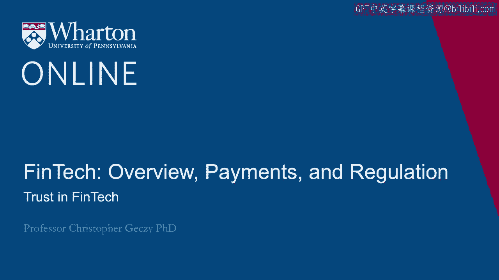
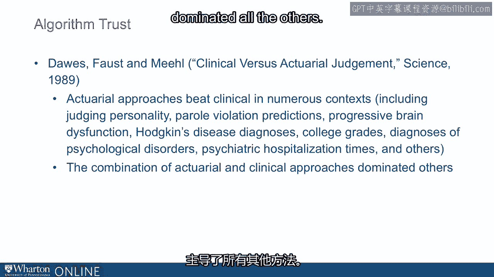

# 沃顿商学院《金融科技（加密货币／区块链／AI）｜wharton-fintech》（中英字幕） - P13：12_对金融科技的信任.zh_en - GPT中英字幕课程资源 - BV1yj411W7Dd

 If customers of FinTech companies are expected to rely， at least in part， if not in the whole。

 on the algorithms of the technology themselves， what do we know about how important trust， is？

 There's a substantial amount of work on trust in financial markets and in the financial。

 advisory space， and that would include in the insurance space and the real estate space。

 and some of the related spaces we talked about as part of these lectures that are informative。

 about what we might be able to conclude in the case of FinTech。 Of course， in FinTech。

 we have a number of other considerations， including the quality。

 of algorithms and what the human machine interface might look like。

 Let us look next at some of the evidence that is accumulated by a way of research and anecdote。

 Realists and psychologists tell us that when humans see each other for the first time or。

 perhaps see each other after not having seen one another for a period of time， we quickly。

 assess attributes of safety and competence very rapidly and powerfully。

 The first two principal components， if you will， of human interaction。

 We can often think of levels of trust construed along these dimensions。 For example。

 trust in technical competence and know how do I trust that you know what， you're doing？ Second。

 especially important in financial transactions and financial services relationships。

 trust in ethical conduct and character。 Do I trust you not to steal money from me？

 Important of course， in an obvious way。 Third， trust in the ability to be human。

 trust in empathetic skills， maturity， emotional intelligence。

 If I tell you personal things about myself or my family， can I trust that you， an advisor。

 will handle that well and can provide counsel？ Many who are concerned about FinTech crowding out the traditional methodologies and traditional。

 relationships in the advisory space and elsewhere often highlight the last component under the。

 idea that 3 million use of human progress may not be ultimately resulting in an app by， itself。

 However， the open question remains of what are the trade offs between or the interactions。

 between trust in advisory services， the kind of services that FinTech providers are actually。

 potentially providing and the clients need to feel safety。 What builds trust？ Well traditionally。

 we hear taking time to explain products and offerings and recommendations， explaining fees。

 staying up to date with current products and trends， responding quickly to， client needs。

 Although our research suggests the financial services industry over emphasizes required。

 frequency of communication。 We studied this at Wharton partnership with State Street Global Advisors a couple years。

 ago。 We did a survey of thousands of financial advisors and their clients， the kind of clients who。

 might be purchasers of FinTech services at some level， at least from a consumer perspective。

 We asked what the most important characteristic of a financial advisor is。 Far and away。

 both advisors and their clients， which were matched， indicated that trustworthiness。

 of the advisor was the most important element。 Trustworthiness was at the margin seen as more important by advisors than clients。

 but， over all the possibilities for both of them， trustworthiness was at the top。 Second。

 understanding the family's needs and goals。 Again。

 viewed slightly more important by advisors than by clients。 Quick， efficient， fulsome communication。

 seen more important at the margin by clients， and advisors， and then performance。

 Interestingly enough， financial advisors viewed performance as less important than clients。 Finally。

 cost fees。 Others felt that fees were not as important as trustworthiness， which was inherent in。

 the client data as well， but they thought it was less important than clients saw， among。

 other possible answers as well。 So far and away， the trustworthiness of an advisor appears to matter at the margin more。

 for advisors than clients， but for both incredibly important。

 An additional part of the analysis looked at the most important attributes of the value。

 proposition of financial advisors， ranging from knowledge， personal factors， including。

 relationship factors， communication styles， including pro-activeness， stability of the。

 relationship， transparency， and responsiveness。 For clients。

 being knowledgeable was seen as most important。 Clearly important for the FinTech industry is the ability to reflect and to carry through。

 a knowledgeable applications of their art and their craft。

 Responsiveness was seen as the third most important thing for advisors followed by personal factors。

 including pedigree and history and tenure in the profession。 Not seen as very important by clients。

 Top for clients was knowledge， second was responsiveness， third was transparency。 Knowledge。

 responsiveness， and transparency are things that the FinTech industry can lead， with。

 On the other hand， financial advisors thought that personal factors， knowledge， and responsiveness。

 were most important once again areas in which FinTech may have an advantage。

 What did millennials think of it？ Well， in research specifically focusing on the millennials。

 when they were asked what， the most important characteristics of advisors were。 Well， first。

 it depended upon complexity of the scenario or the questions involved。

 And second was ordered in a manner that was apparent from previous data and previous comments。

 that we've made。 The millennial segment also has specific attitudes toward this idea of knowledge。

 transparency， and communication。 In some research published in the Journal of Financial Planning。

 Johnson and Larsen reported， the results from a survey of millennials on the attributes of financial advisors that。

 were most important in the dichotomized under two scenarios。 One。

 where there's a simple decision to be made。 And a second where the information was complex and the decision was complex。

 I've highlighted the statistically significant attributes and the table is sorted in descending。

 order of importance attributes that were rated most important。 By way of statistical significance。

 it was knowledge and friendliness that dominated。 And of course， to a lesser extent， degree。

 advanced training， and so on were important。 In other words。

 one instrumental and one effective characteristic of advisors。

 Note that in a high complexity scenario， friendliness and approachability， which we equate。

 roughly with safety， was more important than technical capacity。

 For a low complexity financial planning scenario， again， more than the margin， latest financial。

 techniques and models were rated most highly。 This gives insight into some of the challenges of FinTech when it's distinct from the human。

 element， highlighting the importance of the bionic model in FinTech。 To summarize it one more way。

 when high complexity scenarios were at stake， the human element。

 dominated when low complexity scenarios were at stake。 The technical element dominated。

 although they were both important across the board。 In addition。

 trust and constant contact has been born out as being highly important across。

 scenarios for clients of financial advisory firms。

 Schmeicher and Hogarth a couple of years ago found that financial advice increases financial。

 well-being， broadly construed by way of perception， and also has an influential effect on financial。

 behaviors in a positive direction。 So financial advice was important。

 That seems like a predicate in the FinTech world。 Second。

 trust was a function of age and with contact in particular。

 These results which were developed in an ongoing way as recovery from the financial crisis。

 was happening found that especially among retired people， trust levels were low。 However。

 trust levels were especially low when clients had not been contacted by financial。

 advisors recently， either because they hadn't been contacted proactively or they hadn't sought。

 out advice。 The results suggest here that a proactive element of FinTech advisory， just like it is。

 for human advisory， will be important。 Now the FinTech platforms that we discussed and you've heard about or will hear about。

 another lectures or in your travels and prevails are not purely human in orientation by definition。

 you might say。 Although some might have bionic approaches。

 they don't necessarily distinguish themselves， by being not tech。 They're by definition tech。

 So the question then arises， what do we know about trust not in humans， as you just heard。

 with respect to financial advisors， but specifically with respect to algorithms？

 In a fascinating bit of research published in the Journal of Experimental Psychology and， Elsewhere。

 Dittvore Simmons and Massey in a pen working paper discovered that people displayed。

 algorithm aversion and the article is titled algorithm aversion， people erroneously avoid。

 algorithms after seeing them。 In this groundbreaking research。

 they found that people prefer humans over algorithms， generally。

 That may sound strange in a FinTech lecture， but it's something that needs to be confronted。

 for anyone who is interested in the space， who is investing in the space， who is working。

 in the space and so on。 They also found that trust in algorithms is lower when humans view them at work。

 In other words， before they see algorithms work， they trust them more than afterward。

 even if they're better than competing human technologies。 Finally。

 they found that when an algorithm was perceived to make a mistake， it was especially， bad。

 So in other words， people like people over algorithms， when people watch an algorithm。

 work they trust at less， even if the algorithm is producing better results than humans。

 And then when an algorithm makes mistakes， it's especially bad。 In their study。

 the authors focused on predictions of MBA application success and on forecast。

 a number of airline passengers in the airline industry。 In each case。

 they asked participants in their study to make forecasts either of application。

 success or of a number of airline passengers and compared that to quantitative models that。

 they manipulated。 In their studies of MBA students' performance。

 they allowed participants to witness results， of what they call "humans forecasts" and then forecasts of student performance that。

 they described to participants as coming from models。

 When the forecasts were described as coming from humans， they sought no difference in。

 the selection of participants to use humans' forecasts。

 You can see that in study one because there's no palpable difference between a control。

 random-oriented choice selection and those that saw results of the human's forecasts。 However。

 when participants witnessed results of forecasts from models， whether the models。

 were better or not， but even when the models were better， their selection of them， aka their。

 trust of them， declined。 You can see the numbers and the control went from 65% and 63% based on the first treatment。

 of those participants choosing the next round to be a statistical model compared to what。

 happened after they actually saw the models forecast or the models in humans' forecasts。

 Same thing was repeated in study number four， which incorporated their own forecasts as well。

 as another human。 And perhaps because this might have been a cooked MBA student example。

 they looked at， forecasting the number of airline passengers in the United States。

 a kind of exterior problem， the same exact results。

 When asked to select a statistical model or a human model， when they saw the results of。

 a human's forecasts， they were just over 50% likely to choose the statistical model。 However。

 when they saw a statistical model， they were more likely to choose the human forecast。

 56% went to 41% for choosing the statistical model， and that's also true when they saw both。

 humans and statistical model algorithmic forecasts when the model outperformed humans。

 It's an incredibly powerful result across the board。 More than that。

 your belief in advance was a function of whether you saw a model or a。

 statistical algorithm perform。 Even if it was better。

 So your confidence in advance made a difference。 If you look at the far right of the graph from front of you。

 when participants described， themselves as being much more confident in a model in advance。

 they were 82% likely， if， you will， to choose a model。

 and that converged across whether you saw the model perform or， whether you didn't see it。 However。

 if you were not confident in advance and you saw the model perform， you were significantly。

 less likely to choose it 13% compared to 39% who are more confident。 In the other dimension。

 across confidence， again， if you were more confident in the model。

 you were more likely to choose it。 So how can we bring this together for FinTech？ Well， number one。

 we see how important trust is and the variance of trust， at least in， part。 Second。

 in the FinTech context， we might translate this notion of trust into trust of algorithms。

 What do we know there？ Algorithmic aversion exists。

 People don't choose algorithms over humans once they see the algorithm in action， even。

 if the algorithm beats people。 They may choose the algorithm if they haven't seen any results。

 even if those results are， better than theirs。 If algorithms make mistakes and people see them。

 they strongly avoid the use of the algorithm。 Interestingly enough。

 the authors of the piece we just mentioned followed on and found that。

 if they could change the algorithm， they should say participants， if people can change。

 the algorithm， even a small bit after seeing its performance， they're more likely to use。

 the algorithm。 So it looks like， in some sense， combining judgment with the algorithm helped them feel。

 confident and trusting of the algorithm itself。 This reflects some pretty interesting work summarized in a well-known paper in science。

 in the late '80s by Dawes-Fauston-Miel called clinical versus actuarial judgment in which。

 in a meta-analytic approach the authors described how actuarial approaches， called them algorithmic。

 approaches in many different contexts beat clinical or human-oriented approaches， including。

 judging people's personalities， making parole violation predictions， diagnosing progressive。

 brain dysfunction， understanding and diagnosing Hodgkin's disease， forecasting college grades。

 diagnosing psychological disorders， understanding hospitalization times and numerous others。

 The actuarial approach dominated the clinical approach， although they did find that the。

 combination of actuarial and clinical approaches dominated all the others。

 There were several reasons， consistency or its converse for humans in consistency across， time。

 across scenarios， across states of mind of the protagonist。

 Clinical approaches tended to be more rational and rules-based。

 They allowed formal rational weighting of inputs。 They included all kinds of relevant variables and excluded irrelevant variables。

 Sample biases of clinical approaches are often large in number， limited samples， skewed exposure。

 to treated cases。 Doctors， for example， see only the sick as opposed to a controlled sample and so on。

 One area where it was found that the combination of actuarial and clinical approaches dominated。

 others was in the area of what we call the broken leg problem or the recognition of extreme。

 outliers in which clinicians were shown to have better predictive capabilities。

 But the idea that the combination of humans and machine might give the best results is highly。

 supportive of the FinTech proposition in some ways， especially as it relates to trust in。

 algorithms and ultimate outcome for clients。 [BLANK_AUDIO]。

