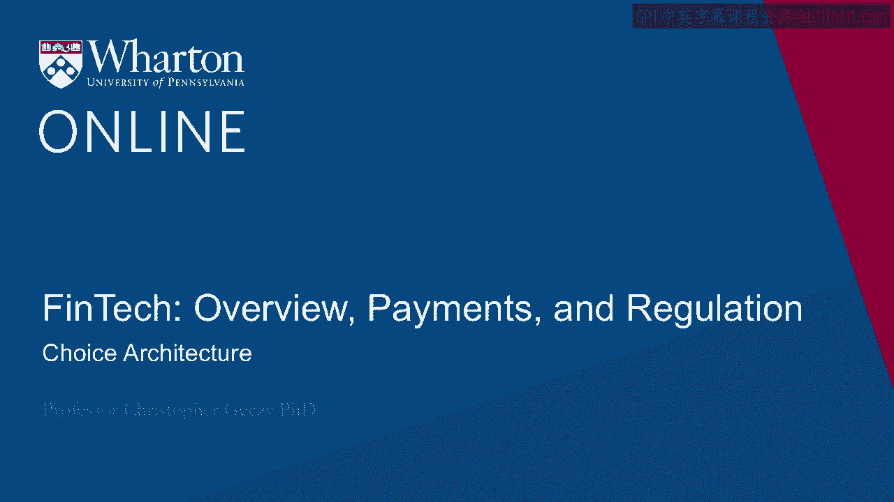
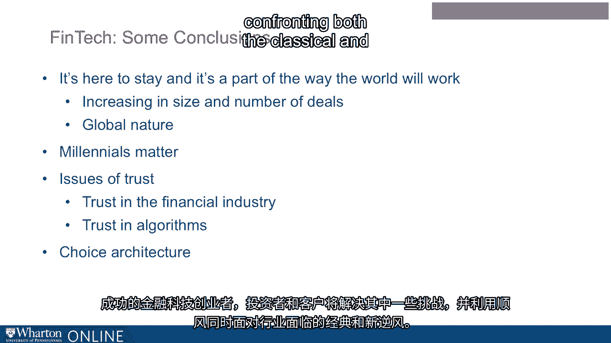

# 沃顿商学院《金融科技（加密货币／区块链／AI）｜wharton-fintech》（中英字幕） - P14：13_选择体系结构.zh_en - GPT中英字幕课程资源 - BV1yj411W7Dd

 Understanding the evolution of FinTech， both its present and its future， necessarily requires。

 mentioning the idea of choice architecture and the challenge that consumers or purchases。

 of FinTech products and services might have in selecting their purchases。 For example。

 in a Robo-Advisery context， selecting elements within a portfolio。

 One of the solutions that have been offered， again in the Robo-Advisery space， are pre-selected。

 portfolios。 Where do those come from？ Why do they have three choices versus 30 choices？

 Well choice architecture and the challenge of computation burdens when the number of choices。

 is large becomes really important。 Again， FinTech has its own challenges。

 both with the number of possibilities out there。 How many apps on the app store related to FinTech at this point as an example。

 but also the， underlying number of choices within the palette of potentials。

 Well complexity matters when numerous choices are available。

 Research over many years has suggested that showing "too much information can affect。

 the way choices are made。 It can skew risk perceptions。

 It can slow or make impossible decisions and decision making。

 It can also impact the way people feel about their decisions and make them less happy about， it。"。

 For example， Dietcon and Hasseldeen a couple years ago found that investors are more likely。

 to take risk when shown presentations over longer periods than when presented with succession。

 of short period returns。 In other words， one single longer term representation of results allowed clients or investors to。

 make decisions more easily than a large number of shorter period returns。

 Other studies have suggested that when faced with many choices， investors choose not to。

 participate in a famous study of 401(k) defined contribution plans over a large number of。

 participants， almost a million participants across 660 companies。

 The number of choices as they increased caused decision making paralysis， we call it analysis。

 paralysis。 For every increase in options by 10 overall participation in retirement plans themselves。

 declined by 2%， framing decision making thus turns out to be important。 In addition。

 complexity interacts with trust。 First， not having an answer leads to declining trust。 Second。

 when a client asks a question involving a complex scenario， a product service， and， so on。

 if an advisor did not know an answer， it was better than making up an answer。 In a well-known study。

 Bichert and co-authors conducted a series of studies in which participants。

 rated advisors on two scores， trustworthiness and intention to make an investment decision。

 with the advisor per se after being presented with three answers from the advisor。

 Absolutely correct and simple。 Two， admitting ignorance。 And three。

 an answer that didn't sound right and appeared up fuscatory。

 What they found was that it's always better for an advisor to admit ignorance than obfuscate。

 whether the client perceives the advisor earning a commission。

 Here are the results of the study relating complexity and clarity to trust and intention， to invest。

 This is essentially a 2x2 matrix with commission motives on the left and no commission motive。

 on the right。 In other words， fee only versus commission。

 And then participants who understood there's a commission versus participant who said the。

 salesperson knew all the answers。 Down at the bottom we see intention to invest。

 subsequent to the interaction and an overall， rating of trust。

 Both of these scales range from one to seven with seven being greater in trust or intention。

 than one。 Let's focus on the bottom in the highlighted box。 When there was no commission involved。

 and of course we know that in the FinTech space， we have fee only and commission oriented platforms and companies。

 when a correct answer was， provided clear and simple， 4。

91 average rating on the trust scale was observed。 And a 4。5 rating on intention to invest。

 Note that when a commission was involved， the 4。9% average dropped to 4。61 and the intention。

 to invest dropped from 4。5 to 4。3， both of which were statistically significant。

 Then when we move from the correct answer simply expressed to a VUSCatory， in other words， an。

 unclear possibly wrong response， the trust levels once again dropped dramatically， especially。

 when a commission was involved。 4。91 on the trust scale moved to 4。34 and then 4。34 moved to 3。

66 on the trust perception， scale when a commission was perceived。 To say it another way。

 a Nafuscatory response brought trust perceptions down and interacted。

 with the commission motive in a misalignment of incentives on behalf of the advisor as perceived。

 by the client。 In addition， the intention to invest went down from 4。5 to 4。36 and then from 4。

36 to 3。56。 Was simply saying I don't know better？ Absolutely。

 Then think about trust perceptions they went from on the right in the no commission case， from 4。

91 to 4。8 and then in the commission case， the don't know response went from 4。8， to 4。42。

 In both cases better than making up a response。 To summarize intentions to invest。

 perceptions of trust interact with commissions and the。

 misaligned of incentives as well as how responses happen。 In the FinTech space。

 having unclear actions and unclear responses as well as a heightened， sensitivity to mis。

 to algorithms and potential mistrust and algorithms come together both。

 to represent a tailwind and a headwind for the industry。 So at the end of the day。

 what can we say about what we know about the FinTech space generally。

 and in particular about robo-invising？ Well， first it's here to stay and it's part of the way the world will work。

 It seems ineluctable， judging from both supply and demand， the increasing in size and number。

 of deals， the upward general trend despite some market cycle variation， the global nature。

 of the industry as well as how it's construed across sub-components all tell us that FinTech。

 is part and parcel of the world and the way forward。 In addition。

 millennials matter and the hard in minds of millennials which seem to be so。

 much in the crosshairs of financial services firms already， legacy firms as well as disruptors。

 and entrepreneurial enterprises， underscore the advent both the supply and demand of FinTech。

 providers。 However， the traditional notions of trust not just in the financial industry but specifically。

 in what is special about FinTech algorithms and potential exposure to technology all come， together。

 Traditional challenging areas like those of choice architecture arise， it's going to。

 be nothing different for FinTech。 Successful FinTech entrepreneurs。

 investors and clients will resolve some of these challenges。

 and harness the tailwinds while confronting both the classical and the new headwinds that。

 are facing the industry。 Almost surely there will be winners and losers。

 those that win will accommodate and treat， these challenges and they'll harness some of them for the future。

 [BLANK_AUDIO]。

