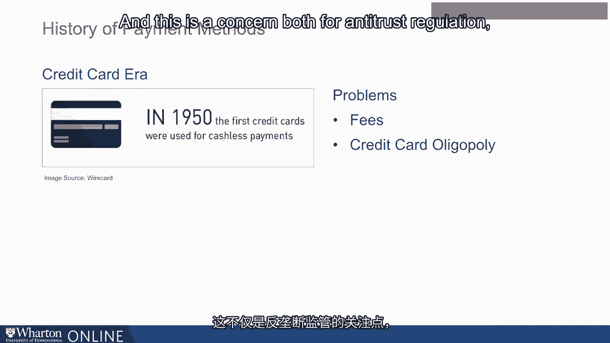

# 沃顿商学院《金融科技（加密货币／区块链／AI）｜wharton-fintech》（中英字幕） - P16：15_支付方式历史.zh_en - GPT中英字幕课程资源 - BV1yj411W7Dd

 In this module， we'll be talking a lot about how we pay for and transact for the goods that。

 we purchase。 So I'm going to start by telling you a little bit about the history of payment methods。

 and then talk to you a little bit about the inherently two-sided nature of this market。

 and why that makes it quite unique relative to normal sort of goods transaction purchases。

 that we do。 I'm going to talk a little bit about the growth of the credit card industry in particular。

 and problems that have emerged in this industry。 And the way that regulation has tried to solve these problems and perhaps the way that financial。

 technology can solve these problems in the future。

 Just to start and sort of level the playing field for us a little bit， what is and how。

 historically have we transacted for goods？ This is a question that has been with us since the beginning of time and it takes us。

 back to long， long ago when we used to barter or exchange actual goods with one another。

 The issue with this sort of bartering in the slide I present to you there are bartering。

 horses for shells for example is that there are no real common standards of value。

 Your livestock might be really valuable to you but less valuable to the person you're。

 transacting with。 And so whose valuation should govern in that particular exchange is a difficult question。

 It's also quite inefficient as a means of exchange every time you want to sort of exchange your。

 livestock for some shells you have to carry these goods around with you to transact。

 And so understanding that this is quite an inefficient means of transacting we kind of。

 innovated and the first series of innovations had to do with using rare metals or coins in。

 order to be a store of value for exchanging and transacting。

 This also posed some issues from the perspective of those engaged in these exchanges。

 One issue is that there's inherently fluctuation in the value of the metals like gold， the silver。

 that you're using because it depends on how much gold and silver you have and your ability。

 to make those resources into these coins。 It's also deeply burdensome to sort of weigh and carry around every day。

 And that we only transact with quarters。 This would be deeply inefficient for all of us and quite cumbersome。

 And quarters are much lighter than the kind of metals that we were using in this sort。

 of means of exchange。 And so we got to using paper money as a means of exchange。

 This comes to us from China where merchants invented the first paper money。

 And by the 19th century paper money was very common in Europe。

 And while a significant advancement that got rid of some of the inefficiencies of for example。

 having to carry around metals with you or being concerned about the fact that there。

 are fluctuations in these values depending on the resources that you have available is。

 still not a perfect payment structure by any means because there are real concerns about。

 theft and the ease of theft when you're transacting with paper currency。

 And also a forgery that counterfeit notes are going to emerge and people are going to。

 be able to transact with them。 The kind of more modern innovation we still obviously have paper money。

 But in the early 1950s we introduced the first credit cards as a means of transacting。

 This had a lot of advantages from the perspective of the consumer who's able to now transact。

 with a single payment instrument that they have in their wallet rather than a host of。

 paper bills or a lot of coins that they're carrying around with them。

 So there's certainly efficiency gains for consumers。

 There are problems as well for the perspective of both consumers and merchants。

 From the consumer perspective you worry about things like credit card fraud which has emerged。

 as a leading concern。 From the merchant perspective the nature of these markets which we're going to spend some。

 time talking about in this lecture resulted in a few large card networks having considerable。

 control over this market。 And that creates some problems that regulation is trying to address。

 From the merchant perspective the main problem is that the fees for processing these transactions。

 tend to be very large。

 And this is a concern both for antitrust regulation but also a concern for financial。

 innovation going forward。 [BLANK_AUDIO]。

