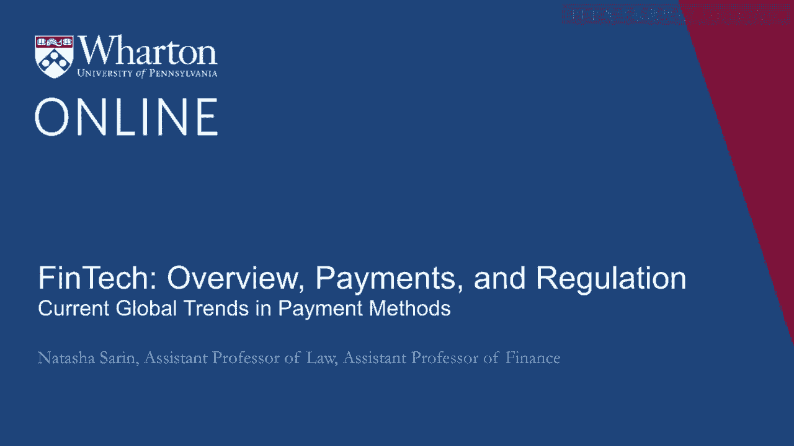
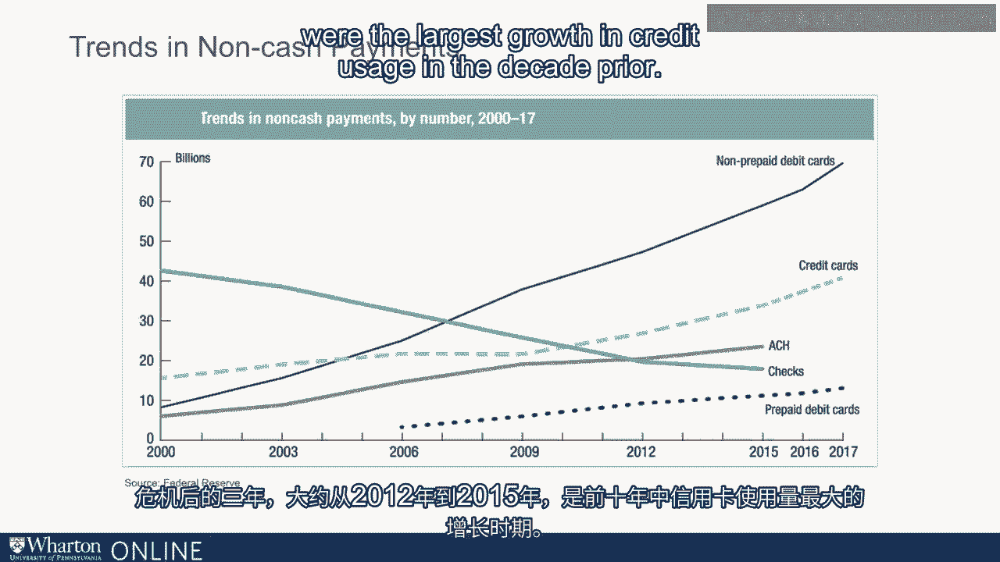

# 沃顿商学院《金融科技（加密货币／区块链／AI）｜wharton-fintech》（中英字幕） - P17：16_当前全球支付方式趋势.zh_en - GPT中英字幕课程资源 - BV1yj411W7Dd

 It wasn't too long ago that CHEC was the most common non-cash form of payment。

 In the early 1990s， almost 90% of non-cash transactions were done with CHEC。

 Cheques have declined significantly over the last three decades as debit and credit card。

 usage has really exploded。 Cash is still the most common means of purchase in the US。 However。

 its share is declining quickly。 And by 2022， we anticipate that there's going to be a growth in new kinds of payment instruments。

 like e-wallets that FinTech technologies are developing continuously。

 There are interesting distributional aspects to who transacts with what kind of payment， instrument。

 Cash is predominantly used by low-income consumers， often who don't have access to credit cards。

 as a means of transacting。 Debit cards are more commonly used by low and middle-income consumers who have access。

 to a debit card because they have a bank account but don't transact with credit either。

 because they don't have a credit card or because they don't feel comfortable transacting。

 with a means of payment that couples borrowing from a bank or financial institution with。

 transacting。 Credit cards are predominantly used by higher-income consumers who have access to really。

 attractive rewards cards and use them as a means of purchase。 Since the financial crisis。

 debit usage has actually dominated credit usage。 One reason that people think this may be is because especially millennial consumers are。

 still operating in the shadow of the crisis and worry about taking on too much credit， card debt。

 However， in the future going forward， the belief is that credit will dominate debit and。

 that new payment instruments like e-wallets and apple pay are really going to dominate。

 the payment landscape。 What's really quite interesting about credit card and debit card payment networks is that。

 a few large card networks tend to dominate the global landscape。 Here in the US。

 over 90% of credit card volume is dominated by Visa， MasterCard and American， Express。

 Visa and MasterCard significantly larger share than American Express account for around 70%。

 of the total。 Overall， across the globe， Visa， MasterCard and UnionPay dominate the global payment。

 landscape。 UnionPay you may not have heard of。 It's a payment processor that was established in China and has a true monopoly on the Chinese。

 market。 For many years， Visa and MasterCard cards in China were dual-badged with UnionPay， but。

 at 2017 regulation prohibited this dual-badging going forward。

 As all Chinese cards issued for domestic use now have to be UnionPay branded and banks。

 are typically issuing UnionPay only cards， this means Visa and MasterCard's ability to。

 compete in the Chinese market has all but been depleted。

 As the Chinese appetite for tourism has grown substantially， so is the number of countries。

 where UnionPay cards are accepted。 Today， these cards can be used in over 150 countries。

 even though those of us who transact， in the US have likely never seen them。 Here in the US。

 since the early 2000s， we've witnessed a substantial decline in the use。

 of checks as a means of transacting。 That decline has been picked up by a substantial growth in credit cards and debit cards as a。

 means of purchase。 Since the recession， there's also been a growth in prepaid debit cards as a means of。

 transacting。 prepaid debit cards allow consumers who either don't have bank accounts or who have bank。

 accounts but don't want to transact on them to prepay and purchase a card， for example。

 from Walmart， and then use that prepaid debit card as a means of， for example， paying for。

 gas with their debit card。 Today in the US， around 67% of transactions are made with debit cards and around 33% of。

 card transactions are made with credit cards。 Again。

 the distributional aspects of this are really quite interesting。

 High income financially sophisticated consumers disproportionately use credit cards as a means。

 of transacting primarily to get access to attractive rewards that card issuers offer， them。

 Low income consumers who either don't have access to credit or don't trust that they're。

 going to be able to monitor their credit in an appropriate way tend to transact much。

 more with debit cards。 It's also true that for larger transactions。

 consumers are much more likely to use credit， cards as a means of purchase and for smaller transactions。

 consumers are much more likely， to use debit cards。

 The financial crisis was really a quite interesting inflection point from the perspective of the。

 payment system。 In the decade leading up to the crisis。

 credit card use really quite exploded as card networks。

 introduced rewards cards that incentivize consumers to transact with them。 Following the crisis。

 there has been a real substantial growth in debit relative to credit， usage。

 particularly for a certain class of consumers， precisely millennials who lived， through the crisis。

 There appears to be a bit of a distrust with respect to using credit cards that couple。

 transacting and financial borrowing from large financial institutions。

 Around 70% of millennials tend to believe that debit cards are as safe or safer than。

 credit cards and prefer transacting with these instruments。

 It's also unclear what new regulations that make it more expensive for banks to supply。

 credit have done to credit card usage in the US。 A 2013 report by the Fed suggested that the loss of around 120 million credit card accounts。

 following the recession might tell us that consumers are choosing to reduce the number。

 of cards they hold and presumably choosing to transact with fewer credit cards in the， future。

 But this could also be that consumers are simply adjusting the number of cards they hold。

 or banks or adjusting the availability of credit to certain categories of consumers。

 but not in a way that's going to have a substantial impact on the means that they transact。

 The three years following the crisis from around 2012 to 2015 were the largest growth。

 in credit usage in the decade prior， which suggests that overall credit usage in terms。

 of volume is growing quite substantially， even though there are certain classes of consumers。

 who tend to be a little bit wary about transacting with credit instruments。 And so。

 we're going to make a decision to make a decision to make a decision to make a decision。

