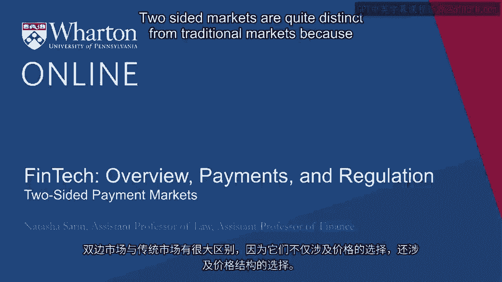
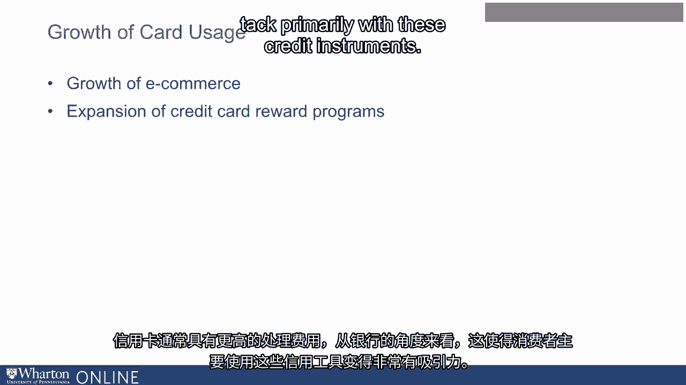
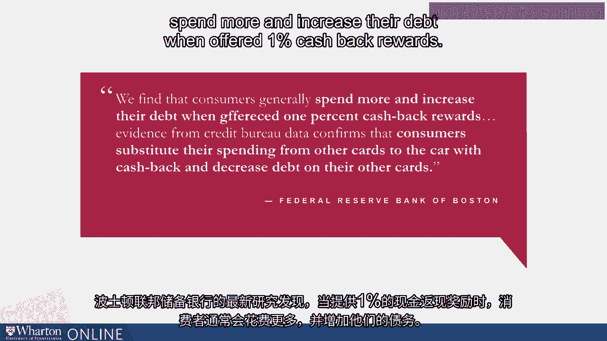

# 沃顿商学院《金融科技（加密货币／区块链／AI）｜wharton-fintech》（中英字幕） - P18：17_双边支付市场.zh_en - GPT中英字幕课程资源 - BV1yj411W7Dd

 Two-sided markets are quite distinct from traditional markets because they involve the choice of not only a price。

 but also a price structure。

 In a traditional one-sided market， like let's say the market for widgets。

 the producer of the widget sets a price for the widget。

 And all consumers who value that widget at that price and are willing to pay it are going to purchase that widget。

 In a two-sided market， like a card network system。

 the card network is essentially the intermediary between two different distinct traditional markets。

 The intermediary with respect to consumers and the intermediary with respect to merchants who accept these cards。

 And so they have to choose not just prices on both sides of the market， but also a price structure。

 How much to levy the cost of processing these particular transactions on consumers relative to on merchants？

 Card networks are far from the only two-sided network。

 and this is a canonical set of issues that are discussed in the economics literature。

 The nature of how costs are distributed between two different sides of this market vary depending on the kind of market we're talking about。

 So for example， for newspapers， we tend to not really charge consumers significantly for reading the news。

 but we charge advertisers quite significantly for advertising on those platforms。

 With respect to card networks， card holders tend to actually be charged in essence a negative transaction fee because they receive rewards for a transaction with payment instruments like debit cards and credit cards。

 And the costs of transaction are primarily borne by merchants who pay high processing fees for processing these transactions。

 Note that one issue with a traditional two-sided market relative to a one-sided market is just having a cost that's elevated relative to what you think the true cost is on one side of the market isn't necessarily indicative of market failure。

 So one side of the market you often treat as a loss leader in the perspective of card networks。

 those are， that's the consumer side of the market where consumers actually have a negative cost on that side。

 The negative cost that consumers have means a higher cost than you would set in a traditional one-sided market is going to be borne by merchants in this setting。

 From an antitrust perspective， this poses some complexity for antitrust authorities because simply seeing an elevated cost relative to what you would expect on one side of the market isn't by itself indicative of a market failure。

 Setting up a two-sided market is quite complicated because the platform is essentially valueless until you have substantial participation on both sides of the market。

 So even if you set really attractive credit card terms and give consumers a ton of rewards。

 your platform is valueless unless you can also convince merchants to accept your cards。 Similarly。

 if you're Uber， you don't want to charge consumers too much or no one will ride with you。

 but you also don't want to pay drivers too little or no one will drive for you。

 A canonical example that's used to explain two-sided markets is actually interestingly nightclubs。

 and I apologize for the heteronormative nature of the example I'm about to use。

 but I think it illustrates the point quite well。 A nightclub， which only has male patrons。

 doesn't have much value to the men who are patronizing the institution unless they're able to convince women to also join and attend the nightclub。

 Similarly， a nightclub with no men but only women doesn't have much value to the women at the nightclub unless they're able to convince men to also attend。

 Depending on how desirable the extra woman at the nightclub is to the existing men or the extra man at the nightclub is to the existing women。

 the nature of the payment structure or the nature of the price structure in this market might be different than what you would expect。

 For example， this explains why ladies drink free at certain nightclubs on certain evenings because it's very attractive to be able to recruit more female patrons for the existing male customers。

 Card networks have value and cost to both sides of the market。

 both in the merchant acceptance relationship and in the cardholder usage relationship。

 On the merchant side， cards are immensely valuable because customers that don't carry cash are able to buy products and services。

 And in this day and age， customers tend to expect that they're going to be able to pay for goods with their debit and credit cards and you may lose customers if you're not willing to accept these transaction methods。

 Additionally， the sort of cash based theft concerns or the counterfeiting concerns are significantly reduced by the existence of card networks in these markets。

 The costs though are quite significant depending on the payment instrument and depending on whether it's a debit card or credit card or what particular card network you operate with。

 merchants can pay between 1% and 3% of transaction value in the form of processing fees。

 That's quite a significant sum and as card usage has really exploded in the last 30 years。

 these interchange costs as they're referred to are often the second highest cost of operation for merchants after labor。

 On the cardholder side of this relationship， in terms of cardholder usage。

 credit cards are attractive because they tend to come with attractive rewards。

 things like cashback or airline miles。 There's also the ease of transacting with credit and debit cards that simply involve a swipe of your card rather than having to deal with the cash that you may or may not have in your wallet。

 But again， there are real risks of transacting with these payment instruments。

 One concern from the consumer perspective is the possibility of credit or debit card fraud on their account。

 which can depending on your card network and depending on the payment instrument be quite challenging。

 Another concern that's quite distinct to credit cards is that as we've discussed。

 credit cards tend to couple financial transacting with financial borrowing。

 So you may tend to really use your credit card quite significantly because you're really attracted to the ability to generate a ton of credit card rewards。

 But if you don't keep track of your credit card payments。

 then you're tending to bear high delinquency fees and get trapped in expensive cycles of consumer debt。

 Another real attraction of credit and debit card usage from the perspective of consumers is this allows them to transact online in ways that cash simply wouldn't do。

 So as e-commerce has grown quite significantly， in the early 2000s。

 transacting online for goods was less than 1% of total retail sales。 In 2018， it was almost 10%。

 So as it's become common for us to purchase goods from eBay or Amazon。

 the value of credit and debit payment instruments is skyrocketed。 And also， again。

 from a distributional perspective， those consumers who don't have access to a debit card。

 let's say because they're unbanked， or those consumers who don't have access to a credit card。

 let's say because there are subprime consumers who are risky borrowers that banks don't want to lend to in this manner。

 are actually shut out from an important means of being able to transact for goods online through e-commerce。

 Along with e-commerce， another significant driver of growth of card usage has been the expansion of credit card rewards programs。

 Following the financial crisis， as regulation that we'll discuss in a later module restricted the ability of banks to generate revenue from debit processing fees。

 this regulation left untouched credit processing fees。

 And so banks and card networks had every incentive to try to encourage greater use of credit cards。

 Credit cards also tend to have higher processing fees generally。

 making from the bank's perspective it really attractive for consumers to try and snack primarily with these credit instruments。

 In order to get consumers to use credit cards more frequently。

 card networks and financial institutions realized that they could do well by offering really attractive rewards and cash back loyalty programs to consumers for their transactions。

 Additionally， as credit cards have become an incredibly competitive industry and one in which consumers really do display a willingness to switch credit cards depending on the rewards that they're being offered。

 card networks and financial institutions really have to best each other with respect to the rewards they offer consumers in order to maintain substantial market share。

 Consumers tend to be highly responsive to the offerings of rewards and to the transact much more with cards when it is attractive to them from a rewards perspective。

 Recent work by the Federal Reserve Bank in Boston finds that consumers generally spend more and increase their debt when offered 1% cash back rewards。

 And evidence from credit bureau data confirms that consumers substitute their spending from other cards to the card with cash back and decrease debt on their other cards in order to take advantage of attractive rewards programs。

 This is quite important because it suggests that consumers are increasing their indebtedness past the level which perhaps is socially optimal in order to take advantage of the existence of attractive rewards programs。

 [BLANK_AUDIO]。

