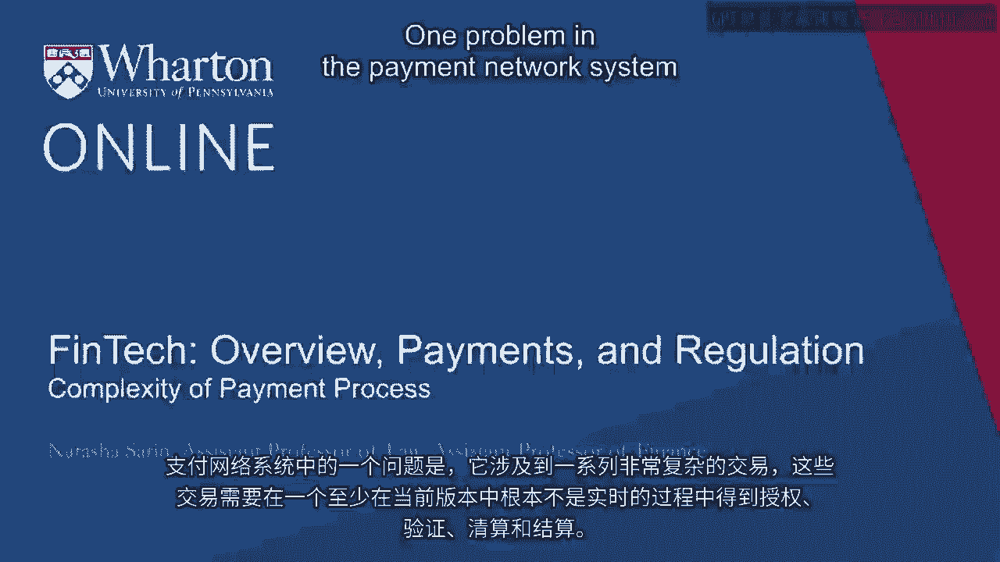
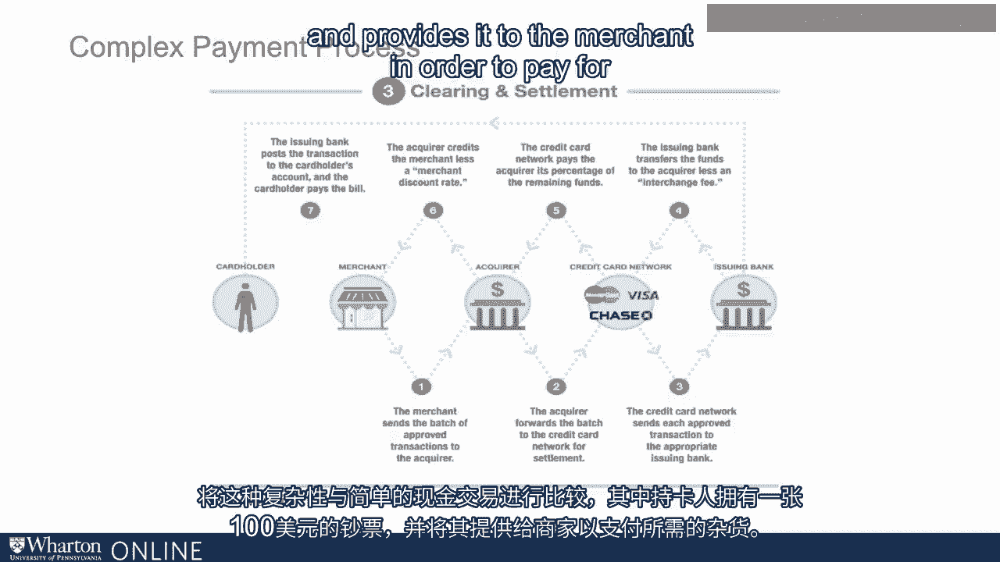
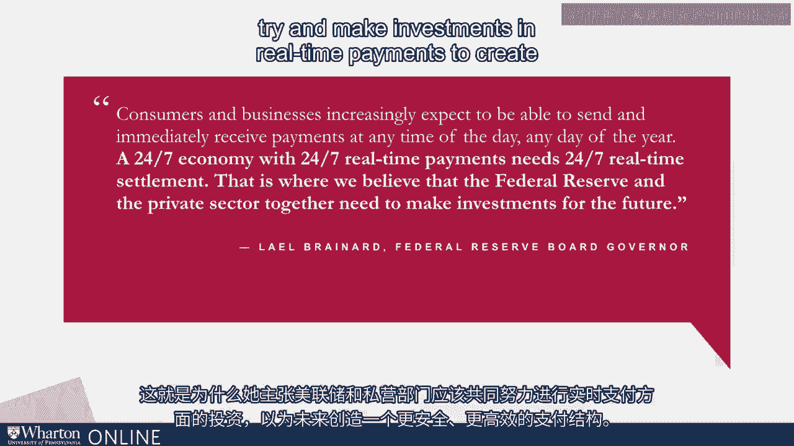
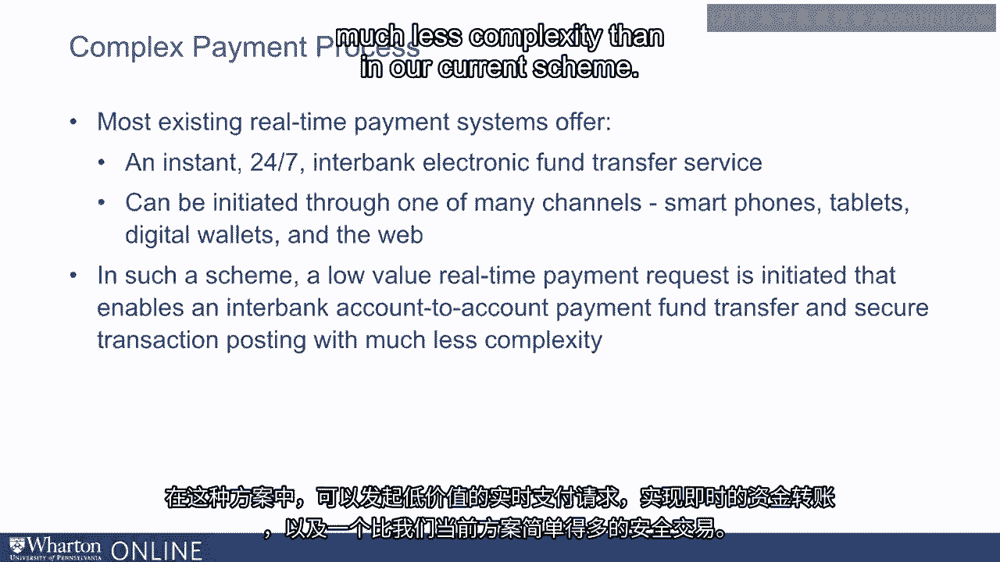

# 沃顿商学院《金融科技（加密货币／区块链／AI）｜wharton-fintech》（中英字幕） - P19：18_支付过程的复杂性.zh_en - GPT中英字幕课程资源 - BV1yj411W7Dd

 One problem in the payment network system is that it involves a really complicated series。

 of transactions that need to be authorized， authenticated， clear， and settled in a process。

 that at least in current iterations is not at all in real time。

 Let's think about what happens when you use your credit card as a means of transacting。

 So you go to the local grocery store and you give the grocer your credit card to purchase。

 $100 of groceries。 The merchant then has to send those credit card details to the merchant's acquiring。

 bank。 The merchant's acquiring bank is responsible for getting the funds from the card holder's。

 issuing bank back to the merchant。 So the acquiring bank， the merchant's bank。

 then forwards those credit card details to， the credit card network。

 Let's say a master card in this setting。 And then master card goes to the customer's bank。

 the issuing bank， and then requests payment， authorization for that transaction。 Next。

 the issuing bank， the customer's bank has to verify the card information that it。

 receives from the credit card network。 And if customer funds are available for that transaction。

 it has to send an approval code， to the merchant via the same series of channels through the initial card network。

 master card， in this case， back to the acquiring bank， the merchant's bank， then back through the。

 acquirer to the merchant。 And then the merchant's payment terminal collects all the approvals from this complicated process。

 and approves the transaction， providing the customer with a sales slip to complete this， purchase。

 At this point， the transaction has been approved by the customer， but no funds have actually。

 exchanged hands。 Now the merchant is going to have to send the batch of approved transactions back to his。

 bank， the acquiring bank。 The acquiring bank then has to forward that approval back to the credit card network。

 master， card for settlement。 The credit card network has to send every approved transaction to the appropriate issuing。

 bank， the customer's bank。 And then the customer's bank is going to have to transfer the funds back to the acquiring。

 bank， routing it through the credit card network， through a series of complex transactions， each。

 of which has a fee for the participating institution。 At this point。

 the transaction has been approved， but no funds have actually been transferred。

 between the card holder and the merchant。 So now the merchant is going to send the approved transaction。

 notice of the approved transaction， to his bank， the acquiring bank。

 The acquiring bank is then going to send that approval along to the card network， master。

 card for settlement in this case。 The card network sends every approved transaction to the customer's issuing bank。

 and then the， issuing bank transfers funds through the card network to the acquiring bank。

 and the acquiring， bank， the merchant's bank， provides the merchant those funds to complete this particular transaction。

 Note how many different participating institutions are required just to get an exchange from。

 the card holder to the merchant for purchase of a retail good in this setting。

 And compare this complexity with a simple cash transaction where the card holder has。

 a $100 bill and provides it to the merchant in order to pay for the groceries that she。

 requires。 Perhaps unsurprising given this incredibly complicated chain of transactions， but in the。

 United States today we are far from a real time payment system。

 This means that every piece of this transaction chain takes significant time in order to settle。

 or clear。 So it takes time for merchants to be able to get the funds that they are owed when consumers。

 make transactions。 And it also is unclear from the consumer's perspective。

 for the merchant's perspective， even the bank's perspective。

 whether the funds are actually available to be dispersed at， the time when the transaction is made。

 This is a problem that exists in the United States more so than in countries with better。

 real time payment systems like China。 And one that the Federal Reserve is quite attuned to and paying attention to。

 Recently， Lael Brainerd， a governor on the Federal Reserve Board， noted that consumers。

 and businesses expect to be able to send and immediately receive payments at any time of。

 the day on any day of the year。 And given that our economy is a 24/7 one。

 it is important for the payment structure to， be as well。

 And this is why she advocates that the Federal Reserve and the private sector come together。

 to try and make investments in real time payments to create a more secure and more efficient。

 payment structure for the future。 Most existing real time payment systems around the world offer instantaneous 24/7 interbank。

 electronic transfer fund services that can be initiated through a variety of channels。

 like on your smartphone or through a digital wallet or through the web。 In such a scheme。

 low value real time payment requests can be initiated that enables instantaneous。

 payment fund transfer and a secure transaction that can be done with much less complexity。

 than in our current scheme。

 Thank you。 [BLANK_AUDIO]。

