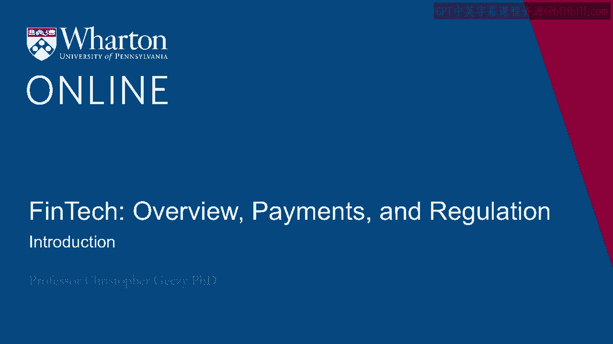
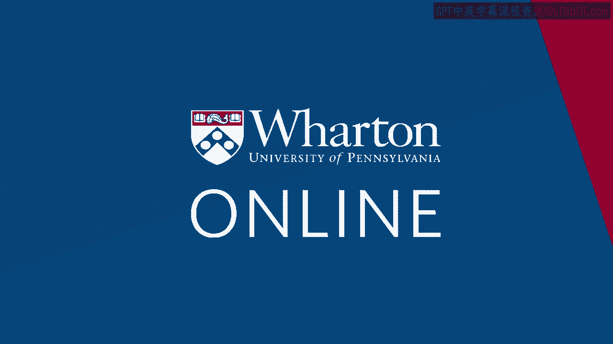

# 沃顿商学院《金融科技（加密货币／区块链／AI）｜wharton-fintech》（中英字幕） - P1：0_介绍.zh_en - GPT中英字幕课程资源 - BV1yj411W7Dd

 Hi， my name is Chris Gatesy from the Finance Department at the Wharton School。

 I'm also Academic Director of the Jacobs Levy Equity Management Center for Quantitative。

 Financial Research and the Academic Director of the Wharton Wealth Management Initiative。

 In today's lectures， we'll be looking at the broad notion of the FinTech market。 Its definition。

 its depth， its breadth both across time and in the cross-section of。

 countries in which we see FinTech evolving。 We'll also look at some of the specifics driven by research into the potential audiences。

 of FinTech。 Users， adoption rates， as well as some results from recent research on algorithms that trust。

 that goes behind adoption of algorithmic approaches， as well as some of the headwinds。

 and tailwinds to that adoption。 [BLANK_AUDIO]。

