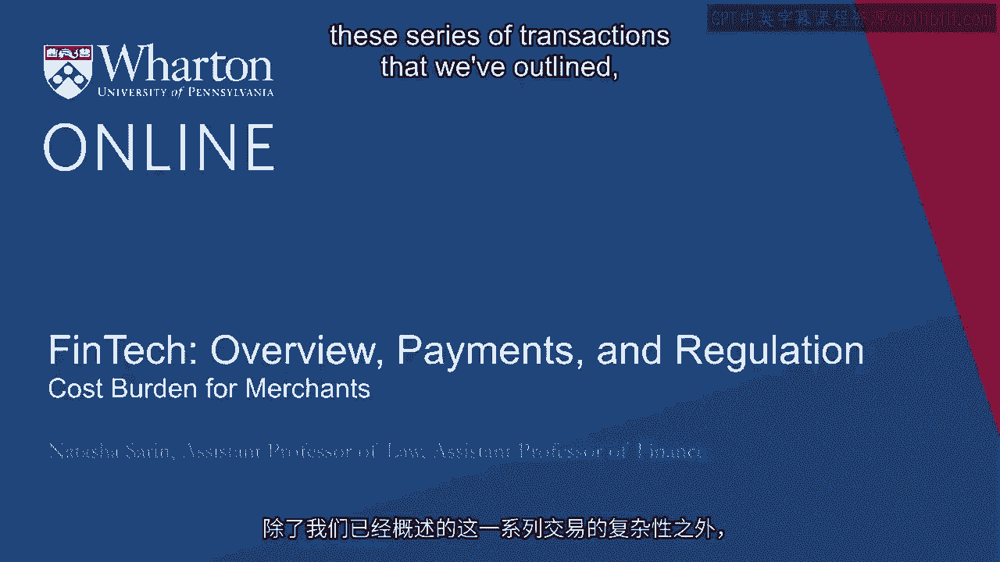
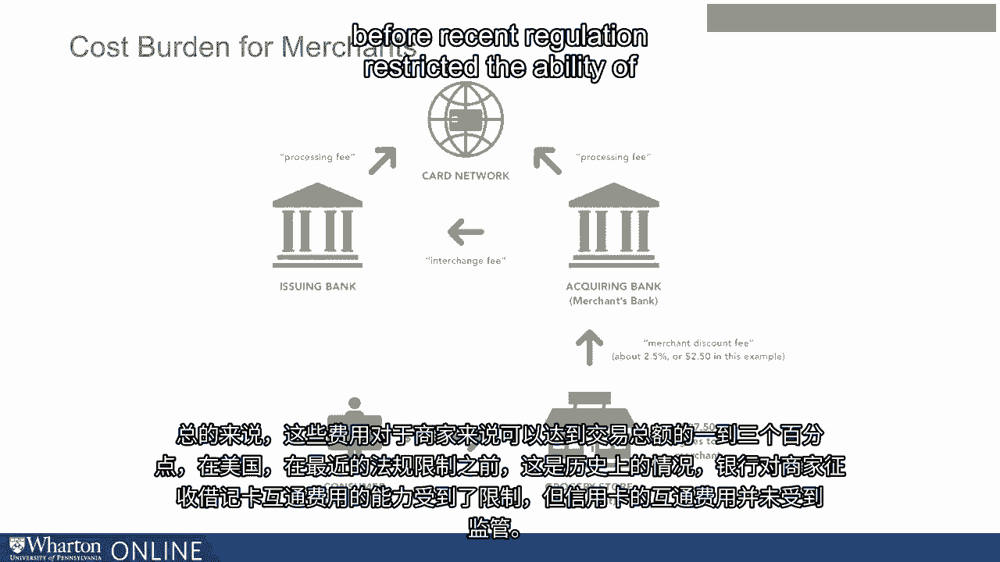
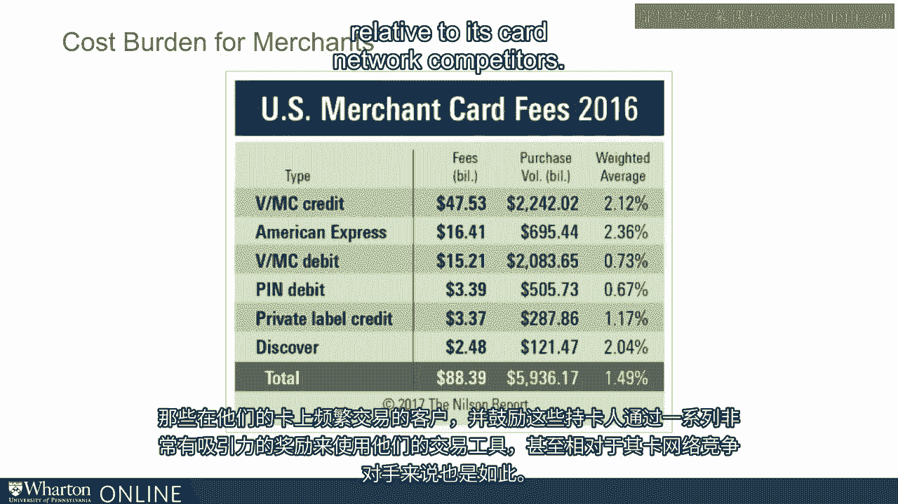
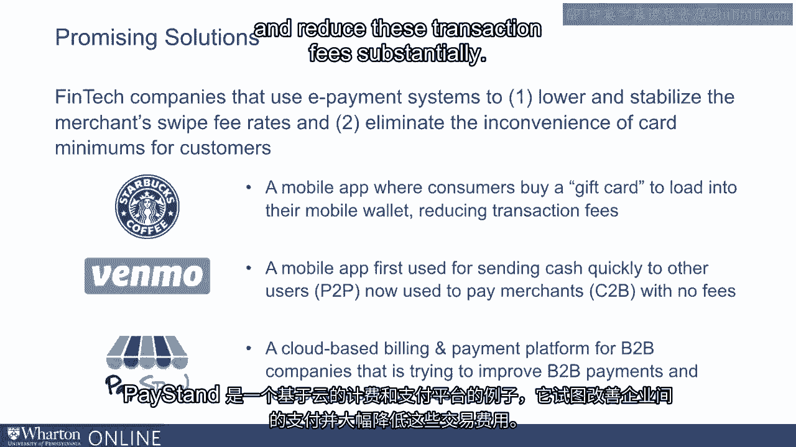
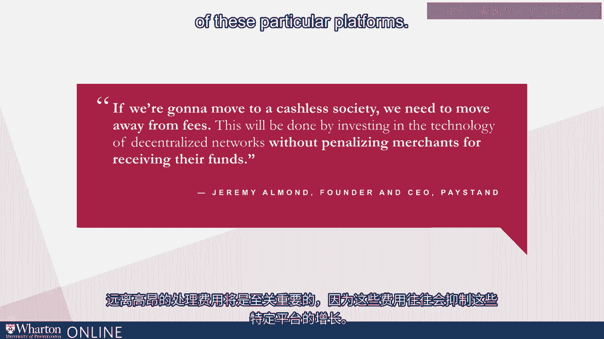

# 沃顿商学院《金融科技（加密货币／区块链／AI）｜wharton-fintech》（中英字幕） - P20：19_商家的成本负担.zh_en - GPT中英字幕课程资源 - BV1yj411W7Dd

 In addition to the complexity of the series of transactions that we've outlined， another。

 problem in the payment system is that there tends to be a substantial cost burden for。

 merchants at various points in this transaction chain。

 Let's go back to our initial transaction for groceries to try and understand the nature。

 of fees in this setting。 Remember that the cardholder， the consumer here。

 is buying $100 of groceries from a， merchant。 You would think that if the transaction was happening with cash。

 that would mean that， the merchant gets $100 for $100 of groceries。 In this setting though。

 that's not true。 The merchant agrees to accept a sum less than $100 for that transaction because it has to。

 pay a fee for processing。 It initially pays a fee to its own bank， if the acquiring bank。

 that's on the order of， let's say 2。5% and this is known as a merchant discount fee。

 which is kind of an ironic name， given that the merchant is bearing this cost。

 The acquiring bank then pays the card network in the setting master card， a small fee for。

 processing this transaction and for providing， furnishing the funds from the issuing bank。

 to the acquiring bank。 The issuing bank also pays the card network a small fee for completing this transaction。

 and the acquiring bank pays the issuing bank directly in the form of an interchange fee。

 for this transaction being processed。 All in all， these fees can total between 1% and 3% of total transaction value for merchants。

 or at least did historically in the US before recent regulation restricted the ability of。

 banks to levy debit interchange fees on merchants though credit card interchange has been left。

 unregulated。 What's quite interesting is that interchange fees tend to vary depending on the card network。

 and the kind of payment instrument that's being used。 So historically。

 debit interchange fees tend to be lower than credit card interchange fees。

 with pin debit having the lowest processing costs。

 Credit card fees tend to be higher and American Express credit card interchange fees tend to。

 be the highest because their business model involves recruiting customers who are high。

 value customers from the perspective of merchants。

 Those who are wealthy transact frequently on their cards and encouraging these card holders。

 to use their transaction instrument through a series of incredibly attractive rewards even。

 relative to its card network competitors。

 It is striking that in the United States， merchants can pay let's say $3 of $100 transaction。

 in the form of processing fees to financial institutions and card networks。

 In response to these really quite high fees that they bear as we've discussed often their。

 second highest cost of operating after labor， many merchants respond by simply saying they。

 won't accept certain kinds of cards or having a minimum required amount before they're willing。

 to process a debit or credit transaction。 The high cost associated with payment processing suggest an opportunity for financial technology。

 companies that use e-payment services to come in and usefully disrupt the industry and benefit。

 merchants by creating a lower cost processing system but also consumers by eliminating the。

 inconvenience of card minimums being required in order to complete transactions。

 Some innovators in this space include large merchants like Starbucks。

 Other than having to bear a processing fee every time a consumer goes and buys a latte。

 what Starbucks has done is essentially created an app where consumers buy a gift card， let's。

 say a $50 or $100 gift card and keep that gift card on their consumer wallet。

 That means that Starbucks now only has to pay a processing fee every time you reload。

 or purchase a new gift card rather than every time you go and buy your latte。

 Other innovators include Venmo which is a mobile app that was first used for sending cash quickly。

 to other users but is now used to pay merchants without exorbitant processing fees。

 Paestan is an example of a cloud based billing and payment platform that's trying to improve。

 payments between businesses and reduce these transaction fees substantially。

 The point that the founder of Paestan， Jeremy Almond， makes sort of quite profoundly is。

 that in this movement toward a cashless society that seeks to more efficiently allow consumers。

 and merchants to transact with payment instruments like credit and debit cards。

 it will be imperative， to move away from high processing fees that tend to inhibit the growth of these particular。

 platforms。 This requires a substantial investment in technology for decentralized networks that will allow。

 merchants to receive their funds but not require a substantial penalty in the form of a high。

 processing fee for these particular transactions。 [BLANK_AUDIO]。

