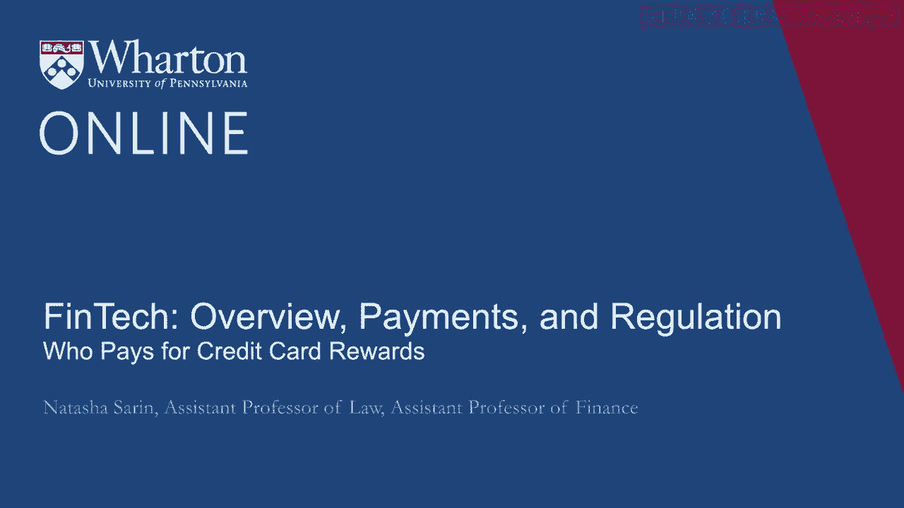
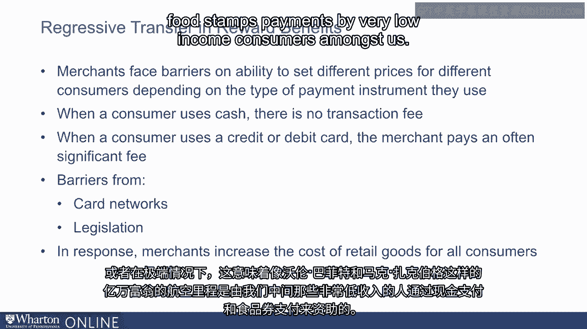
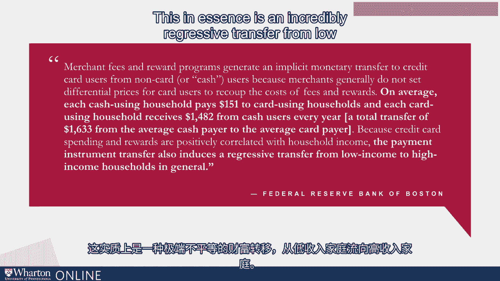
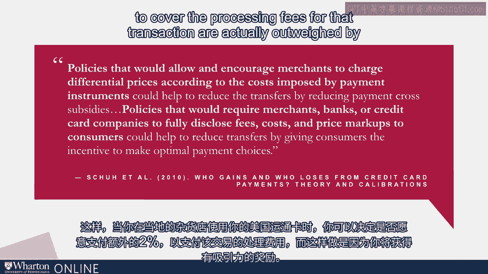

# 沃顿商学院《金融科技（加密货币／区块链／AI）｜wharton-fintech》（中英字幕） - P21：20_信用卡奖励由谁支付.zh_en - GPT中英字幕课程资源 - BV1yj411W7Dd

 In the decade leading up to the financial crisis， there was a significant growth in the use of credit and debit cards as a means of transacting for goods。

 Part of that is because these transaction instruments simply became more attractive for consumers as these networks developed and became larger。

 As more merchants were accepting credit and debit cards。

 consumers enjoyed transacting with them and the ease and convenience associated with it。

 But what card networks and financial institutions realized that they could do and did successfully in the decade leading up to the crisis is introduce sort of new payment instruments rather than just the standard credit cards they offered in the form of rewards cards。

 These rewards cards encouraged transactions by providing consumers incentives to use these particular instruments。

 things like airline miles or cash back for completing significant transactions。

 Something we as consumers don't spend that much time thinking about is why exactly it is or who exactly bears the costs associated with the attractive rewards that we receive。

 You may think that it's financial institutions and card networks who have to compete for our business by offering us attractive rewards。

 And to a certain extent， that's of course true。 But in reality。

 a large portion of the credit card rewards that we receive are actually born by less sophisticated lower income consumers who don't have access to or who don't transact with rewards instruments。

 In the United States， there are significant barriers to merchant's ability to set different prices for different consumers depending on the kind of payment instrument they use。

 When a consumer transacts with cash， there is no processing fee associated with that transaction。

 For $100 of groceries， your grocer receives the full $100 bill that you provide to her。

 When a consumer transacts with a credit card or a debit card， the grocer receives only a portion。

 as we've discussed， of that total $100 as in her pocket and pays out a significant sum off and on the order of $3 or more to financial institutions and card networks for processing this transaction。

 Of those $3， let's say you the consumer receive a dollar in terms of rewards as cash back。

 This means that for your $100 groceries， you actually only paid something like $99 for that transaction and the merchant only received $97。

 Yet for a cash user， the merchant receives the full $100。

 And the merchant has no ability really to charge you， the card user。

 an extra $3 for using a more expensive payment instrument for a variety of reasons。

 One reason is because card networks created actual barriers to the ability of merchants to upcharge consumers for more expensive means of payment。

 Although merchants are allowed to provide cash discounts to consumers for transacting with cash。

 historically it was very difficult for them to charge higher fees for card users or highest fees for card users who used expensive rewards cards。

 As a result of a 2013 settlement between Visa and MasterCard and a group of merchants。

 they're now able to sort of technically able to surcharge consumers who are using expensive forms of payment for transacting。

 However， in reality， there still exist a variety of legislative barriers like rules in 11 states that explicitly ban the practice of charging higher prices to consumers for the use of more expensive payment instruments。

 This means that practically merchants have very little ability to charge different prices for those who use more expensive rewards cards。

 And in response， what they do is simply increase the costs of retail goods across the board for all consumers to cover the cost of processing fees for the few of us who transact with rewards cards。

 Or in the very extreme， it means that airline miles for sort of billionaires like Warren Buffett and Mark Zuckerberg are being subsidized by cash payments and food stamps payments by very low income consumers amongst us。

 In recent work， the Federal Reserve Bank of Boston has made this point quite explicitly and tried to quantify it。

 They point out that on average， every cash-using household pays around $151 annually to card-using households。

 And each card-using household receives around $1，500 from cash users every year in the form of a transfer through their ability to get access to attractive rewards。

 This， in essence， is an incredibly regressive transfer from low income to high income households。

 The legislative fixes for this sort of transfer are a little bit complicated and perhaps not politically that attractive。

 Sort of the most extreme solution that we could imagine is we could simply ban loyalty rewards programs altogether and get rid of your airline miles or your 2% cash back。

 Perhaps a more politically palatable solution to this regressive transfer would be focusing on making it easier for merchants to charge differential pricing to consumers who use differentially expensive payment instruments to process。

 That way， when you use your American Express at your local grocery store。

 you can make the decision of whether the 2% extra you'll be charged in order to cover the processing fees for that transaction are actually outweighed by the attractive rewards that you're going to be offered。

 You， the consumer that's causing the merchant to bear the extra processing fee。

 are the one who has to make the decision about whether you want to pay that extra processing fee rather than unfairly the processing fee associated with your transaction being spread out across consumers who aren't receiving the rewards that you are。

 [BLANK_AUDIO]。

