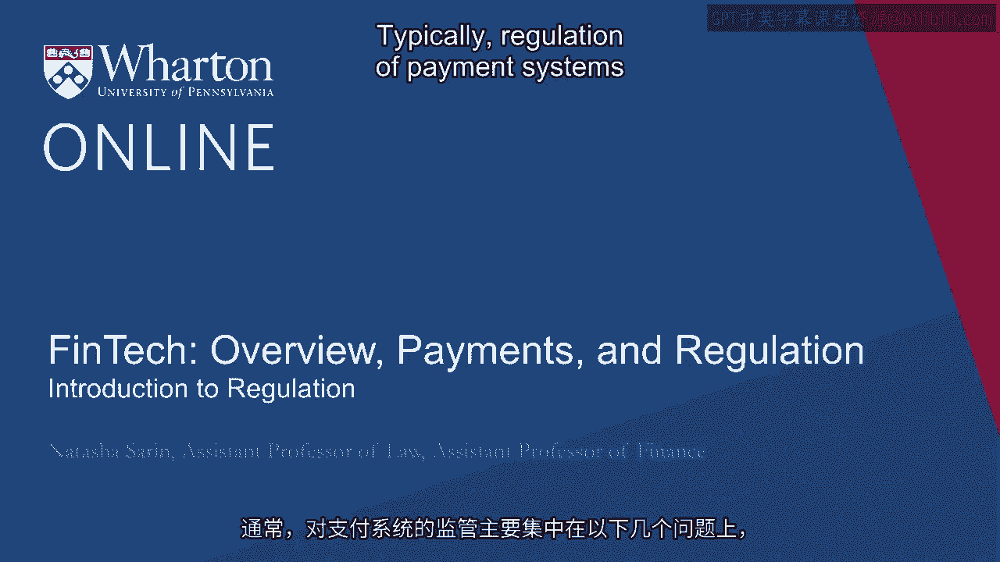
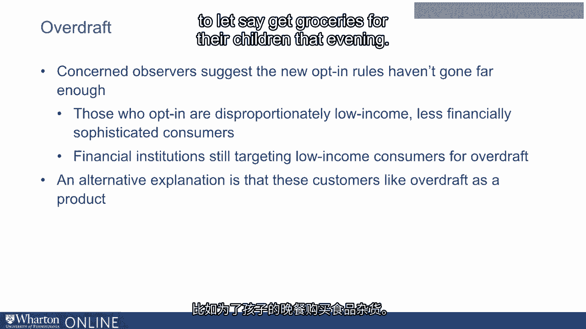

# 沃顿商学院《金融科技（加密货币／区块链／AI）｜wharton-fintech》（中英字幕） - P22：21_监管介绍.zh_en - GPT中英字幕课程资源 - BV1yj411W7Dd

 Typically， regulation of payment systems focuses principally on issues of first fairness。

 by disallowing certain practices that feel unfair or abusive， issues of transparency。

 by making the fees and rates associated with credit and debit cards more transparent so。

 consumers understand how much they're actually paying and consumers understand how much。

 merchants are actually getting。 And issues of overall risk by ensuring that， for example。

 consumer credit is appropriately allocated so that systemic risk of overall financial。

 crisis is substantially reduced。 Following the financial crisis， there has been quite。

 substantial regulation of both debit and credit cards along the lines of the issues， of fairness。

 transparency and systemic risk that we've discussed。 With respect to debit， cards。

 in the decade leading up to the financial crisis， the fastest growing source of revenue。

 for financial institutions was from fees that they collected from their customers。 These。

 fees included， for example， overdraft fees that are charged to consumers who unwittingly。

 overdraw on their accounts。 When overdraft was first introduced as a product， the way that。

 banks decided whether they would complete the transaction and charge consumers an overdraft。

 fee or decline the transaction and simply refuse to let it be processed with this payment。

 instrument was on a case-by-case basis determined by the nature of the consumer that they were。

 dealing with and also the nature and size of the transaction itself。 In the decade leading。

 up to their crisis， what banks realized with the help of third-party vendors who emerged。

 in this space was that overdraft could be a really profitable revenue source for financial。

 institutions。 If they， instead of discouraging consumers from relying on overdraft， for example。

 by in some instances， declining these transactions on a case-by-case basis， instead encouraging。

 consumers to turn to overdraft as a product with a series of practices that we now think。

 of as rather nefarious。 For example， what became commonplace in the period leading up。

 to the crisis was for banks to order your transactions in a way that made it most likely。

 for you to incur the maximal overdraft fees。 For example， imagine that you wake up in the。

 morning and you're the kind of consumer who tends to transact with your debit card with。

 some frequency。 You start the day with $10 in your checking account and you go to Starbucks。

 to buy a $5 latte and then you go to， let's say， IKEA to buy a $100 couch。 Well， by the。

 time your IKEA transaction has been processed， you're overdrawn your account， which means。

 you're liable for an overdraft fee for your IKEA transaction。 What banks did though and。

 were able to do since we did not have and still do not have a real-time payment structure。

 in this country is they reordered the processing of your transaction so they first processed。

 your IKEA transaction， depleting your checking account entirely and then they processed your。

 Starbucks transaction。 So what chronologically should be one overdraft incident now thanks。

 to the processing order that the bank has selected has become two expensive overdrafts。

 Practices like this resulted in overdraft being a very significant source of revenue for financial。

 institutions and one they relied on with the great success for their debit card using customers。

 In the aftermath of the crisis， popular attention focused significantly on overdraft as a nefarious。

 bank practice。 There were a series of New York Times articles that lamented the fact that。

 consumers would regularly pay $40 for their morning latte rather than $5 when they incurred。

 a $35 overdraft fee attached to their $5 debit purchase。 This is again especially troubling。

 as a distribution matter。 Only 10% of consumers are responsible for around 85% of overdraft。

 revenue that's generated。 This means that their frequent overdrafters， those who overdraft。

 with great regularity， tend to subsidize the existence of things like free checking accounts。

 for the rest of us。 These consumers are disproportionately low income。

 less financially sophisticated， prone to the kind of mistakes that result in overdraft but also mechanically more likely。

 to overdraft because they simply have less funds in their checking accounts。 Concern。

 about overdraft as a practice also related to the fact that people simply did not realize。

 that they were about to overdraw and bear these expensive fees。 Around 70% of customers who。

 were surveyed reported that they wished that these transactions had been declined rather。

 than completed with a significant overdraft fee。 In response， what regulators chose to。

 do in the aftermath of the crisis was change the default rules around overdraft。 Prior to。

 the financial crisis， 100% of consumers were basically automatically opted in to overdraft。

 protection as it is referred to again rather ironically which means that they're eligible。

 for incurring these overdraft fees when they overdraw their accounts either by transacting。

 or by withdrawing money from the ATM that they don't actually have sufficient funds， to cover。

 In the aftermath of the crisis before banks are able to levy these overdraft fees。

 consumers are now required to affirmatively opt in to banks' overdraft protection。 This。

 has reduced the share of customers that are even capable of incurring overdraft fees from。

 100% so essentially all US bank customers to around 15% of customers and decreased overdraft。

 revenue substantially for financial institutions。 The largest financial institutions who realize。

 that overdraft is a notorious product and that these practices are frowned upon by their。

 customers and much more broadly responded to this regulation by embracing it and even。

 going beyond the requirements of the new default rules。 In some instances by eliminating overdraft。

 entirely as a product and no longer charging consumers high costs instead declining these。

 transactions if they occur。 Some banks offer instead for consumers the ability to rewind。

 expensive overdrafts， not charging consumers a high overdraft fee if they're able to replenish。

 their accounts within 24 hours and cover the cost of the transaction that they had made。

 Concerned observers of the debit card industry and overdraft in particular suggest that the。

 new opt in rules haven't actually gone far enough。 This is a point made by legal academics。

 like Lauren Willis， Ryan Bub and Richard Pildes。 These academics advocate or point out that。

 if you look to see the consumers who have affirmatively opted in to banks overdraft protection。

 they're， disproportionately the low income less financially sophisticated consumers who tended to generate。

 the most overdraft revenue in the previous era。 The interpretation of these legal academics。

 of this fact is that financial institutions are aggressively targeting low income consumers。

 for opting into overdraft because these are the consumers that actually generate overdraft。

 revenue for the bank。 An alternative explanation for the fact that these customers tend to opt。

 in to overdraft protection is that these customers simply like overdraft as a product and appreciate。

 the ability to be able to complete their transactions without having to find another。

 means of payment， things like going to a payday lender to be able to withdraw the funds they。

 need to let's say get groceries for their children that evening。 The series of critics。

 around overdraft protection， the Bob Pildes Willis set of critiques advocate that essentially。

 in the new overdraft default rules you're pitting very sophisticated financial institutions against。

 unsophisticated consumers。 And so no matter what default rules you set set， the large financial。

 institutions are inevitably going to prevail because they're much more sophisticated actors。

 in this setting。 These academics suggest that what we need in overdraft is to ban this predatory。

 practice altogether and instead no longer allow banks to offer overdraft protection for。

 consumers since these since there are other cheaper alternatives available to consumers。

 to get access to these funds， albeit alternatives that might be less desirable because they're。

 they take longer to try and initiate things like calling up your bank and setting up an。

 overdraft line of credit。 An alternative to the approach advocated by critics of overdraft。

 to say that the default rules haven't gone far enough and we should ban the product altogether。

 is to simply alert consumers to the high cost of overdrafting in the moment before they。

 actually make the decision to bear an overdraft fee。 We know that disclosure generally tends。

 to be complicated and less useful as an intervention with respect to consumers because no one really。

 reads their long contract with a financial institution when they which lists on page 28。

 of 37 that they're likely to bear an overdraft fee of $30 if they overdraft their account。

 So that kind of disclosure is not going to be effective。 But the kind of disclosure that。

 can be effective is alerting consumers when they're in line buying their Starbucks in。

 the morning that if they complete this transaction with their debit card， they're in fact likely。

 to incur a $35 overdraft fee。 Since consumers who bear overdraft fees disproportionately。

 report that they would rather those transactions have been declined than completed with a fee。

 this would discourage overdrafting by the consumers who don't actually want to complete those transactions。

 and would prefer to pay with a different means of payment or not get their latte that morning。

 at all but still allow the availability of overdraft for consumers who rely on it as a。

 means of being able to complete purchases that they wouldn't be able to otherwise。

 I call this approach a salient shock for consumers and have in mind a text message that you would。

 receive when you're in that line at Starbucks telling you that if you pay with your debit。

 card and complete this transaction， it's going to charge a high overdraft fee。 And I have。

 reason to believe that this will be an effective way of discouraging overdraft incidents。 In the。

 UK they've adopted such an approach where they alert consumers via text message when。

 their account balances are getting low and overdraft fees are likely to be incurred。 And。

 they find that this approach decreases overdraft incidents by around 25% for consumers。

 [BLANK_AUDIO]。

