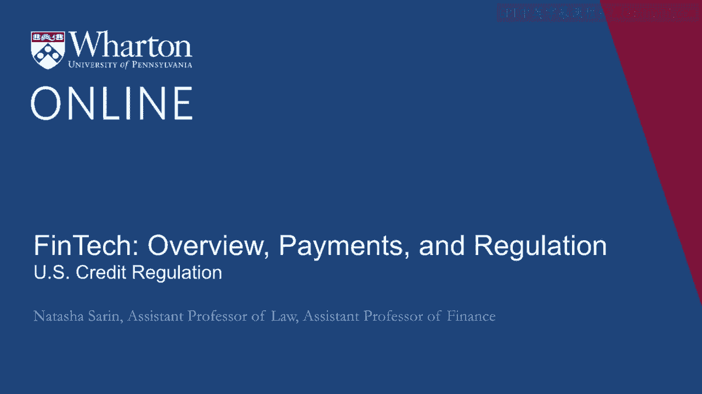
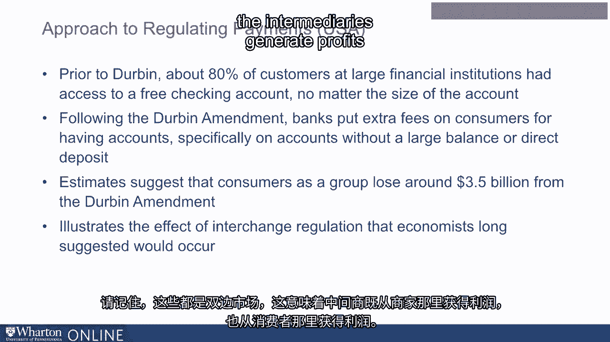

# 沃顿商学院《金融科技（加密货币／区块链／AI）｜wharton-fintech》（中英字幕） - P23：22_美国信贷监管.zh_en - GPT中英字幕课程资源 - BV1yj411W7Dd

 A concern in the credit card market that emerged well before the financial crisis was the。

 fact that consumers tended to bear high delinquency fees for missing payments on credit， missing。

 their credit card payments and that financial institutions tended to without sort of fair。

 warning increase the interest rates that consumers owed them in a way that felt unfair。

 to particular consumers。 These are problems that Elizabeth Warren highlighted in 2007 in her call for a Consumer Financial。

 Protection Bureau。 Warren used a really terrific analogy comparing a toaster to consumer credit or home mortgages。

 for example， and pointed out that while there were institutions in place to make sure that。

 your toaster didn't explode， there were far less institutions in place to make sure that。

 you weren't receiving a mortgage that you wouldn't be able to repay or you weren't。

 being given credit card debt at a certain price without realizing that that price didn't。

 include all of the various fees and interest rate hikes that you would experience over。

 the lifetime of your credit card account。 In the aftermath of the financial crisis。

 there was substantial political ability to navigate。

 this sphere and impose new regulations on the financial institutions that had been responsible。

 for the calamity of the crisis。 One of the first pieces of legislation that Barack Obama signed into office in 2009 was。

 aimed exactly at addressing the problems in the credit card market， the credit card accountability。

 responsibility and disclosure act。 The nature of the card act was to provide greater transparency for consumers on the actual。

 price of the credit that they would have to pay。 This eliminated or reduced the ability of banks to charge very high late fees for consumers。

 who missed their credit card payments and also limited the ability of financial institutions。

 to increase interest rates significantly without providing fair warning to customers。

 The idea behind these interventions was based on the simple observation that Elizabeth Warren， made。

 That card contracts had grown increasingly complicated in the decades leading up to their， crisis。

 They went from being on average a page in the 1970s to 40 pages by the time the crisis hit。

 This meant that whatever expectation you had for consumers to read a single page contract。

 even the most sophisticated among us would never read a 40 page credit card contract。

 and understand and appreciate the terms associated with their borrowing。

 This means that what you actually pay attention to as consumers is sort of the teaser rate。

 that's offered to you that's listed on even the outside of the envelope which gives you。

 a credit card solicitation。 And that's what you think the price of credit is without realizing that that teaser rate。

 is going to expire very quickly。 Without realizing that if you are delinquent on your credit card payment。

 you're going， to bear high fees。 The simple institution said that this regulation that aimed at protecting consumers from having。

 to pay a price for credit that was significantly higher than what they anticipated would actually。

 hurt precisely the consumers that it aimed to help。 Jamie Dimon。

 the CEO of JPMorgan Chase said that in response to the Card Act， his bank。

 would simply stop offering credit cards to 15% of its customers because what the Card。

 Act had done is it restricted JPMorgan's ability to reprice the cost of credit to consumers。

 once aspects of consumers risk profile became known to the financial institution。 For example。

 a consumer who is late in making repayments is riskier than a consumer who， pays on time。

 In reality， the empirical evidence on the Card Act suggests that contrary to this expectation。

 set by JPMorgan and other financial institutions that the Card Act would harm consumers， it。

 actually helped consumers quite significantly， decreasing the total cost of credit for consumers。

 by around $13 billion annually。 Empirical evidence shows no suggestion that other kinds of bank fees increased in order。

 to cover the costs of the Card Act or that credit supply was decreased significantly。

 for consumers expect in ways that the Card Act anticipated and in fact desired by for。

 example decreasing the tendency of credit card companies and financial institutions to。

 advertise credit cards to college students without ascertaining that they had any ability。

 to repay this credit and trapping them in expensive cycles of debt。 As we've discussed。

 interchange fees became a significantly large cost of operating for， merchants。

 And so in the aftermath of the crisis， we did several things to help decrease the payment。

 costs associated for consumers， things like overdraft protection or the Card Act。

 But what we also did was try and restrict these fees that are borne by merchants。

 This was also in the guise of consumer protection。 The idea behind the Durbin Amendment。

 which was added to Dodd-Frank by Senator Dick Durbin， of Illinois。

 was that it would decrease interchange fees that merchants bore and instead， as a， result。

 decrease the cost for consumers of retail goods since consumers are the ones。

 who inherently bear higher interchange expense that merchants have to pay。 Interestingly。

 although initial ideas around interchange regulation focused on credit， interchange。

 where interchange rates tend to be higher， eventually the Durbin Amendment。

 targeted only debit interchange and left credit interchange fees unregulated。

 This is sort of a strange regulatory intervention given that if anything， we view debit cards。

 as a safer payment instrument and credit cards as a more dangerous payment instrument because。

 they couple transacting and consumer borrowing。 The idea。

 the reason that Durbin offered for this intervention being focused on the debit。

 market was that in the aftermath of the recession， there was a concern that restrictions in the。

 credit market or further restrictions in the credit market would restrict credit supply。

 at a moment in time when the recovery was barely underway and it was important for consumers。

 and businesses to be able to get access to these funds for borrowing。 In reality though。

 the decision to focus on debit rather than credit interchange made。

 the Durbin Amendment a rather complicated regulatory intervention and kind of an undesirable。

 one from the perspective of consumers。 What banks did in the aftermath of Durbin was that they decreased credit debit card。

 rewards and all but eliminated them and significantly increased credit card rewards in order to。

 convince consumers to use credit cards which were left unregulated by this intervention。

 This credit interchange was still very profitable to financial institutions。

 They wanted to encourage all consumers to use credit instruments and discourage the use。

 of debit instruments that tend to be associated now after Durbin with lower interchange revenue。

 for banks。 In theory， financial institutions get revenue from checking accounts in one of two ways。

 The first is that they can charge consumers a monthly maintenance fee on their account。

 for even opening a checking account and serving it for that consumer。

 The second is they generate revenue from interchange every time consumers use their debit。

 cards as a means of purchase。 What the Durbin Amendment did is it restricted the ability of banks to generate profits from。

 debit interchange by capping debit interchange fees at around 22 cents per transaction when。

 previously a hundred dollar debit expense would generate an interchange revenue of around。

 two dollars for a bank。 This decrease in revenue banks first tried to combat by charging exactly those customers。

 who used to transact with their debit card and generate interchange revenue a fee for。

 transacting with their debit card directly。 They proposed a five dollar fee on consumers who use their debit card as a means of purchase。

 in any month when they use their debit card。 This was something that for example Bank of America proposed。

 In response， large groups of protesters in the Occupy Wall Street movement burned Bank。

 of America debit cards in Times Square and Bank of America quickly walked back from this。

 proposed fee。 Instead， what large financial institutions like Bank of America and Wells Fargo and JP。

 Morgan did in response to Durbin was they increased the account fees that they charged。

 consumers to generate this lost revenue。 And so prior to Durbin。

 around 80% of customers at large financial institutions had access， to a free checking account。

 This means a checking account that has a zero dollar maintenance fee no matter the size。

 of the account。 During the Durbin amendment， banks put a extra fee on consumers for having an account on。

 the order of let's say five dollars a month for consumers who didn't have a sufficiently。

 large account balance or didn't have direct deposit in their accounts that generated revenue。

 in other sources。 This again is an unintended consequence of Durbin and a regressive one because the only。

 consumers who are bearing these higher account fees are those who don't have sufficiently。

 large account balances。 All in all， estimates suggest that consumers as a group lose around three and a half billion。

 dollars from the Durbin amendment and that this particular regulation ended up hurting。

 precisely the consumers it sought to help since these higher account fees are borne disproportionately。

 by low income and less financially sophisticated consumers。

 The Durbin amendment case study illustrates the effect of interchange regulation that。

 economists who studied this particular two-sided market long suggested would occur。

 In two-sided markets， the idea of doing cost based regulation like the Durbin amendment。

 which required that the Federal Reserve promulgate rules that didn't allow merchants to be charged。

 a cost that was higher than the actual cost of processing the transaction are a little。

 bit complicated because remember that these are two-sided markets which means that the。

 intermediaries generate profits both from the merchants and from the consumers。

 And so loss leader pricing where one side of the market is subsidized at the expense。

 of the other might mean that one side of the market in a totally competitive world with。

 no sort of monopoly market power concerns bears a cost that feels elevated relative to。

 the true or actual processing cost in this space。 This is something that's been studied extensively by economists like Nobel Laureate Jean Terrell。

 [ Silence ]。

