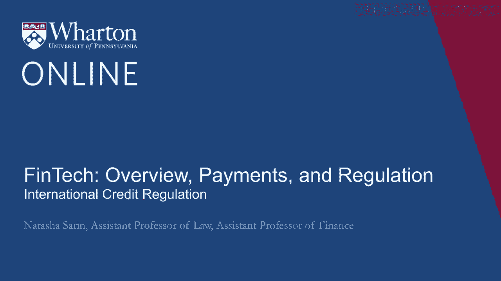
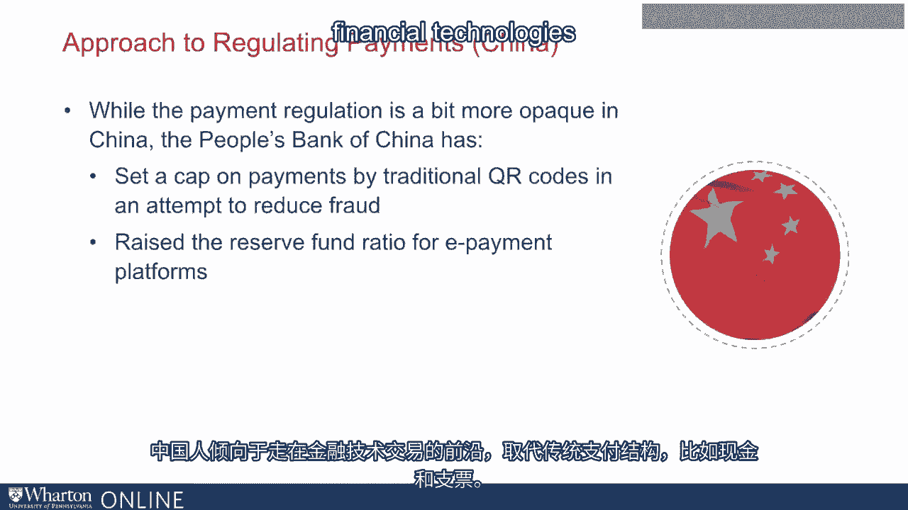

# 沃顿商学院《金融科技（加密货币／区块链／AI）｜wharton-fintech》（中英字幕） - P24：23_国际信贷监管.zh_en - GPT中英字幕课程资源 - BV1yj411W7Dd

 "International approaches to regulating interchange have varied drastically。

 In Australia， for example， where the predecessor regulation to the DERBAN amendment was implemented。

 Australian regulators chose to implement a percentage cap on credit interchange。

 Interestingly note that Australia targeted credit and not debit interchange， and so。

 a result of this intervention was a decreased proclivity of card issuers to have credit。

 rewards and a decreased use of credit as a result of this intervention。 This is quite different。

 of course， than DERBAN where the incentive structure was set up。

 for banks to actually increase the use of credit rewards and try and convince consumers to。

 transact more with credit cards， which are traditionally thought of as a more dangerous。

 payment instrument。 Also interesting in Australia， again。

 because our legal structures are so different， surcharging。

 became very common by Australian merchants in response to high interchange expense that。

 they experienced。 So much so that in recent years。

 Australian regulators have actually limited the ability。

 of merchants to charge what they call excessive surcharges to consumers who decide to transact。

 with credit instruments。 Also relatively recently in Australia。

 legislators have been focused on making sure that credit。

 is only provided to consumers who are sufficiently able to repay these loans。

 which means a limitation， on unsolicited credit offers and on the ability like the Card Act to change interest rates。

 for consumers without providing them sufficient notice of planned changes。

 The approach to regulation in Europe and the UK around interchange has also been quite distinct。

 from that of the US。 Particularly， there has been a tremendous focus on creating a regulatory framework that's appropriate。

 for the payment mechanisms。 And specifically in Europe。

 there has been a push towards limiting the ability of card networks。

 and card issuers to generate revenue from interchange， resulting in an interchange cap。

 that's on the order of 0。2 or 0。3 percent for card transactions relative to interchange。

 rates that are more like 2 or 3 percent in the US。

 It is quite interesting that the exact same card networks like Visa and MasterCard that。

 tend to charge merchants for processing transactions in different countries， depending on where。

 the merchant is situated， have an ability to do so that is dependent highly on the country。

 in which the merchant operates。 And particularly， there are entire interchange structures that are deeply different in different。

 kinds of regulatory regimes。 With respect to China。

 the payment regulation has been much more opaque than it has in the， rest of the world。

 The Chinese tend to be on the forefront of transaction with financial technologies replacing。

 sort of traditional payment structures like cash and check。 [BLANK_AUDIO]。

