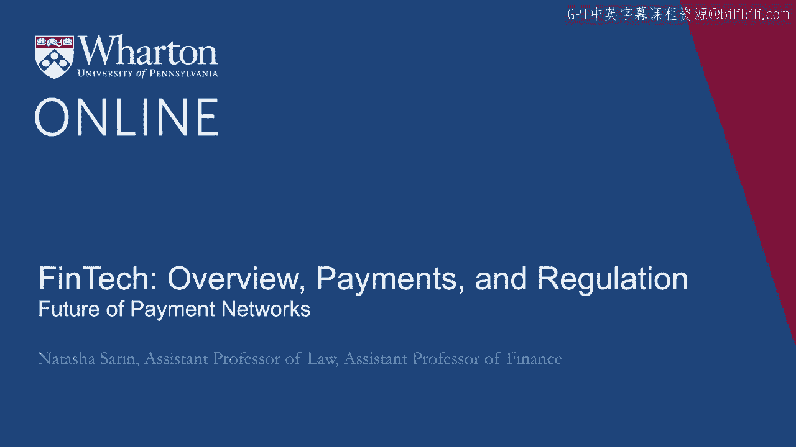
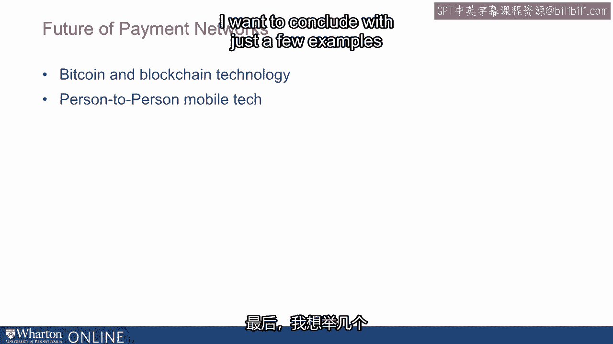
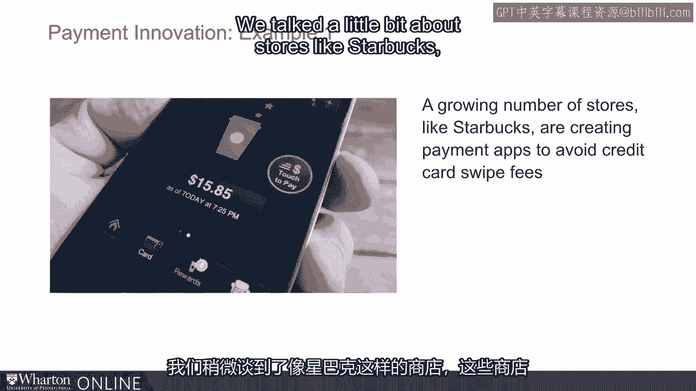
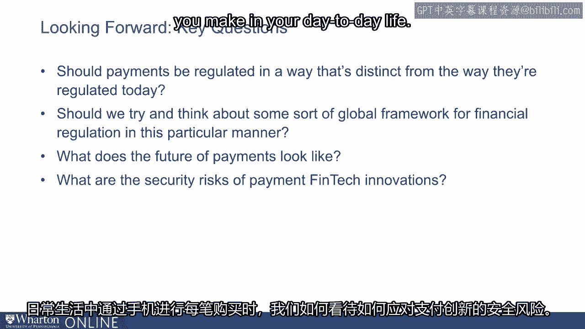

# 沃顿商学院《金融科技（加密货币／区块链／AI）｜wharton-fintech》（中英字幕） - P25：24_支付网络的未来.zh_en - GPT中英字幕课程资源 - BV1yj411W7Dd

 Given the substantial concerns about the fairness of payment markets both to consumers who don't tend to transact with rewards cards。

 also to merchants who tend to bear high fees for processing these transactions。

 as well as general concerns about the efficiency of transacting with these payment instruments given how complicated the series of transactions is required to actually settle and clear these transactions。

 as well as general concerns about， for example， consumer fraud that we spent less time talking about but of course are implicated in situations when consumers transact with payment instruments and provide their credit card information to e-commerce platforms and merchants more broadly in ways that allow for。

 that information to potentially be stolen and fraudulently used。

 So given this sort of myriad problems that exist in these markets。

 there is of course tremendous potential for new financial technologies to come in as real disruptors。

 Incidentally， the sort of existence of credit and debit cards as a means of payment are in and of itself's earlier examples of financial technology innovations that moved us away from less efficient means of transacting。

 for example， with cash and check。 And so here we are。

 we're now innovating further as we think towards what the future holds for financial transactions more broadly。

 This is a space that large financial institutions are actually spending sort of traditional financial institutions are spending significant energy investing in。

 As you'll see here， these are massive investments by the likes of Goldman Sachs， City， JP Morgan。

 Bank of America and many others。 Of course， the existence of sort of digital assets like Bitcoin as a means of transacting may well play into the future of financial technologies around payments。

 As may well， digital platforms for things like peer to peer lending。

 which allow credit needs that consumers have to be met quickly through transacting， for example。

 through a financial technology app rather than by having to go to a traditional lender like a bank to be able to take out some of these loans。

 I want to conclude with just a few examples on around payment innovation。

 We talked a little bit about stores like Starbucks who are creating payment apps to avoid credit swipe fees。

 Additionally， technologies like Ripple， which allow for consumers to send money globally using the power of blockchain in a way that is secure and has fewer payments attached to it than traditional remittance technologies。

 As well as lower no cost applications that allow for consumers to be able to pay bills and make purchases。

 transfer money to other user and make payments stores through the use of their smartphones。

 Of course， as all of this technology is developed。

 it is becoming easier to transact and cheaper to transact through the use of your digital platform like your iPhone or your Android。

 There is a concern that some of these technologies may disadvantage those who don't have access to smartphones to be able to complete their transactions in this manner。

 Of course， this is not a reason to discourage innovation。

 but rather a reason to think about the distributional effects of some of these technological advancements and how it's possible to leverage the power of technology to make financial technology more broadly available to consumers who don't currently have access to some of these great innovations。

 Looking forward， there are several questions that we must think about as we think through both the structure of payments and also how best to intervene as regulators。

 as policy makers， as academics， as sort of interested consumers in this space。 One is。

 should payments be regulated in a way that's distinct than they're regulated today。

 and particularly should we try and think about some sort of global framework for financial regulation in this particular manner。

 The other is what exactly does the future of payments look like and what are the best ways that technology can help make these transactions happen seamlessly and securely and advantage both consumers and merchants in these markets。

 And finally， how do we think about engaging with the kind of security risks of payment innovations when you are transacting on your phone for every purchase you make in your day-to-day life？

 Do you worry about what happens and how do we make sure that your secure information is not going to be easily stolen by those around you？

 And of course， like biometric or two-factor authentication kind of devices are being considered as solutions to many of these problems。

 [ Silence ]。

