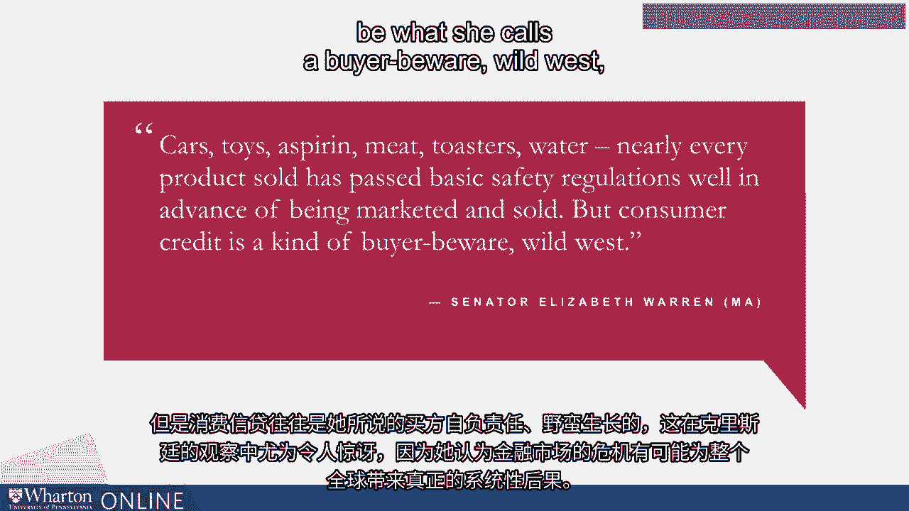

# 沃顿商学院《金融科技（加密货币／区块链／AI）｜wharton-fintech》（中英字幕） - P26：25_监管观点.zh_en - GPT中英字幕课程资源 - BV1yj411W7Dd

 In this module， we're going to spend some time trying to think about how we regulate。

 financial technology and actually what is financial technology before we can get to。

 the kind of regulatory frameworks that are going to make the most sense in this setting。

 I want to start very broadly and try and understand the theoretical criticisms around。

 regulation period and then try and understand the concerns and the innovations that we've。

 made with respect to financial regulation in particular since the Great Recession。

 I then want us to focus on exactly what FinTech is， why it's growing， how it's growing， and。

 also how different countries have approached the regulation of financial technology and。

 what lessons that can teach us in the future going forward。

 The sort of traditional， like， Chicago-style economic view of regulation has been a suspicious， one。

 George Stichler， who famously won the Nobel Prize for the theory of economic regulation。

 made the following observation。 Regulation may be actively sought by an industry or it may be thrust upon it。

 As a rule， regulation is acquired by the industry and is designed and operated primarily for。

 its benefit。 At worst， regulation hinders growth and innovation through bureaucracy。

 This sort of stiglerian perspective is a bit about the nature of regulatory capture。

 Because regulation will be made by government regulators， even well-intentioned regulators。

 those entities with resources like large financial institutions who can lobby and persuade the。

 regulators that their concerns are incredibly valid can use regulation as a tool to try and。

 conform regulation so it is best equipped to deliver precisely what the industry requests。

 This can mean both under-regulating financial institutions or in general under-regulating， industry。

 but it can also mean aggressive regulation in certain settings for the purpose of keeping。

 incumbents with significant market power in these domains and making it more difficult。

 for new competitors to emerge and comply with existing regulatory burdens。

 A sort of Milton Friedman view of regulation is very similar。

 His point made very vividly is that corruption is government intrusion into market efficiencies。

 in the form of regulations。 So the view is that the market kind of functions well。

 it functions freely， and regulation is， going to just come in and muck up a well-functioning market and for the purpose of advantaging certain。

 industry participants who are best able to control the regulatory process。

 This view of regulation is certainly not shared by all and certainly not voiced by regulators。

 in the aftermath of the financial crisis， which many of you as the byproduct of an overly。

 lax regulatory framework with respect to large financial institutions and financial intermediaries。

 more broadly。 Christine Lagarde has made the point that regulation feels especially necessary in sectors like。

 the financial sector where large-scale crises in the sector， like the Great Recession， can。

 expose entire countries around the globe to substantial and significant catastrophic。

 effects if there is in fact a crisis like the recession。

 This is distinct from sort of failures in a particular industry which is less connected。

 than the banking sector and less attached to every single decision and every single choice。

 that consumers and firms make with respect to the investments that they choose for themselves。

 and the businesses that they operate。 Elizabeth Warren made this sort of observation with respect to the financial crisis that。

 although in other industries more conventional consumer industries like car industries， toys。

 aspirin， meat， toasters， the analogy that she uses quite vividly， nearly every product。

 sold has passed basic safety regulations well in advance of being marketed and sold。

 But consumer credit tends to be a kind of what she calls a buyer beware wild west which。

 is especially surprising given Christine Lagarde's observation that crises in financial markets。

 have the potential to create real systemic consequences for the globe as a whole。

 Interestingly industry is also quite understanding of the need for good and thoughtful regulation。

 in financial markets。 Jamie Dimon， the CEO of JP Morgan makes the point that good regulation should simultaneously。

 be conducive to business and to consumer protection allowing businesses to innovate and create。

 structures that will be advantageous to consumers without worrying about having to comply with。

 overly burdensome regulation but simultaneously protecting consumers from the risk that they。

 encountered in the great recession。 George Soros makes the point that the sort of problem with the Milton Friedman conception。

 of markets being freely operational and regulation being a means of corrupt interference in well。

 functioning markets is that in his conception markets in fact are imperfect and so you need。

 regulation but of course regulators are also imperfect and so the regulatory process requires。

 kind of simultaneous adaption both by industry and by regulators to come to a set of processes。

 that are going to well protect consumers in these markets。 [BLANK_AUDIO]。

