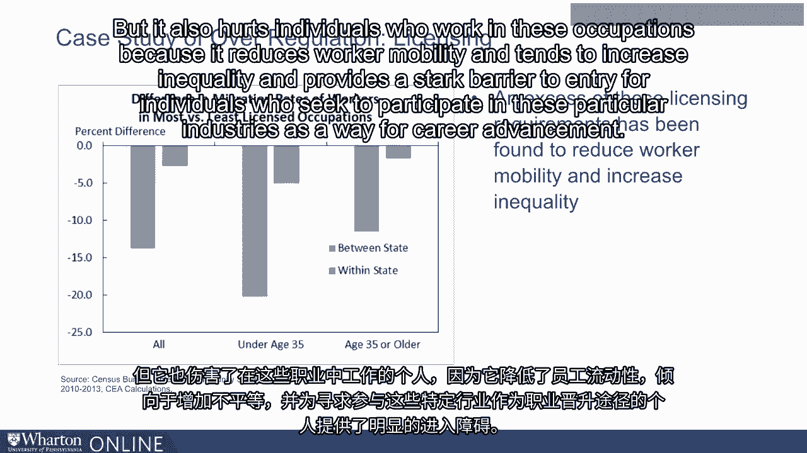

# 沃顿商学院《金融科技（加密货币／区块链／AI）｜wharton-fintech》（中英字幕） - P27：26_监管和创新之间的权衡.zh_en - GPT中英字幕课程资源 - BV1yj411W7Dd

 In general， I like to think about what I call the regulation innovation trade-off。

 So the key sort of balancing act we'll have to have in our minds is that innovation is。

 good and financial technology has the power to serve consumers well and make the markets。

 function more efficiently。 But on the other hand， we kind of worry that as we've regulated the financial sector more。

 aggressively， there's a tendency to move traditional activity outside of the more regulated。

 spaces and into sort of some of these less regulated environments。

 And so just to be quite clear about this， I think that regulation can ensure consumer。

 safety and can reduce the risk substantially of sort of market crises like the recession。

 and overall societal pain that ensues from these kind of blocks-one events。 On the other hand。

 though， regulation does hinder growth and innovation by creating。

 bureaucratic hurdles to innovation， by creating bureaucratic hurdles to advance。 It may also。

 as George Stigler was worried， benefit incumbent firms and tend to transfer。

 risk in the manner we've described from regulated areas of the market to sort of less regulated。

 shadow sectors。 Innovation helps companies create new products in a safe and responsible way that is going。

 to best serve consumers and allow them to profit from the substantial technological advances。

 that have occurred in recent eras。 On the other hand， though， there are real risks of innovation。

 the fact that consumers， aren't particularly aware of the risks that emerge in these markets。

 things like security， and cyber crime risks that we'll get a chance to discuss here。

 It's interesting from a conceptual perspective before we dig deeply into financial technology。

 regulation specifically to think about how we， as consumers in these markets， tend to。

 view the desirability or the usefulness of regulation broadly。

 This Gallup poll illustrates that concerns about regulation have actually risen since。

 the early 1990s， about overly burdensome regulation， with consumers voicing distrust。

 in government's ability to best police these markets， as well as concerns that bureaucratic。

 red tape can hinder significant advancements that occur in other countries with less stringent。

 regulatory frameworks。 What's interesting and important for us to keep in mind is that regulation involves the。

 restriction of industry's ability to engage in certain practices to hopefully best serve。

 consumers in these markets。 Remember that this involves two different classes of consumers。

 on the one side consumers， who are consuming particular products。

 on the other side those who work in the industries， that are being regulated who， in essence。

 are also consumers。 Regulation is meant to help consumers by protecting them against risks that emerge in different。

 markets。 But regulation can also ill-serp consumers by making certain markets less competitive。

 and providing incumbents a tremendous advantage in those faces。 This was， of course。

 the concern of George Stichler and one that manifests itself today， with respect to， for example。

 occupational licensing in the United States。 The percentage of occupations that require a state license in order to participate in。

 that occupation have increased from less than 5% of workers in the early 1950s to a quarter。

 of all workers in 2015。 Jobs that require such licenses range from jobs you would expect。

 things like physicians， and lawyers， but also very intense licensing requirements for occupations like barbers and。

 manicurists and the expectation that they re-license themselves with tremendous regularity in order。

 to remain licensed practitioners in these particular occupations。

 The existence of these sort of licensing requirements does many things from their perspective。

 of consumers。 On the one hand， it makes these occupations more expensive to work in and as a result makes。

 the prices that consumers pay for their manicures and for their haircuts higher。

 But it also hurts individuals who work in these occupations because it reduces worker。

 mobility and tends to increase inequality and provides a stark barrier to entry for individuals。

 who seek to participate in these particular industries as a way for career advancement。

 [BLANK_AUDIO]。

