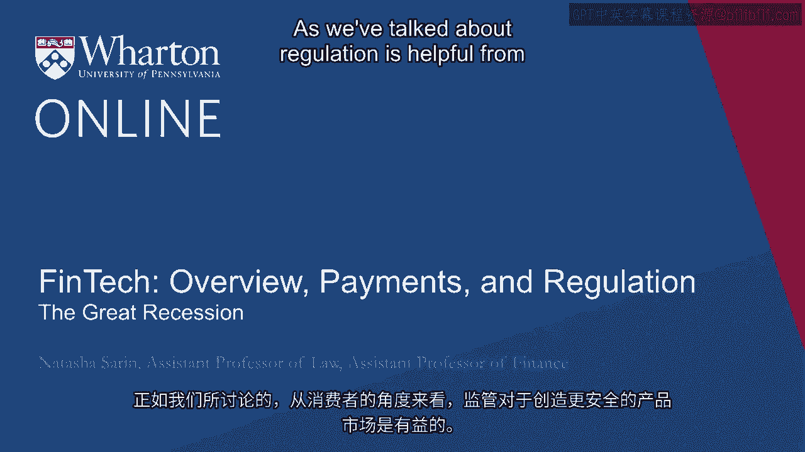
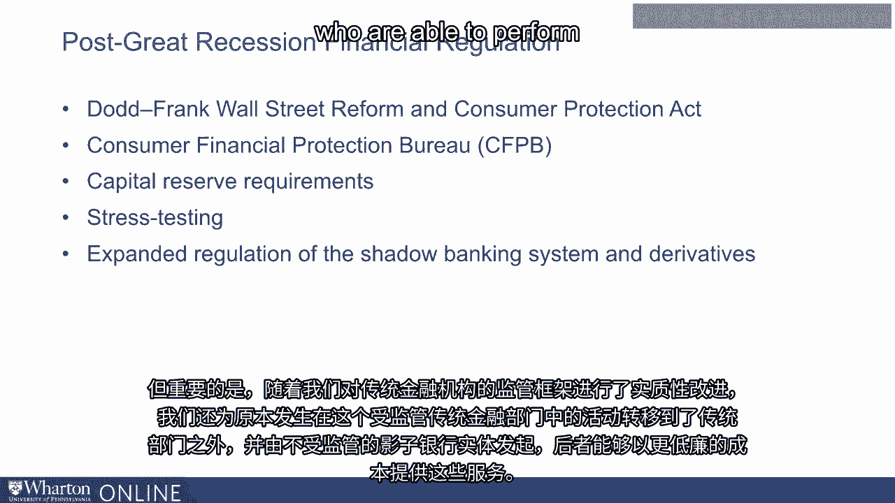
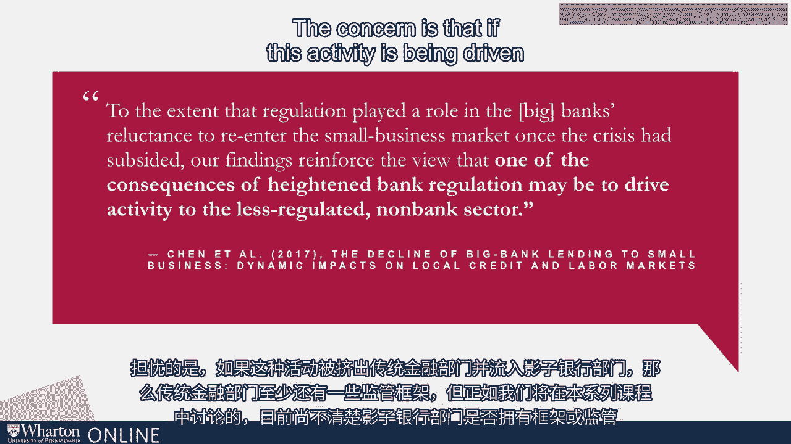
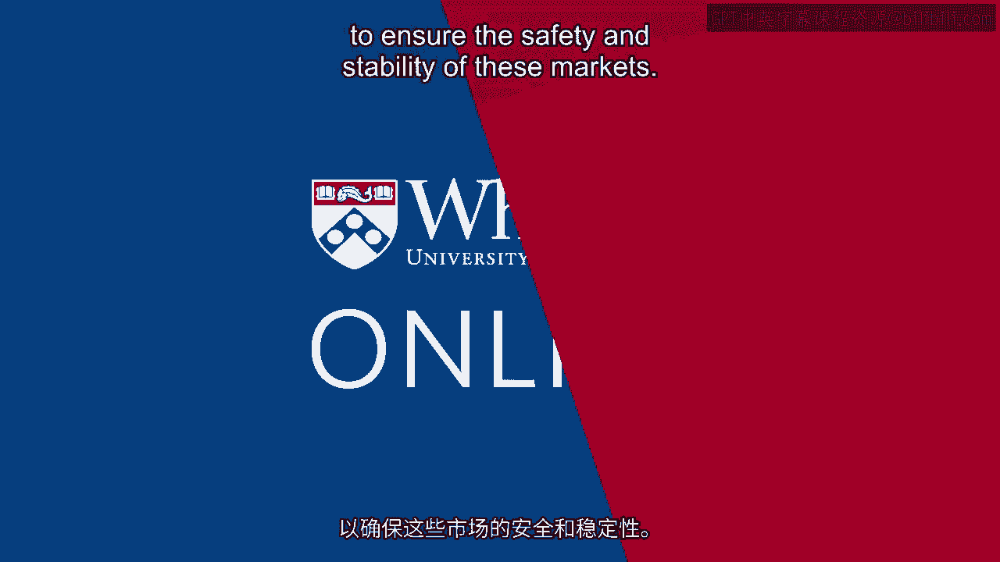

# 沃顿商学院《金融科技（加密货币／区块链／AI）｜wharton-fintech》（中英字幕） - P28：27_大衰退.zh_en - GPT中英字幕课程资源 - BV1yj411W7Dd

 As we've talked about， regulation is helpful from the perspective of a consumer because。

 it creates safer product markets。 On the other hand。

 it discourages innovation and makes it easier for incumbents to control， some of these markets。

 And so in thinking about this trade-off， we need to weigh the enhanced benefit to consumer。

 safety with the losses that consumers suffer from markets that aren't perfectly functioning。

 or markets that aren't sufficiently innovative as they would be if they were less heavily。

 regulated。 There's of course a reason to think that financial regulation is different than regulation of。

 products more generally。 As we've discussed， the losses that come from financial crises are large and widespread。

 and borne by entire communities and entire countries， not just by particular consumers。

 of one kind of product that malfunctions， let's say。

 The Great Recession provides a quite helpful case study about the nature of risks that。

 it can emerge in financial markets and the harm that can be caused to consumers when。

 these markets go awry。 The losses of the Great Recession were large and widespread。 In the U。S。

 alone， over 8 million Americans lost their jobs， 8 million American homes， were foreclosed upon， 2。

5 million businesses were closed， there was a 12% of the cost， decline in median real family income。

 a 40% decline in median real net worth and a 4。3%， decline in real GDP。

 These are substantial decreases in the wealth of the United States as a whole but also are。

 born primarily by actual real American consumers who lost their jobs or found their homes foreclosed。

 upon with little ability to remedy the situation and recover the losses that they had suffered。

 during the crisis in often instances because of no malfeasance of their own。 In the U。S。

 the most significant post-crisis financial reform was the passage of the Dodd-Frank。

 Wall Street Reform and Consumer Protection Act。 Even the name of the Dodd-Frank Act in and of itself illustrates the dual priorities。

 that regulators had in the aftermath of the financial crisis。

 The focus certainly was on creating a financial sector that was better functioning， that was。

 better regulated and less likely to suffer the kind of systemic collapse that had occurred。

 and had been brought about and exacerbated by the recession。

 But simultaneously the focus was on consumer protection and making sure that in the future。

 consumers had better information and more information about the kind of risks that were associated。

 with their financial products and a way by which to voice their grievances to regulators。

 in the case that consumers felt that financial institutions were not serving them well。

 A very significant reform following the crisis was in fact the creation of the Consumer Financial。

 Protection Bureau whose entire mandate is to regulate these institutions from the perspective。

 of consumers to supervise these institutions to pass rules and require them to comply with。

 behaviors that are going to best serve consumers and be sure to rid these markets of unfair。

 abusive and deceptive acts and practices。 Another significant reform following the crisis in the banking sector in the United States。

 was to drastically increase the amount of capital banks are required to hold in order to engage。

 in business practices like lending to small businesses and lending to consumers。

 As a result of these interventions large financial institutions are today much better capitalized。

 than they were before the crisis and much better equipped to weather the next crisis whenever。

 it will hit。 This is a substantial improvement relative to the pre-crisis financial system and additionally。

 we've created a framework for regular annual stress testing of large banks to make sure。

 that they're going to be able to hold sufficient capital to withstand the next crisis and tailoring。

 the capital requirements that are required to hold to new risks that emerge in financial。

 markets as time progresses。 But importantly as we've made substantial improvements on the regulatory framework for。

 traditional financial institutions we've also created incentives for activity that used。

 to happen in this regulated traditional financial sector to shift out of the traditional sector。

 and instead be initiated by less regulated sort of shadow banking entities who are able。

 to perform these services at much cheaper costs。

 A recent paper by Brian Chen， Sam Hanson and Jeremy Stein， a former governor of the Federal。

 Reserve Bank， note that to a large extent big financial institutions have gotten out of。

 the business of small business lending perhaps because of the increased in regulatory burden。

 required to be able to participate in this market。

 And one of the consequences of this movement has been that traditional small business lending。

 is now being done by the less regulated non-bank sector。

 In fact these authors observed that in places where big banks have left the business of。

 small business lending most substantially peer to peer lenders like Prosper like Lending Club。

 have come in to fill the void that's been left by these financial institutions。

 And the concern is that if this activity is being driven out of the traditional financial。

 sector and into shadow banks， well the traditional financial sector at least has some regulatory。

 framework but as they exist currently and as we're going to talk about over the course。

 of this series it's unclear that the shadow banking sector has either a framework or。

 regulation in place to ensure the safety and stability of these markets。 [BLANK_AUDIO]。

