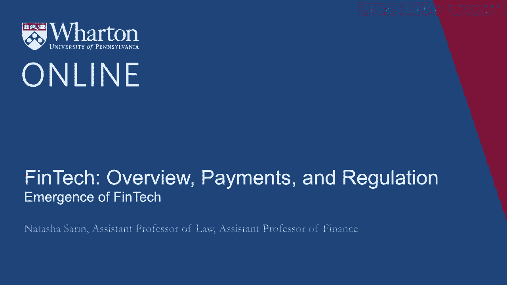
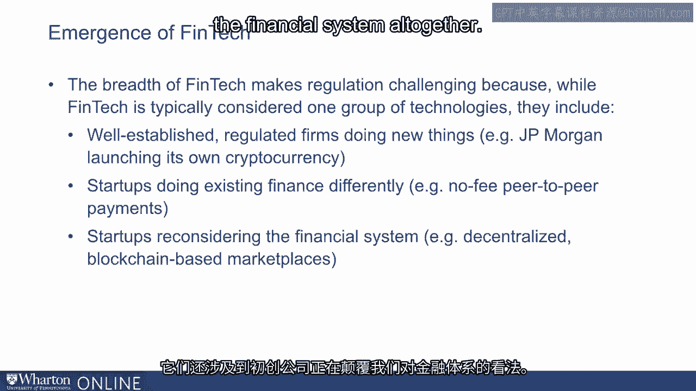

# 沃顿商学院《金融科技（加密货币／区块链／AI）｜wharton-fintech》（中英字幕） - P29：28_金融科技的出现.zh_en - GPT中英字幕课程资源 - BV1yj411W7Dd

 Before we think about how to regulate Fintech， I think it's quite important for us to come。

 to an understanding of what， if many things， we think Fintech actually is。

 In the years following the financial crisis， entrepreneurs saw the need for new types。

 of financial businesses， including the creation of low-cost ways to invest， household savings。

 platforms that make it easy to borrow money from one another rather than with the use。

 of a commercial bank， faster payment methods， mediums to crowd fund projects and entrepreneurial。

 startups， and low-cost ways to transfer money abroad or across consumers。

 And so what of the following to you feels like a financial technology innovation？

 An app that allows you to deposit checks via your smartphone to a traditional financial。

 institution like Bank of America， a new peer-to-peer lending platform， something like Lending Club。

 where you can borrow funds theoretically from your next-door neighbor in reality from large。

 institutional investors who purchase these loans from Lending Club。

 A website that makes it easier to do international remittance transfers， a new， entirely new。

 medium of exchange of value like Bitcoin， the use of what are now thought of as traditional。

 platforms but historically very new platforms like Facebook to facilitate the process of。

 consumer payments。 So in reality， it's quite interesting to try and place some of these financial innovations。

 on a bit of a spectrum from totally new ideas and new kinds of businesses， things like Bitcoin。

 to traditional businesses， things like Bank of America， getting involved in and taking。

 advantage of new technologies that exist in the world。

 I think it's quite useful to think about financial technologies as involving business practices。

 and financial institutions and the relative newness varies depending on the particular。

 product that we're talking about。 So if we take the example of Bank of America creating a mobile platform。

 well Bank of America， is at this point a traditional financial institution that's getting involved in a traditional banking。

 practice， the deposit of checks， but doing so with a new technology。

 You can contrast that to someone like Facebook getting involved in payments。 Again。

 Facebook is a traditional business but not a traditional financial business at。

 all and payments are a traditional sort of activity that financial institutions engage。

 in but of course not in this way。 To take a third example， if we think of someone like Lending Club。

 they're getting involved， in a traditional financial practice which is consumer lending but they're doing so with。

 an entirely new platform。 And so the reason why it's important to bifurcate the layers of newness in financial technology。

 is because the kind of regulatory framework we will want to adopt will be a byproduct of。

 the existing regulation that already exists in that space。

 So when you think about traditional financial institutions doing traditional financial activities。

 albeit with new technologies， the sort of new regulatory framework that you have to conceive。

 up for that setting is much less extreme than in the case of something like Bitcoin which。

 involves an entirely new asset class in essence， entirely new business practices that regulators。

 really haven't conceived of in the past。 And so the kind of， it's almost a misnomer。

 this whole module is almost a misnomer as we， think about financial technology regulation because the kind of regulation that we're。

 going to need to conceive of is inherently going to be a byproduct of the particular practice。

 that we're considering a new financial technology。

 Even the name FinTech is quite useful as a sort of guidepost for the kind of technology。

 that we're thinking about。 Of course it just involves the contraction of financial and technology。

 At first FinTech referred to technology that tended to improve back-end systems at traditional。

 financial institutions。 Things like these mobile apps that large banks have managed to develop that provide tremendous。

 convenience and real amenities to the consumers that bank with these institutions。

 But with the emergence of entirely new players in businesses like lending， like investing。

 like crowdfunding， payments and much more， the definition of FinTech has necessarily been。

 significantly broadened。 And again it's this breath that is going to make regulation quite challenging because。

 while we tend to talk about and tend to think about FinTech as one thing， one group， think。

 about how to include these well-regulated， sort of well-established firms who are used。

 to doing financial service provision， like the JP Morgan's of the world， that are doing。

 totally new things like launching their own cryptocurrency。

 FinTech also involves startups doing existing finance differently， things like Venmo in。

 the payment space or Prosper and Lending Club in the lending space or RoboAdvisors in the。

 investment advising space。 And they involve startups disrupting the way we think about the financial system altogether。

 things like these decentralized blockchain-based marketplaces。 [BLANK_AUDIO]。

