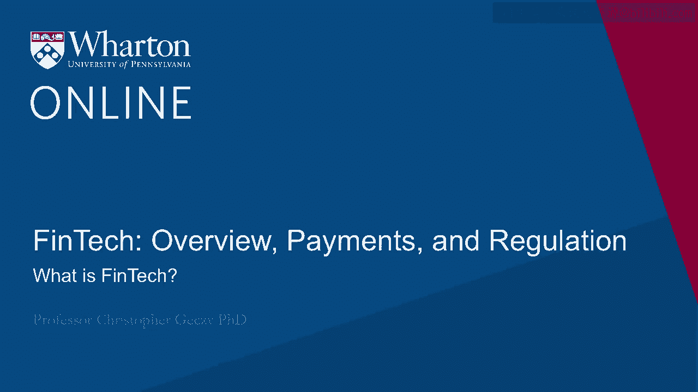
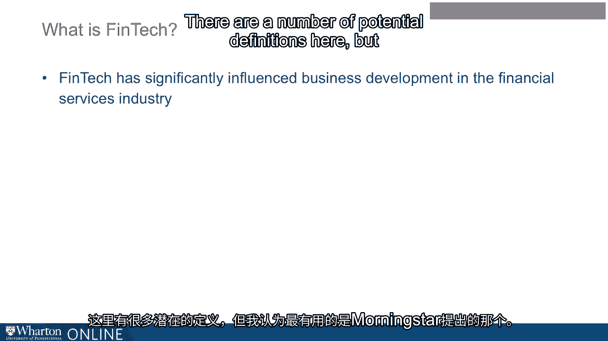
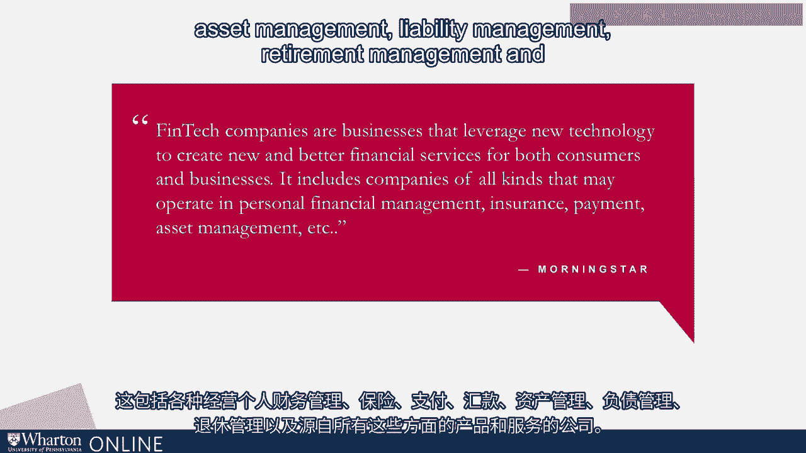
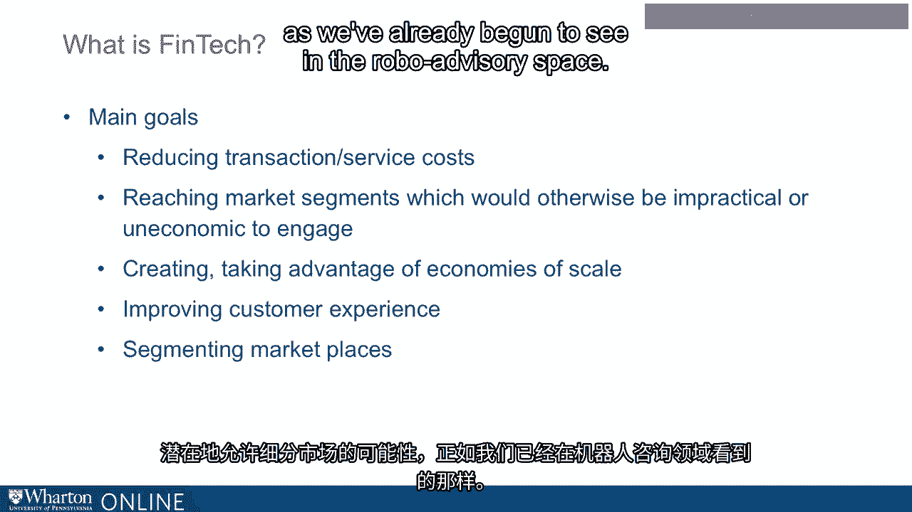

# 沃顿商学院《金融科技（加密货币／区块链／AI）｜wharton-fintech》（中英字幕） - P2：1_什么是金融科技.zh_en - GPT中英字幕课程资源 - BV1yj411W7Dd

 Just one quick word before we begin。

 For the absence of doubt， we're not selling any products here， any specific services。

 This is purely for educational purposes in our course。

 Fintech has evolved over the last decade or so fairly rapidly。

 It has begun to significantly influence business and business development in the financial services。

 industry。 There are a number of potential definitions here， but one that is most useful， I think。

 is that proposed by Morningstar。 Fintech companies are those businesses that leverage technology to create better and perhaps。

 new financial services， both for consumers and businesses， including companies of all。

 kinds operating in personal financial management， insurances， payments， remittances。

 asset management， liability management， retirement management。

 and a broad cross-section of products and。

 services stemming from all of those。 This would include， of course。

 issues and questions of blockchain， applications of big， data technology， artificial intelligence。

 deep learning， thin learning， natural language， processing。

 automated technology applied to customer relationship management， robo-advising。

 in a business to investor setting， both for defined benefit and defined contribution， investors。

 Automated and technological enablements in the insurance industry， including rapid underwriting。

 and ongoing monitoring of properties and lives and human behaviors。 This cash management。

 lending platforms， and numerous other areas， which of course can。

 expand to include really all areas of the financial services industry。 At the core。

 the main goals of Fintech are reducing transactions and service costs， as。

 well as reaching market segments that are untapped or new， and which would otherwise be。

 potentially impractical to costly， to uneconomic， to engage， creating or taking advantage of。

 economies of scale and improving customer experience。

 potentially allowing the possibility of segmenting。

 the marketplace as we've already begun to see in the robo-advisory space。

 [BLANK_AUDIO]。

