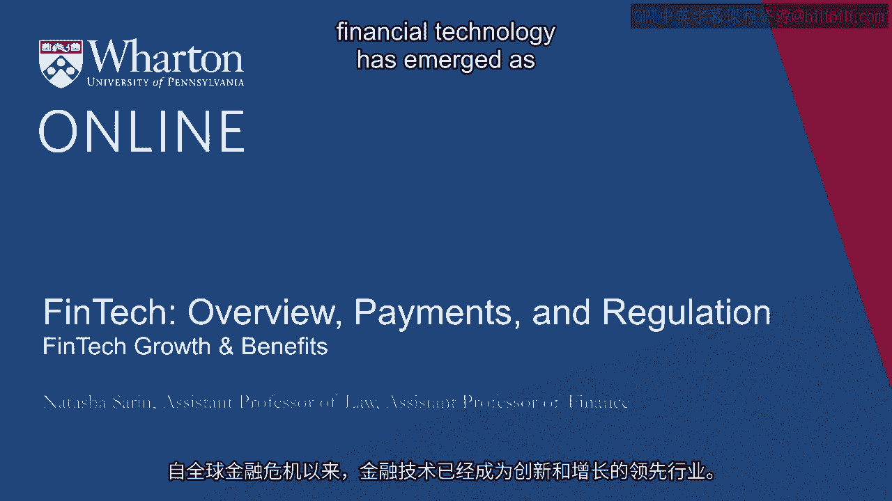
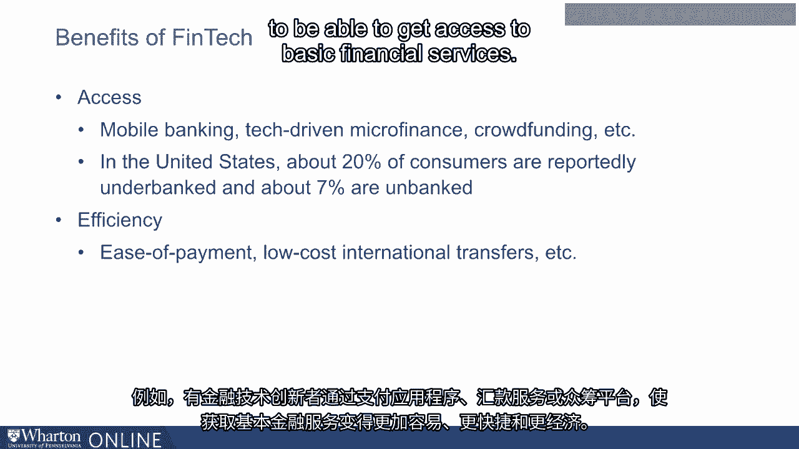

# 沃顿商学院《金融科技（加密货币／区块链／AI）｜wharton-fintech》（中英字幕） - P30：29_金融科技增长带来的好处.zh_en - GPT中英字幕课程资源 - BV1yj411W7Dd

 Since the global financial crisis， financial technology has emerged as a leading industry。

 for innovation and growth。 The number of financial technology companies founded annually has grown significantly from。

 around 178 in 2008 to around 700 in 2014。 By the year end 2016。

 there were over a thousand firms that classified themselves as financial。

 technology firms operating globally。 The total investment in financial technology companies has grown 5-fold since 2014 from。

 around 18。9 billion in 2013 to around 110 billion in 2018。

 The number of investment deals involving financial technology firms has more than doubled in。

 the last five years。 Over $100 billion of new investment money has flown into financial technology firms since。

 the financial crisis。 An interesting way to understand the growth in financial technology as an area for investment。

 and also for consumer attention is to leverage the power of technology to study attention。

 in this space。 What we've done here is we've looked at Google Trends for the search term FinTech over time。

 What you'll see is there's a significant uptick in attention in consumer attention around。

 financial technology firms relating to financial technology that has occurred in the last five。

 years。 As these trends illustrate， financial technology has really become a hot space from consumer。

 attention as well as an investment perspective。 Storied financial firms like Goldman Sachs。

 individuals like Warren Buffett are substantially， investing in the financial technology space。

 And emerging superpowers like China and India are leveraging technology to improve the attractiveness。

 of their country for investment and entrepreneurship。

 And trying to take an incredibly inclusive and innovative stand towards new kinds of industries。

 and new kinds of disruptive technology in a way that makes the regulatory burdens that。

 exist here in the United States and in other countries that have taken a less permissive。

 stand towards FinTech， sort of less attractive countries from the perspective of entrepreneurs。

 in these spaces。 And developing countries， those like Latin America and Africa。

 are really hoping to use， the power of technology to be able to provide more to their citizens and to better serve。

 consumers who have traditionally lacked access to basic financial services。

 The real benefit of financial technology is that it improves banking access for consumers。

 Mobile banking allows consumers to interact with banks conveniently， for example， those。

 who live far from traditional banks。 And crowdfunding allows entrepreneurs without access to conventional loans to fund their。

 new businesses to be able to get funding for these businesses from crowdsourcing investments。

 In the United States today， around 20% of consumers are reportedly underbanked and around 7% of。

 consumers are entirely unbanked。 This means that unbanked consumers who have no access to the traditional financial sector。

 and underbanked consumers who may have access to the traditional financial sector but tend。

 regularly to turn to expensive financial services provider alternatives like payday lenders。

 and check cashing facilities。 For these consumers。

 a real benefit of Fintech is the ability to create a much more inclusive， financial sector。

 one that is able to best serve and cheaply serve consumers in a secure， and efficient way。

 In the United States， it's relatively rare in that only 7% of consumers in the US are， unbanked。

 These numbers are significantly higher in developing countries where consumers don't。

 have access to traditional financial service providers but incidentally often do have smartphones。

 And so being able to provide more financial services to consumers through the technologies。

 that they already have access to will be a way to create a globally more inclusive financial。

 sector and to bring the efficiencies of technological innovation to populations that need them the。

 most。 Another real benefit of financial technology providers is that they bring more efficiency。

 to the financial sector。 For example， there are financial technology innovators who through payment apps or remittance。

 services or crowdfunding platforms have made it much easier and faster and cheaper to be。

 able to get access to basic financial services。 Thank you。

 Thanks for your attention。 Thank you。 Thank you。 Thank you。

