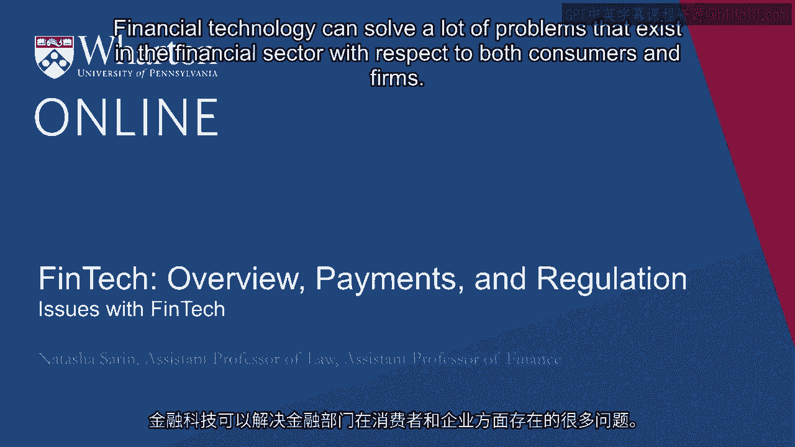
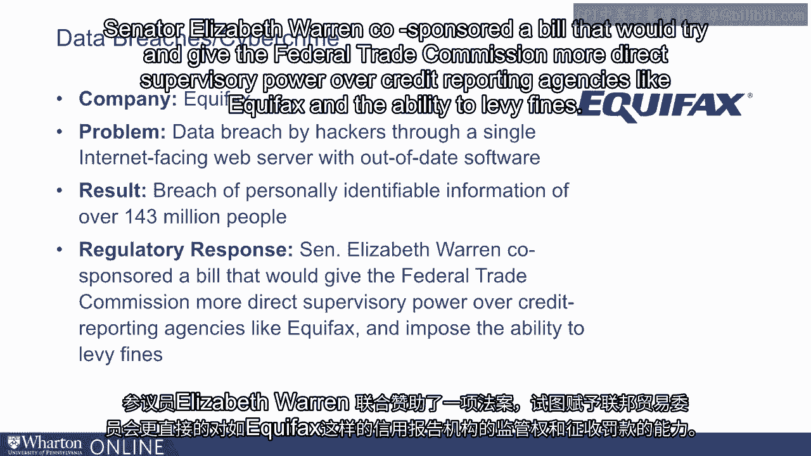
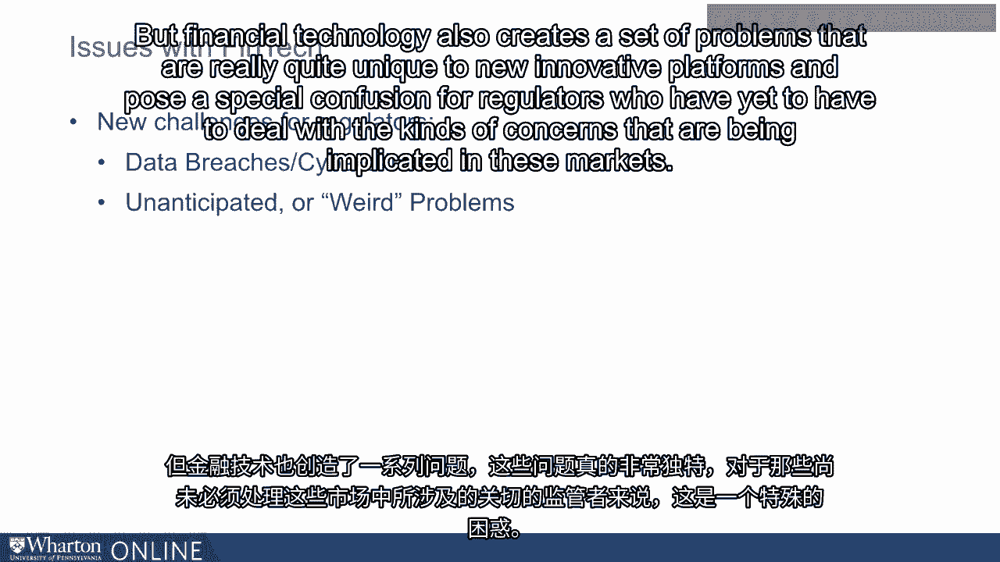
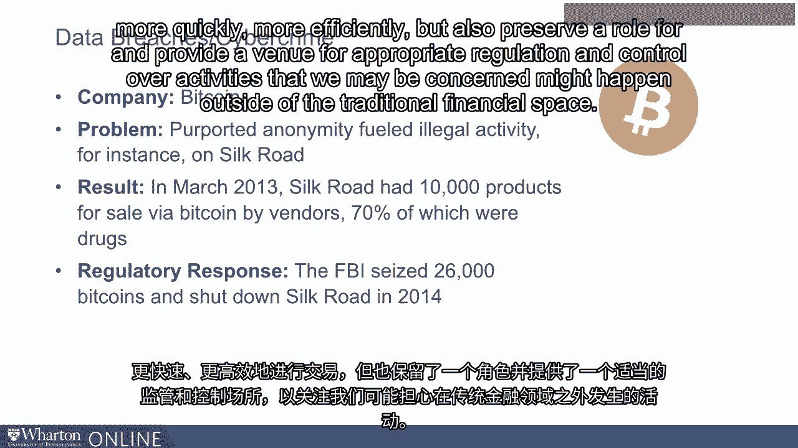

# 沃顿商学院《金融科技（加密货币／区块链／AI）｜wharton-fintech》（中英字幕） - P31：30_金融科技的问题.zh_en - GPT中英字幕课程资源 - BV1yj411W7Dd

 Financial technology can solve a lot of problems that exist in the financial sector with respect。

 to both consumers and firms。 For example， it can help those who don't have access to the traditional banking sector。

 be able to get access to financial services at lower cost than expensive alternative， providers。

 And from the perspective of entrepreneurs and firms， it can help new businesses who might。

 not have access to sources of funding from traditional financial institutions be able。

 to crowdfund at relatively low cost in order to fund their new enterprises。

 But that's not to say that there aren't also problems that exist with respect to financial。

 technology service providers and sort of new challenges for regulators as they think through。

 how best to intervene and to help facilitate the growth of these markets。

 The potential for data breaches and cyber crime attacks is one area in which financial。

 technology feels especially vulnerable。 According to the FBI's internet crime report。

 in 2017 cyber crime costs the US almost one， and a half billion dollars。

 As more consumer information is stored on the cloud and more financial technology is。

 happening and services are being provided to consumers on their sort of personal electronic。

 devices like their smart phones， concerns about cyber hacking dominate significantly。

 As the technology innovators have at their disposal to try to better the lives of consumers。

 improved significantly， so too does the technology that hackers and cyber criminals can rely upon。

 to prey on consumers information and regular use of financial technology innovations。

 One case study that's quite helpful to see the issues posed by data breaches and potential。

 cyber criminality is of course Equifax's recent exposure to hackers of its customers personal。

 information。 Equifax technology allows consumers to interface with their credit scores online and stores。

 personal consumer information on its web based platform service。

 The enterprise technology that Equifax relied upon had a vulnerability which was identified。

 months before the breach but not fixed。 And so hackers were able to steal personal information of approximately half of the United。

 States population。 That means that hackers were able to get access to social security numbers for around。

 143 million US citizens。 The regulatory response to the Equifax data breach was quite swift。

 Senator Elizabeth Warren co-sponsored a bill that would try and give the Federal Trade Commission。

 more direct supervisory power over credit reporting agencies like Equifax and the ability。

 to levy fines。 The Equifax example is a salient one both because it's a very large data breach that。

 implicates around half of the population of the United States and because it was a relatively。

 easily avoidable data breach given that this vulnerability was known but not fixed for months。

 leading up to the hack。 However， this is far from the only instance of the kind of cyber criminality and fraudulent。

 stealing of consumers personal information that is made available by financial technology。

 service providers。 Large financial institutions are often the targets of these kind of internet hacks。

 Those like JP Morgan Chase and eBay and T-Mobile and online payment structures like Target and。

 Apple。 And there's a question for how regulators should think about harnessing the power of technology。

 and allowing for innovation in these new sectors。 While simultaneously being cognizant of the fact that protecting consumer information。

 is a difficult and important task。 And so if consumers transacted less online there would certainly be less ability and。

 less concern that their personal information could be so easily stolen by those with expertise。

 and cyber criminality。 But on the other hand financial services provision would be less efficient and less able to serve。

 a large swath of the population both here in the United States but much more globally， as well。

 And so the inherent question here is how to weigh the benefit of innovation and the benefit。

 of broads financial inclusion through financial technology service providers against the nature。

 of criminal threats that will inevitably occur as more and more of our personal transacting。

 is happening online。 The idea of data breaches or cyber criminality while heightened in the context of financial。

 technology are not really new problems。 It's always been a concern that individuals could get access to personal information in。

 ways that are undesirable and likely to harm consumers。

 But financial technology also creates a set of problems that are really quite unique to。

 these new innovative platforms and pose a special confusion for regulators who have yet。

 to have to deal with the kinds of concerns that are being implicated in these markets。

 So for example recently cryptocurrency investors were locked out of 190 million dollars after。

 the founder of a particular Canadian exchange died prematurely without making provisions。

 for the future viability of this particular cryptocurrency。

 Now the main idea of a crypto asset is a decentralized ledger to allow for anonymous。

 transacting and while this creates tremendous benefits for consumers and makes financial。

 intermediation much more decentralized it also creates quite unique problems that wouldn't。

 occur for example if Jamie Diamond passed away the CEO of JPMorgan Chase。

 Perhaps there would be turbulence at the firm but the bank would roughly continue to function。

 as normal and instead the death of a cryptocurrency exchange founder unexpectedly practically means。

 that large sums of money can effectively disappear。

 There would be no such concern at a bank that deposits of individuals or of firms would magically。

 disappear even if the founder of one of these large financial institutions was to pass away。

 prematurely。 Another sort of divergent example involves peer-to-peer lending schemes。

 The nature of peer-to-peer lending is individuals apply for a loan and that loan is given to。

 them by the peer-to-peer lending platform and then repackaged and sold to the other。

 side of the platform which the nature of peer-to-peer lending makes it sound like it's。

 another peer of yours but in reality it tends to be large institutional investors。

 And in this particular context the loans that were being resold didn't meet the buyer's。

 criteria the buyer in this case was Jeffries Bank but they were doctored by the peer-to-peer。

 lending platform to make it appear that they did and this became a cause for concern of。

 the FTC in the context of lending club and eventually led to the resignation of lending， club CEO。

 One very interesting case study that illustrates the unique problems posed by financial technology。

 has to do of course with Bitcoin and particularly this Silk Road。

 The idea behind Bitcoin is it allows for anonymous and fast transacting between consumers for。

 a variety of goods essentially any kind of good that you could conceive of。

 The anonymity is quite desirable to those who value their privacy and would prefer that。

 their exchange happen on a decentralized ledger。 The concern though with such technology is that it can be used for nefarious activities。

 as is the case with the Silk Road where transactions would occur for example illegal drugs on what。

 is called the dark net through the use of Bitcoin and other crypto assets。

 Estimates suggested that around 70% of the transactions that occurred on the so-called。

 Silk Road involved illegal activities such as drug trading。

 This suggests the need for more regulation and also more direct intervention in this space。

 and points to the idea that it is important for us to develop use cases or think through。

 what the use cases for crypto assets may be that simultaneously improve the lives of consumers。

 and allow us to transact more easily more quickly more efficiently but also preserve a role for。

 and provide a venue for appropriate regulation and control over activities that we may be。

 concerned might happen outside of the traditional financial space。 [ Silence ]。

