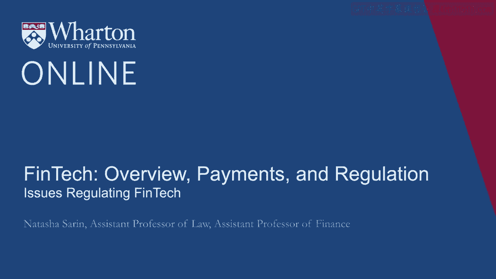
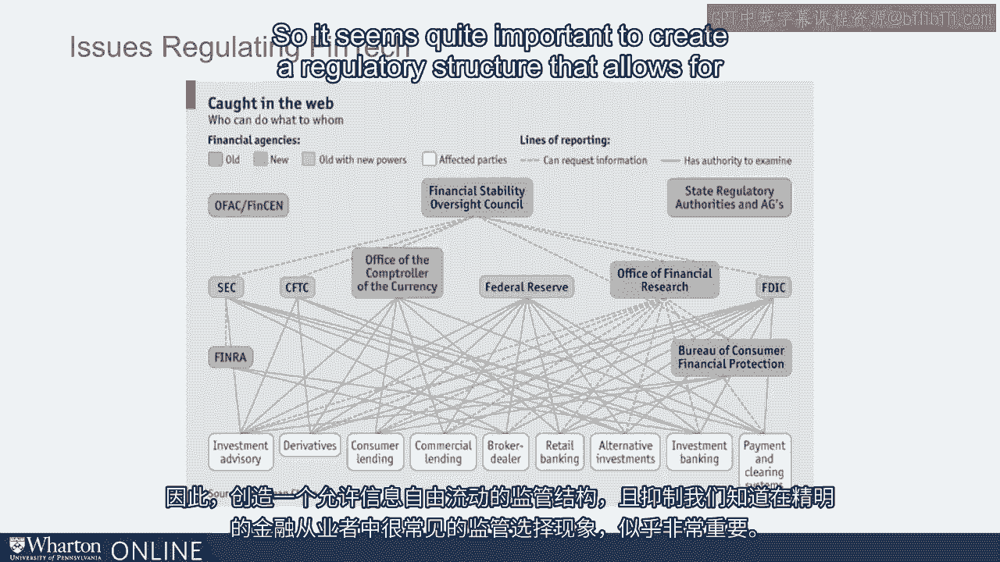

# 沃顿商学院《金融科技（加密货币／区块链／AI）｜wharton-fintech》（中英字幕） - P32：31_监管金融科技的问题.zh_en - GPT中英字幕课程资源 - BV1yj411W7Dd

 As we've discussed， FinTech is a broad and really quite difficult to define industry。

 It covers banking， credit cards， securities， crypto currencies， lending， investment advising。

 and much more。 And regulating new technologies associated even with these existing industries often。

 requires thinking about a new framework for regulation and also who should bear the。

 responsibility for supervising and intervening in these particular markets。

 Another issue besides the breadth with which regulators have to think about a regulatory。

 framework involves the fact that inherently we are thinking about regulation in an industry。

 and in a space that is evolving incredibly rapidly。

 Alfred Kahn the Nobel laureate said this with respect to regulation generally that it almost。

 was an inevitable game of whack-a-mole。 What is whack-a-mole？ Well， for those of you who don't know。

 it's a fantastic arcade game where a bunch of， holes come out of a wall and in essence you the player has a mallet and when one of a。

 mole comes out of one of these holes you hit the mole with the mallet as fast as you can。

 And then another mole comes out of another hole and kind of the objective of this particular。

 game is to hit as many moles as you can in a certain period of time。

 Why is this a good analogy for the regulatory space？

 Well you worry that when you restrict one particular kind of practice of a financial institution。

 or a financial technology provider then inevitably another sort of very similar practice is going。

 to emerge and the regulator is kind of going to always be playing catch up with respect。

 to industry。 And that's especially true with respect to FinTech where the entire nature of this industry。

 involves leveraging new technologies in innovative ways successfully。

 And so it's kind of inevitable that regulators will be one step behind the innovators and。

 have difficulty figuring out how best to supervise in this setting。

 Edward Kahn of course didn't think that this was a reason not to regulate。

 He had a very clever analogy for what he thinks of the role of a regulator that can help enlighten。

 us with respect to financial technologies more broadly。

 His view for regulation was that just as a sort of as industry as clever and there will。

 inevitably be holes in the dike。 Dike is like a container for water let's say。

 The role of the regulator is to as there will always be holes that emerge in the dike there。

 will always be new fingers that sprout for the regulator to sort of try and restrict。

 water from flowing out。 And so the point is that regulators have to industry will always evolve and financial。

 technology in particular will always reform itself and adjust to sort of work around regulatory。

 frameworks in ways that are profit maximizing for institutions。

 But what regulators must do is they must be clever and thoughtful and adept and quick。

 in responding to new risks as they emerge in these markets。

 Another issue with respect to financial regulation broadly and financial technology regulations。

 specifically is that we are struck by the fact that these markets are actually inherently。

 global and if there's no sort of global coordination around a regulatory framework this becomes。

 quite difficult even for countries which decide that it's important to pay attention to risks。

 as they build up in these new sectors。 So for example if there is very strict regulation of new tech financial technology service。

 providers in the United States which tends to be on one side of the spectrum in these， discussions。

 Then there's concern that first innovation will gravitate outside of the United States。

 but second that's the risks that build up in other countries with respect to financial。

 technologies that the US doesn't have jurisdiction over may still harm consumers in the US market。

 And so how do we deal with the fact that risks are really global rather than national in financial。

 markets？ Here in the United States with respect to financial regulation a few points seem quite relevant。

 First as we've discussed financial regulation encompasses a broad swath of different industries。

 These industries are currently regulated by distinct regulatory agencies with different。

 mandates and different standards for what they deem acceptable and promoting of financial。

 stability。 I happen to work at the White House in the aftermath of the crisis and as we're conceiving。

 of the new post-crisis financial regulatory framework what was hoped for and conceived。

 of as a massive innovation was to create a structure where one particular regulator was。

 kind of in charge for overseeing the entire financial services industry。

 In reality individual regulators still maintain significant power over regulating their particular。

 domains and in many industries participants are required to meet the standards of a swath。

 of different financial regulators。 For example the SEC deals with investment advising。

 the Federal Reserve deals with retail banking， and the Consumer Financial Protection Bureau is the consumer facing arm of the regulatory。

 framework。 This means that sort of large financial institutions are beholden to the Federal Reserve but also。

 must meet the mandates of the Bureau of Consumer Financial Protection。

 This creates a real question over who is best suited to regulate financial technology service。

 providers。 Perhaps most naturally the answer to this question depends on the nature of the financial technology。

 that we're thinking about。 For example if it's Bank of America's new mobile app that allows you to deposit checks。

 on your phone well perhaps the Federal Reserve is already regulating Bank of America and。

 so it's natural for them to also supervise this new kind of technological development。

 Or maybe it's the Consumer Financial Protection Bureau because the concerns that we would have。

 with these new financial innovations are primarily that they will be abused or misused or deceptively。

 advertised to consumers who are customers of these financial institutions。

 But there are real concerns with having such a fragmented regulated system。

 Two concerns that we had at the White House with respect to the financial regulatory。

 framework were first that having such different authorities be responsible for different aspects。

 of the financial sector meant that information would get stuck with one regulator and not。

 find its way to the other even though together these two different agencies set of information。

 might hint at risks building up in a particular sector of the economy。

 And so there was a concern about the lack of ability of information to flow very freely。

 between regulators。 There's also a concern that from the perspective of industry if you could be regulated through。

 a state banking charter or you could be regulated through a federal banking charter your incentives。

 are structured to try and find the regulator who's going to be easiest on you。

 There's empirical evidence that that is exactly what financial firms do。

 So it seems quite important to create a regulatory structure that allows for information to flow。

 freely and discourages this sort of regulation shopping that we know is commonplace among。

 sophisticated financial players。 [BLANK_AUDIO]。

