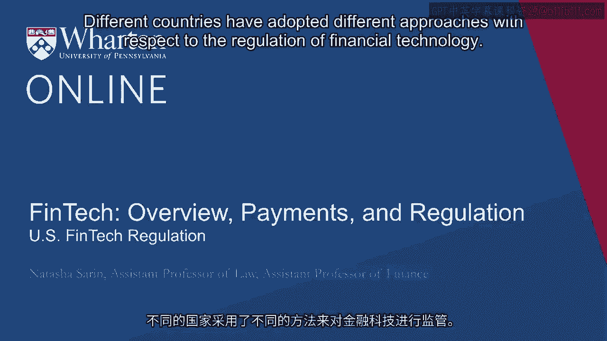
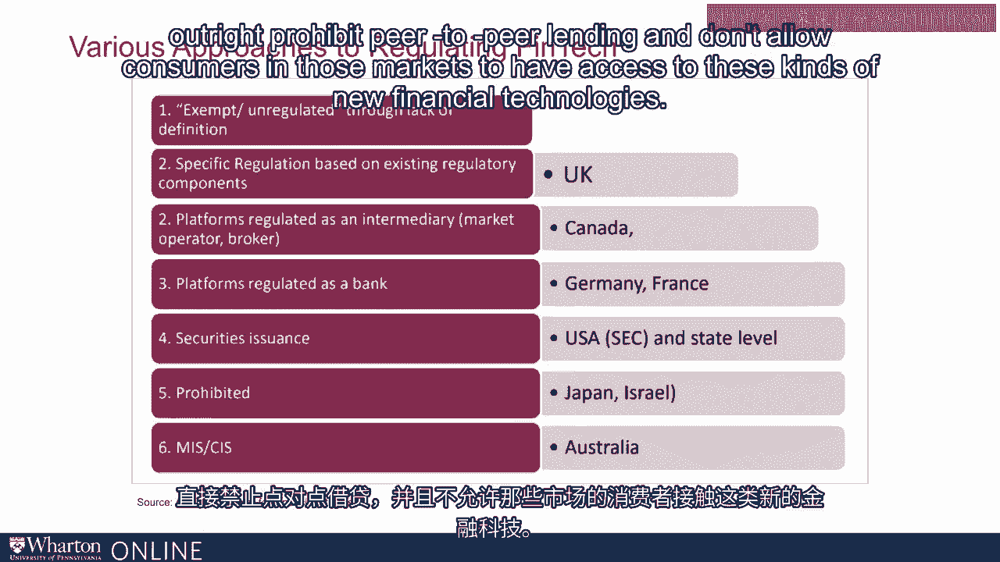
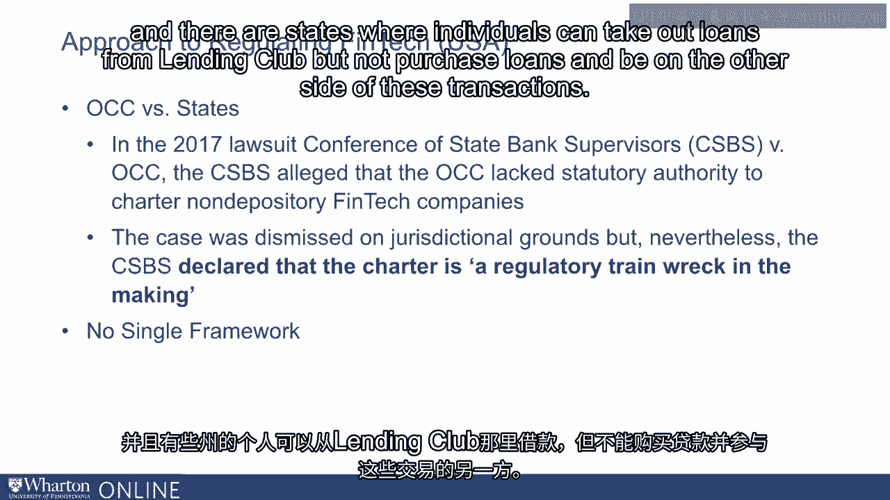

# 沃顿商学院《金融科技（加密货币／区块链／AI）｜wharton-fintech》（中英字幕） - P33：32_美国金融科技监管.zh_en - GPT中英字幕课程资源 - BV1yj411W7Dd

 Different countries have adopted different approaches with respect to the regulation of。

 financial technology。 Pewter-Pier-Lending illustrates the wide variety of regulatory approaches adopted by different。

 localities。 For example， in Germany and France， peer-to-peer platforms are regulated like banks。

 In the United States， that's not the case because to be a bank you must also make deposits。

 And so regulation falls to the SEC and these activities are treated like securities issuances。

 Some countries like Japan and Israel outright prohibit peer-to-peer lending and don't allow。

 consumers in those markets to have access to these kinds of new financial technologies。

 We're going to talk a little bit about approaches to financial regulation here in the United。

 States as well as in other countries and kind of compare and contrast a variety of approaches。

 During the United States， perhaps motivated by concerns that regulation would happen in。

 a half-hazard manner across a variety of regulatory agencies rather than in a consistent way that。

 provided a sort of broad framework for the industry。 In 2018。

 the office of the Comptroller of the Currency， the OCC and the U。S。 Treasury announced。

 that they would begin accepting applications for special bank charters， particularly for， FinTechs。

 Eligibility for these new OCC special FinTech charters would be restricted to financial。

 technology service providers who do not take deposits otherwise they would just be regulated。

 as traditional banks but otherwise engaged in the business of banking， for example by。

 lending money to consumers through peer-to-peer platforms。

 The reaction of state regulators to this sort of suggestion by the OCC for a national banking。

 charter for financial technology providers was swift and deeply concerned。 In 2017。

 the Conference of State Bank Supervisors sued the OCC， alleging that it lacked the statutory。

 authority to charter non-depository financial technology companies。

 The Conference of State Bank Supervisors was concerned that the operation of a federal banking。

 charter with respect to these non-depository institutions would make it impossible for。

 them to impose higher standards on financial technology service providers who impose unique。

 risks with respect to the consumers in their particular states。

 That's sort of the charitable view of the concerns that the State Bank Supervisors had。

 Another set of interpretations is simply an example of regulatory turf wars， whereas states。

 didn't want to provide the ability to regulate or restrain themselves from the ability to。

 intervene in these particular financial technology providers。 Well。

 of course there are problems with the idea of an OCC FinTech charter。

 There are of course benefits from creating a single structure that is responsible for。

 the regulation of these new and emerging industries。

 The issues of not having a single framework responsible for regulation are well illustrated。

 by a series of examples。 Currently， new digital payments firms or cryptocurrencies in the current regulatory environment。

 are regulated both under the Federal Banking Security Act and so have to register with。

 the Treasury as well as gain state licenses in order to operate。

 And there is no national consensus on the ability of peer-to-peer platforms to operate。

 in different states across the country。 Lending Club is able to operate in more states than Prosper。

 And there are states where individuals can take out loans from Lending Club but not purchase。

 loans on beyond the other side of these transactions。

 These sort of differences create opportunities for regulatory arbitrage on the behalf of firms。

 and also create a set of restrictions that are very difficult to comply with from the。

 perspective of new and emerging industries and new and emerging financial services providers。

 who would like some clarity about what requirements they have to meet in order to operate but don't。

 have the resources to be able to meet high regulatory burdens that are differential depending。

 on the state in which they seek to do business or gain new customers。 [BLANK_AUDIO]。

