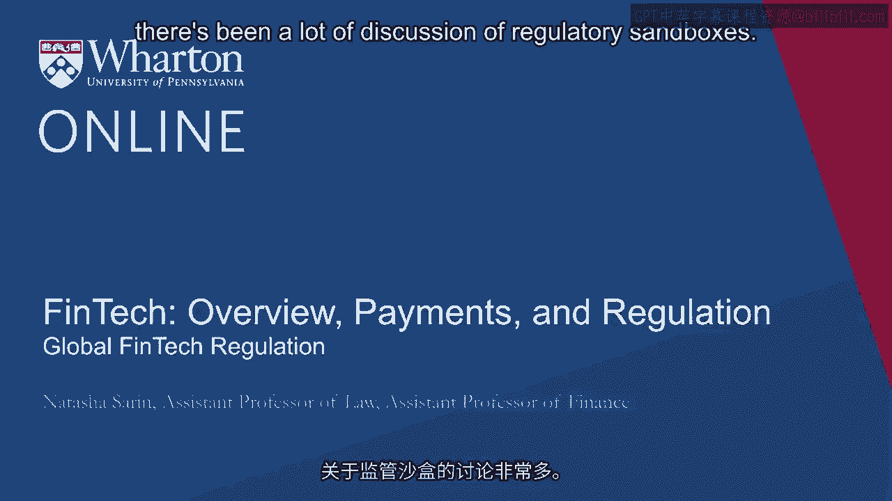
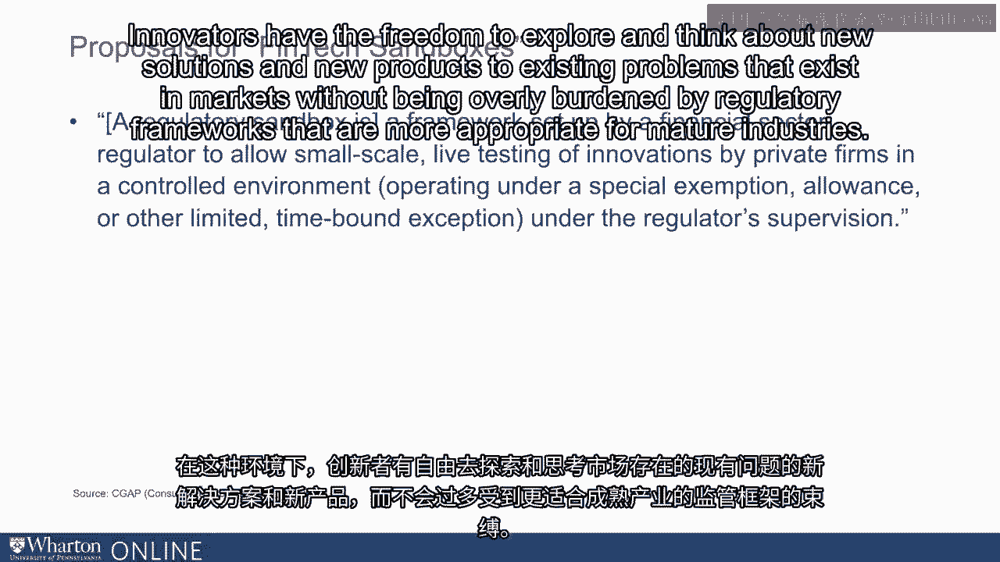
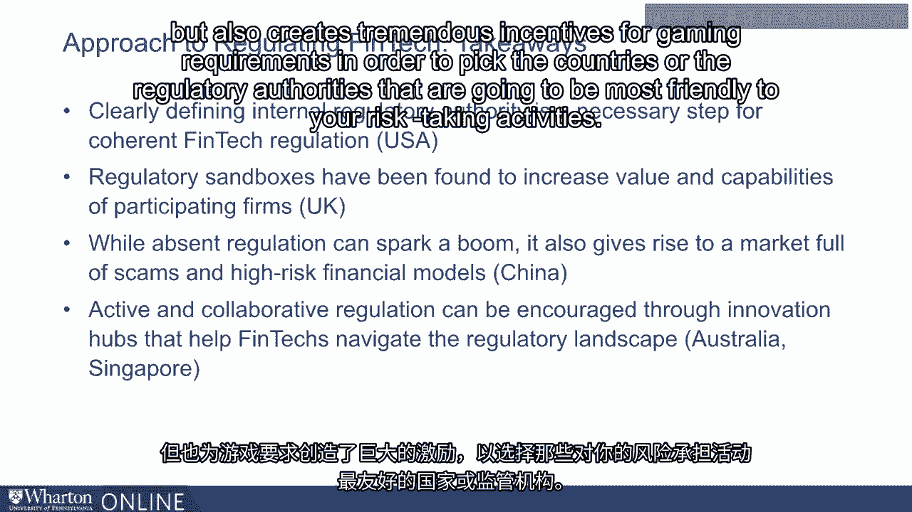

# 沃顿商学院《金融科技（加密货币／区块链／AI）｜wharton-fintech》（中英字幕） - P34：33_全球金融科技监管.zh_en - GPT中英字幕课程资源 - BV1yj411W7Dd

 In the Fintech space， particularly globally， there's been a lot of discussion of regulatory。

 sandboxes。 So what exactly is a regulatory sandbox？ Well， what is a sandbox？ Let's start there。

 A sandbox， for those of you who don't know， is a small space that has a bunch of sand。

 in it where kids go to play during lunch or recess。

 The ideas that they use their imagination and they create sand castles and tunnels and enjoy。

 playing with their peers。 The term regulatory sandbox actually comes from the sandbox that kids play in。

 The idea behind a regulatory sandbox is in this sort of imaginative environment of play。

 Innovators have the freedom to explore and think about new solutions and new products。

 to existing problems that exist in markets without being overly burdened by regulatory。

 frameworks that are more appropriate for mature industries。

 One idea of how to think about the regulation of financial technology going forward and。

 one idea that's been proposed roughly between the Euro areas， the United States and Hong。

 Kong is to come together to kind of form a global financial technology sandbox to provide。

 a reprieve for new and emerging industries and new and emerging firms who seek to innovate。

 and provide financial services to consumers in ways that they haven't before and to seek。

 to provide financial services to consumers who have traditionally been left out of the。

 financial sector。 I thought it would be useful to think about how a few countries outside of the United。

 States have thought about the approach to regulation of FinTechs。

 In Australia FinTechs are regulated by the Australian SEC， the Australian Securities and。

 Investment Commission。 The idea behind ASIC is that it is focused on helping FinTech companies think through which。

 licenses and regulations apply to them and making sure that both consumers and investors。

 are protected when dealing with these new firms。 ASIC created a regulatory sandbox for FinTechs。

 The idea behind the sandbox was that for up to 12 months new financial firms could operate。

 and test products that they hope to bring to a broader market without needing a credit。

 license from the Australian financial authorities。

 The UK is attempting to create a global FinTech sandbox with the hope of helping financial。

 technology companies who have cross-border ambitions grow in a way that is safe for consumers but。

 also facilitates the emergence of these new industries。

 The UK has had significant success with respect to its regulatory sandbox。

 The idea behind its sandbox is that it partners with firms that meet a set of requirements。

 and allows those particular institutions to test products without complying with the full。

 set of regulations that are typically required of financial services providers。

 In order to conduct these tests， these new firms work very closely with UK regulators。

 in order to make sure consumers are sufficiently protected。 Additionally。

 these firms are given a reprieve from regulatory enforcement actions against。

 them for not being able to comply with different requirements that are required of more mature。

 firms。 After the testing period has expired for the sandbox， financial technology companies have。

 the opportunity to think about whether they want to continue to provide this service or。

 modify it as the company becomes more mature。 Singapore has also adopted a regulatory sandbox to enable financial innovators and existing。

 financial technology players to use this opportunity to experiment with innovative financial products。

 or services。 The idea behind the regulatory sandbox is to under the guidance of regulatory supervision。

 test new financial technology products and determine whether they are well suited and。

 likely to solve an existing problem that exists in the financial marketplace。

 China is an example of a country that has taken a relatively loose approach to regulation。

 over financial technology。 Their kind of attitude is to think of the whole country as a regulatory sandbox where。

 new technologies can be tested and new ideas can be implemented without concern over a significant。

 sort of litigation threat or concern that you would run a ri of financial regulators。 However。

 some regulation has indeed been implemented。 The Ministry of Industry and Information Technology has begun to produce ratings for blockchain。

 products and Beijing has banned initial coin offerings and blocked websites that offer。

 cryptocurrency trading services。 The sort of interventions have been mostly with respect to blockchain but in general。

 China has tried to really encourage the growth of innovation in financial technology and。

 try to encourage entrepreneurs who are developing in this space to locate in China where they'll。

 have access to significant testing for new financial technologies and also be able to。

 think about how best to scale up the industries that they're developing。

 The experience of financial technology regulation， both here in the US and abroad， provides some。

 very useful takeaways for thinking about the development of a regulatory framework that's。

 cogent and well suited to protect consumers。 Here in the US。

 some of the struggles we've had with respect to the OCC FinTech Charter。

 as well as in the pre-crisis period with respect to financial regulation more generally。

 illustrate that clearly defining internal regulatory authority is a truly necessary step。

 for coherent financial technology regulation。 This could mean practically deciding which regulatory body is best suited to be in charge。

 of financial technology regulation broadly or it could mean embracing the fact that different。

 financial rights， different kinds of financial technology providers operate in different。

 spaces and are differentially mature。 And so the regulatory framework has to be heterogeneous to adjust for these varied properties。

 The experience of regulatory sandboxes essentially across the globe， particularly in the United。

 Kingdom， have been found to increase the value and the capabilities of participating firms。

 providing the opportunity for these firms to develop and innovate and play in this sandbox。

 framework while also protecting and safeguarding consumers against risks that emerge from sort。

 of nascent industry players。 The experience of China shows both the benefits and the pitfalls of having a loose approach。

 to financial technology regulation。 The absence of regulation has certainly sparked a boom in existing financial technology and。

 encourage innovators to sort of relocate or to do business significantly in China where。

 essentially the whole country is many think of as a regulatory sandbox with respect to。

 new fintechs。 But the lack of oversight in these markets also give rise to scams and high risk financial。

 models and make it difficult for regulators to have a framework by which to intervene in。

 these new industries if they've sort of relinquished regulatory authority at the get go in order。

 to encourage them to develop in the country。 Overall the experience of financial technology regulation and the experience of financial。

 regulation more broadly suggests that the best case scenario for regulators going forward。

 would be the true development of a global framework for regulation in this space。

 The country specific requirements for different financial services providers are complicated。

 given that financial markets are incredibly global。

 And so having different requirements in different countries in which you operate is sort of。

 burdensome from their perspective of industry but also creates tremendous incentives for。

 gaming requirements in order to pick the countries or the regulatory authorities that are going。

 to be most friendly to your risk taking activities。

 One bright note for the future of financial technology regulation is the suggestion that。

 new global regulatory sandboxes be considered to facilitate both singular framework for the。

 kind of regulatory compliance for these nascent firms but also to facilitate cross border growth。

 of these new industries that have significant potential to help best serve consumers。 [BLANK_AUDIO]。

