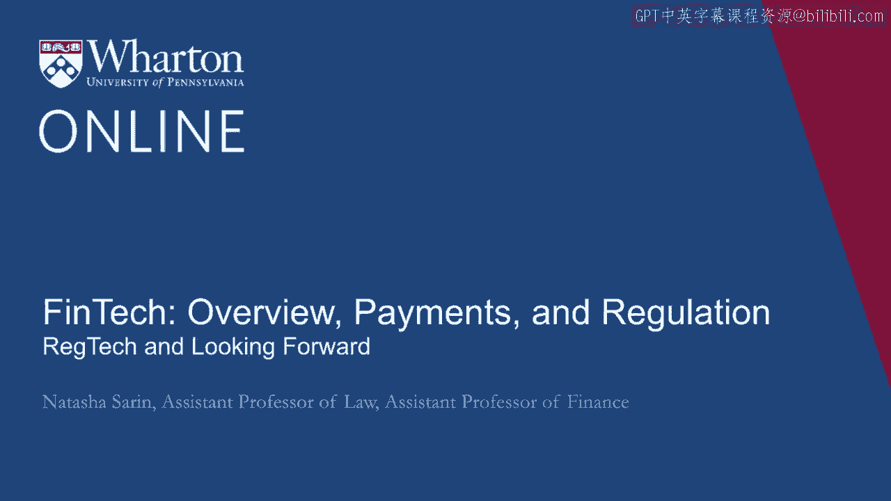
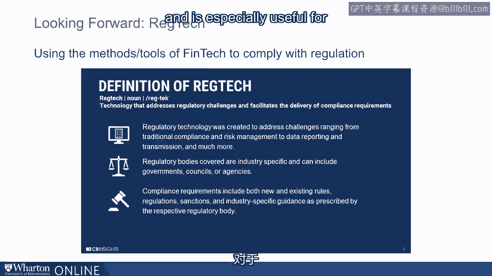
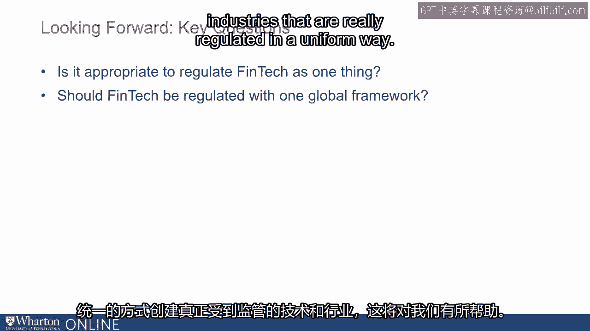
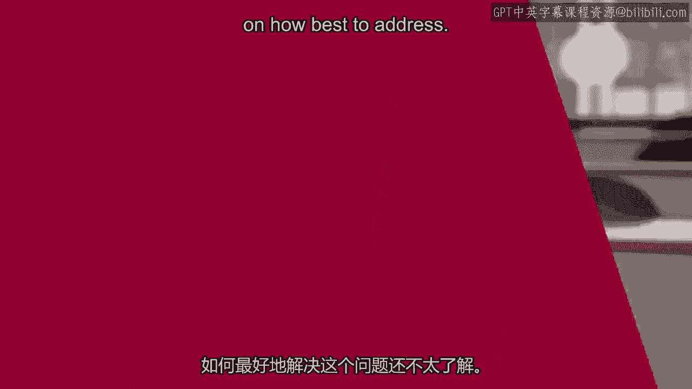

# 沃顿商学院《金融科技（加密货币／区块链／AI）｜wharton-fintech》（中英字幕） - P35：34_监管科技和展望前景.zh_en - GPT中英字幕课程资源 - BV1yj411W7Dd

 I would be remiss in this discussion of financial technology regulation to not say a word or。

 two about the emergence of reg tech。 The idea behind reg tech is that it is actually financial technology that helps financial。

 institutions address regulatory challenges and facilitates the delivery of and the ability。

 of these institutions to comply with existing regulatory requirements。

 Reg tech was created in order to address challenges that arise from compliance and risk。

 management in things like data reporting and is especially useful for sort of nascent financial。

 firms who don't yet have the capacity internally to be able to create these sorts of technologies。

 for their own use。 Some examples of reg tech providers include companies like SWADE。

 a software platform that， allows financial institutions to process granular data and output the required regulatory calculations。

 risks and reports that financial regulators demand。

 Another example is a reg tech provider called Truleco which provides ID verification for。

 companies like PayPal， Stripe and Amazon and helps them comply with new Know Your Customer。

 and Anti-Money Laundering Rules that have become of significant importance and of significant。

 regulatory burden for these institutions particularly in the aftermath of the financial crisis。

 Looking forward as we think of the future of financial technology and financial technology。

 regulation specifically， it's important for us to think about whether we should regulate。

 FinTech as an industry in and of itself or whether FinTech comprises a series of industries。

 depending on whether it involves traditional financial services providers doing new things。

 new financial services providers doing traditional things or totally new means of transacting。

 and means of exchange that didn't exist in the financial system previously。

 It's also important that we be aware that the kinds of choices we make about regulation。

 in this industry are inevitably going to impact the decisions that entrepreneurs make with。

 respect to where they locate and where they innovate， the ability of consumers to be protected。

 from new risks that emerge in these markets and the ability of consumers to be able to。

 benefit and leverage the power of new financial technology to serve them in ways that existing。

 financial institutions prior to this FinTech revolution were simply unable to。

 It's also important for regulators to bear in mind that financial regulation and particularly。

 financial technology where so much of the transacting happens on the internet which is inherently。

 a global platform would be best served by regulation through a singular global framework。

 Of course the sort of history of financial regulation doesn't provide a lot of optimism。

 for this being the inevitable outcome。 If anything the fact that there are myriad financial regulators even within the United。

 States suggests the difficulty of being able to create a singular framework for regulation。

 but it would be very helpful both from the perspective of industry as it looks to operate。

 across the world and from the perspective of consumers as they look to be protected no。

 matter where the firm that provides them financial services operates。

 It'll be helpful for us to be able to create technologies and industries that are really。

 regulated in a uniform way。 It's also important for us to bear in mind that whatever choices we make with respect。

 to the regulation of new financial services providers and incidentally whatever choices。

 we make with respect to the regulation of traditional financial services providers is inevitably。

 going to encourage the growth of and push out of the regulated financial sector activity。

 that used to exist in this space。 One concern about over regulation or one concern about overly burdensome regulation in this。

 setting is that we are going to push activity outside of a sector which we understand and。

 have some framework for regulating into sort of the shadow banking sector where our ability。

 to manage risk is much less strong。 And so as regulators and as sort of interested audiences in this space it's important for。

 us to understand that when we trade off in the context of regulation it's not just trading。

 off between innovation on one side and consumer protection on the other but in fact striking。

 the right balance and the appropriate sort of and striking the right balance and not having。

 overly cumbersome regulation that's going to encourage activity to fly out of the regulated。

 sector and pose a threat to financial stability but one that we don't have a good handle on。

 how best to address。 [BLANK_AUDIO]。

